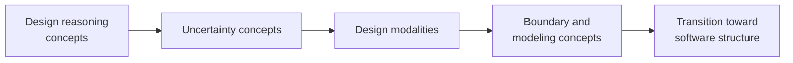

# VSlices Design Glossary

This glossary defines terms used by VSlices Design.

VSlices Design focuses on reasoning, modeling, uncertainty, boundaries, and progressive understanding before committing too early to architecture or implementation.

These terms help describe how design work can begin from different types of available knowledge.

## How to read this glossary

This glossary is organized as a reasoning path, not as an alphabetical list.

The terms begin with the material the team is trying to understand, move through the uncertainty that affects the next decision, and arrive at the design modality that can help the team move forward.

Reading path for VSlices Design terms

This diagram shows one useful way to read the terms. It does not represent a mandatory work sequence.

A team can begin from context, problem, slice, boundary, model, or existing implementation. What matters is that design responds to the real uncertainty of the current work.

## Design reasoning concepts

* **Business material**: information, language, rules, constraints, processes, decisions, problems, expectations, or domain signals before they become software structure.

* **Design reasoning**: the process of understanding why a structure, boundary, behavior, document, or implementation direction may be appropriate for the current context.

* **Modeling heuristic**: a practical reasoning aid used to make domain knowledge, uncertainty, responsibilities, or boundaries easier to observe and discuss.

* **Progressive understanding**: the gradual improvement of domain and system knowledge through discovery, documentation, modeling, implementation, validation, and feedback.

## Uncertainty concepts

* **Uncertainty**: lack of reliable understanding about the domain, problem, behavior, responsibility, risk, or expected outcome.

* **Dominant uncertainty**: the most important uncertainty affecting the next design, documentation, or implementation decision.

* **Design risk**: the possibility of making an incorrect, premature, or overly costly design decision because the team does not yet understand enough about the context, problem, or expected behavior.

## Design modalities

* **Design modality**: a way of approaching design work depending on the current uncertainty, available knowledge, and safest next step.

* **Context-First**: a design modality that begins by understanding the surrounding business, operational, organizational, or system context before narrowing toward a specific problem or implementation.

* **Problem-First**: a design modality that begins from a concrete tension, need, risk, question, or failure that must be understood before deciding what to build.

* **Slice-First**: a design modality that begins from a small useful slice of work in order to learn from implementation, validation, or real use.

* **Modality change**: the adjustment of the design approach when the dominant uncertainty changes or when the current modality stops helping the team move forward clearly.

## Boundary and modeling concepts

* **Boundary reasoning**: the act of using boundaries as reasoning objects to identify where concepts, responsibilities, decisions, systems, actors, or ownership areas should be separated.

* **Conceptual boundary**: a separation between concepts, responsibilities, or meanings that helps the team avoid mixing knowledge that should be reasoned about separately.

* **Domain model**: a representation of domain knowledge that helps explain concepts, rules, behaviors, boundaries, or decisions relevant to software work.

## Transition toward software structure

These concepts help describe how domain understanding begins to become software decisions, forms, and artifacts.

* **Software structure**: the form business knowledge takes when expressed as boundaries, models, behaviors, capabilities, flows, contracts, components, or implementation.

* **Software artifact**: a concrete representation used to design, document, build, validate, or maintain software, such as a user story, document, diagram, API, model, test, component, or slice.

* **Intent traceability**: the ability to follow a decision, structure, behavior, or implementation back to the business intent that justifies it.

* **Implementation feedback**: knowledge that appears when building, testing, using, or reviewing software and that can change the previous understanding of the domain, problem, model, or solution.

## Relationship between design modalities

Design modalities describe different starting points for design work.

* **[Context-First](modalities/context-first/index.md)** starts from the surrounding situation
* **[Problem-First](modalities/problem-first/index.md)** starts from a concrete tension or need
* **[Slice-First](modalities/slice-first/index.md)** starts from a small implementation or useful validation slice

They are not maturity levels and they are not a fixed sequence.

A team can begin with Context-First when the environment is unclear, with Problem-First when a specific tension is visible, or with Slice-First when building a small piece is the safest way to learn.

What matters is choosing the modality that matches the uncertainty of the current work.
