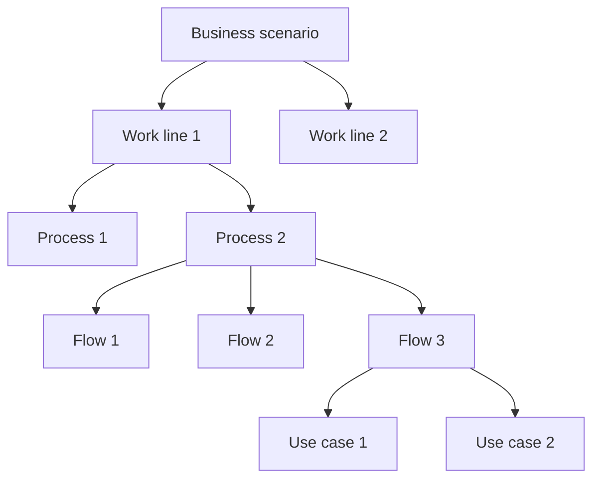

# Perspective "Business scenario"

The "Business scenario" perspective organizes documentation from the question: **Where am I working?**, observed through a process analysis lens.

This perspective helps understand the operational context where the work happens before focusing on specific projects, products, services, or decisions.

It focuses on recognizing work lines, processes, flows, actors, responsibilities, operational rules, and the knowledge needed to understand how a part of the business works.

A business scenario can represent an operation, an organization, an ecosystem, a work area, a business line, or an operational situation that needs to be understood.

## What this perspective orients toward

The "Business scenario" perspective orients toward the operational context where knowledge appears.

It helps see:

* what business situation surrounds the work
* what work lines exist within the scenario
* what processes or flows are part of the context
* what actors, responsibilities, or areas participate
* what parts are inside or outside the current scope
* what knowledge is already documented
* what knowledge still needs more depth

This perspective is useful when the team needs to understand the operational territory before deciding where to intervene.

## What it helps answer

The "Business scenario" perspective helps answer questions such as:

* Where does this work happen within the business?
* What operational situation are we trying to understand?
* What work lines exist within the scenario?
* What processes or flows explain how this scenario operates?
* What actors, responsibilities, or areas participate?
* What part of the scenario is being documented, validated, or modified?
* What knowledge is missing to better understand the operational context?

## Useful documents

These documents are usually useful within a business scenario perspective:

| Document                                                     | Use within the perspective                                                                   |
| ------------------------------------------------------------ | -------------------------------------------------------------------------------------------- |
| [Context document](../../taxonomy/context-document.md)       | Explains the business scenario, its boundaries, actors, conditions, and relevant work lines. |
| [Domain vocabulary](../../taxonomy/domain-vocabulary.md)     | Preserves the language needed to understand the scenario.                                    |
| [Process document](../../taxonomy/process-document.md)       | Explains how part of the work is organized and executed within the scenario.                 |
| [Use case document](../../taxonomy/use-case-document.md)     | Describes specific behaviors that appear within processes or flows.                          |
| [Capability document](../../taxonomy/capability-document.md) | Identifies stable capabilities that the scenario requires.                                   |
| [Decision record](../../taxonomy/decision-record.md)         | Preserves decisions that affect how the scenario is understood or intervened.                |
| [Validation note](../../taxonomy/validation-note.md)         | Captures learning that changes the understanding of the scenario.                            |
| [Support note](../../taxonomy/support-note.md)               | Preserves early, uncertain, or local knowledge before giving it formal structure.            |

Not all of these documents are mandatory.

The perspective only helps decide which documentation can best explain the business scenario.

## Typical path

A path from a business scenario usually starts broad and becomes more specific.

Continuity path from the business scenario perspective

This path does not mean the team must document every level.

It means the business scenario can be navigated from a broad operational context toward more specific knowledge.

## Common stops

A stop is a point in the path where documentation can exist at different depths.

| Stop              | What it helps observe                                                      |
| ----------------- | -------------------------------------------------------------------------- |
| Business scenario | The operational context where the work happens.                            |
| Work line         | An offering, operation, responsibility, or value flow within the scenario. |
| Process           | The way work is organized to produce an outcome.                           |
| Flow              | The concrete sequence of steps, decisions, handoffs, or participants.      |
| Use case          | The expected meaning of a specific behavior within the scenario.           |

## Documentary depth

The "Business scenario" perspective also helps show how documented each part of the operational context is.

| Depth      | Meaning                                                                        |
| ---------- | ------------------------------------------------------------------------------ |
| Identified | The part of the scenario was recognized, but has little documentary structure. |
| Minimal    | There is enough documentation to support nearby work.                          |
| Expanded   | There is detail because there is complexity, risk, coordination, or ambiguity. |
| Reference  | The knowledge is stable and important for future work.                         |

Not everything in the scenario needs the same depth.

One work line can be well documented, another can be barely identified, and another can remain outside the current scope.

## Risks to avoid

!!! risk "Risk to avoid"

    Do not turn the business scenario perspective into an obligation to document the entire organization.

The "Business scenario" perspective should help understand where the work happens.

It should not become an exhaustive map of the whole company, ecosystem, or system.

It is also worth avoiding:

* documenting work lines that do not affect current or future work
* describing processes in more detail than necessary
* mixing operational context with overly specific implementation decisions
* assuming that every scenario must become reference documentation
* using the scenario as an excuse to delay learning from validation or implementation

## Continuity principle

!!! principle "Continuity principle"

    The business scenario perspective should help understand where operational knowledge appears before deciding which part needs more documentary depth.

