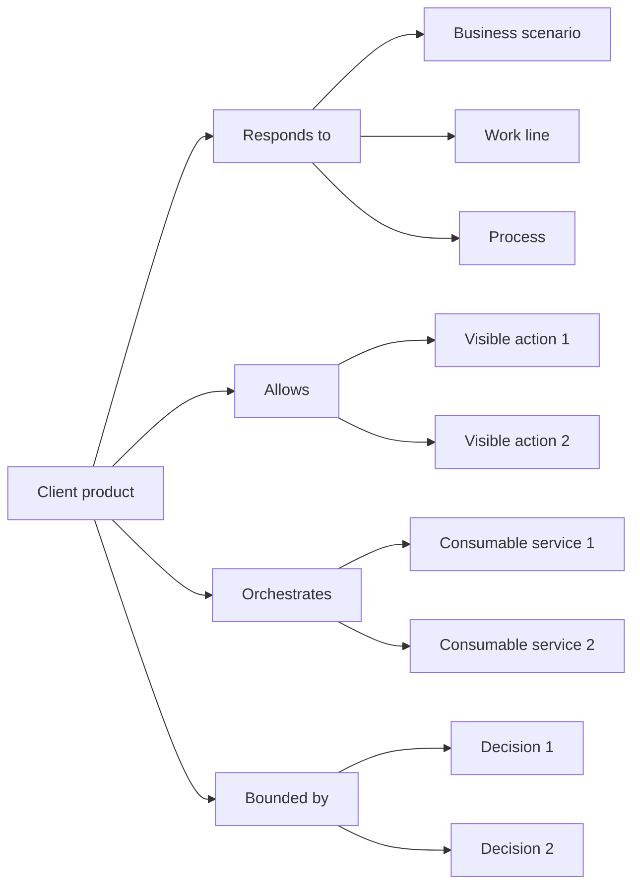

# Perspective "Client product"

The "Client product" perspective organizes documentation from the question: **What can the user do with this system?**, observed through a lens of experience, usage, and software coordination.

In this perspective, "client" does not only refer to an external customer.

It can represent a user, an operator, an internal area, a business team, or any actor that interacts with a software system to perform actions within a business scenario.

This perspective helps understand what experience a product offers, what actions it allows, what part of the business scenario it responds to, and what consumable services, capabilities, or processes it needs to coordinate to do so.

A client product can represent a web application, a mobile application, an internal portal, an operational dashboard, an administrative interface, or any software system used directly by people to execute part of the work.

## What this perspective orients toward

The "Client product" perspective orients toward the visible experience that allows a person to perform actions within a business scenario.

It helps see:

* what part of the business scenario the product responds to
* what users, actors, or areas interact with the product
* what visible actions it allows
* what processes or flows it helps execute
* what consumable services it needs to orchestrate
* what capabilities it uses, combines, or exposes through the experience
* what decisions explain its scope, experience, or boundaries
* what validations confirm or change its expected behavior

This perspective is useful when the team needs to understand how part of the work becomes usable through software.

## What it helps answer

The "Client product" perspective helps answer questions such as:

* What can the user do with this system?
* What part of the business scenario does the product cover?
* What process, flow, or work line does it help execute?
* What visible actions does it offer?
* What consumable services does it need to coordinate?
* What capabilities does it use to respond to the user?
* What remains outside the product experience?
* What decisions explain its scope or experience?
* What validations changed the understanding of the product?

## Useful documents

These documents are usually useful within a client product perspective:

| Document                                                     | Use within the perspective                                                                   |
| ------------------------------------------------------------ | -------------------------------------------------------------------------------------------- |
| [Context document](../../taxonomy/context-document.md)       | Explains the business scenario, or part of the scenario, that the product responds to.       |
| [Domain vocabulary](../../taxonomy/domain-vocabulary.md)     | Preserves the language needed to name actions, users, states, processes, and outcomes.       |
| [Process document](../../taxonomy/process-document.md)       | Explains the processes or flows that the product helps execute.                              |
| [Use case document](../../taxonomy/use-case-document.md)     | Describes visible or expected behaviors that the product must allow.                         |
| [Capability document](../../taxonomy/capability-document.md) | Identifies capabilities that the product uses, combines, or exposes through the experience.  |
| [Decision record](../../taxonomy/decision-record.md)         | Preserves decisions about scope, experience, orchestration, boundaries, or responsibilities. |
| [Validation note](../../taxonomy/validation-note.md)         | Captures evidence that confirms or changes the expected behavior of the product.             |
| [Support note](../../taxonomy/support-note.md)               | Preserves early, uncertain, or local knowledge before giving it formal structure.            |

Not all of these documents are mandatory.

The perspective only helps observe which documentation best explains the client product.

## Typical path

A path from a client product usually shows what part of the scenario the product responds to, what visible actions it offers, and what consumable services it needs to orchestrate.

Continuity path from the client product perspective

This path does not mean every product must have all of these elements.

It means the client product perspective helps show what part of the business it responds to, what actions it offers, what use cases it expresses, what services it coordinates, and what decisions explain its scope.

## Common stops

A stop is a point in the path where documentation can exist at different depths.

| Stop               | What it helps observe                                                                      |
| ------------------ | ------------------------------------------------------------------------------------------ |
| Client product     | The software system used by people to perform actions within a business scenario.          |
| User or actor      | The person, role, area, or participant that interacts with the product.                    |
| Business scenario  | The operational context the product responds to.                                           |
| Work line          | The part of the work that the product helps execute or coordinate.                         |
| Process            | The way of working that the product supports.                                              |
| Visible action     | Something the user can do directly within the product.                                     |
| Use case           | The expected behavior that gives meaning to a visible action.                              |
| Consumable service | A software piece that the product uses to execute, query, coordinate, or persist behavior. |
| Capability         | Something stable that the product needs to use, combine, or make available.                |
| Decision           | A choice that explains scope, experience, boundaries, or orchestration.                    |
| Validation         | Evidence that confirms, corrects, or changes the expected behavior of the product.         |

## Documentary depth

The client product perspective helps show how clear each part of the experience is and how it relates to the business scenario.

| Depth      | Meaning                                                                                          |
| ---------- | ------------------------------------------------------------------------------------------------ |
| Identified | The action, process, or dependency exists, but still has little documentation.                   |
| Minimal    | There is enough documentation to support nearby design, implementation, or validation.           |
| Expanded   | There is more detail because there is risk, coordination, ambiguity, dependency, or user impact. |
| Reference  | The knowledge is stable and relevant for future evolution, support, or later decisions.          |

Not everything inside a product needs the same depth.

One visible action can be clearly defined, a consumable service can be under exploration, and part of the process can remain outside the product scope.

## Risks to avoid

!!! risk "Risk to avoid"

    Do not confuse the client product with the whole project or with all the services that support it.

The "Client product" perspective should help understand what experience a software system offers and what part of the business scenario it allows people to execute.

It should not become a list of screens, visual components, or isolated features without a relationship to processes, services, or use cases.

It is also worth avoiding:

* documenting screens without explaining what actions or use cases they support
* assuming that everything that happens in the backend belongs to the product
* hiding what consumable services support the experience
* mixing user experience with internal service responsibilities
* confusing the product with the whole software project
* treating the user as a secondary detail
* designing visible actions without preserving the business scenario that gives them meaning

## Continuity principle

!!! principle "Continuity principle"

    The client product perspective should help understand what experience a software system offers, what part of the business scenario it responds to, and what services it needs to coordinate.
