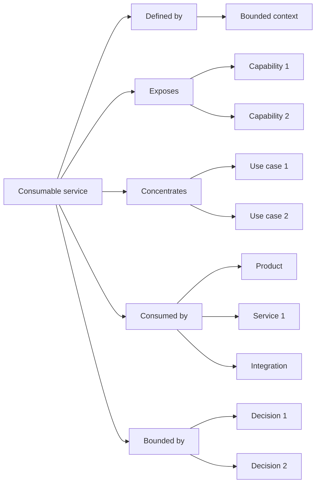

# Perspective "Consumable service"

The "Consumable service" perspective organizes documentation from the question: **What capabilities does this system offer to be used by others?**, observed through a software design lens.

This perspective helps understand what actions, capabilities, or behaviors a service exposes within a bounded context.

A consumable service can represent a microservice, an API, a backend, an application module, or a software segment that concentrates specific use cases to respond to part of the domain.

In this perspective, the service is not understood only as technical infrastructure.

It is understood as a software piece that offers capabilities consumable by products, other services, automations, integrations, or processes.

## What this perspective orients toward

The "Consumable service" perspective orients toward the capabilities that a system exposes within a bounded context.

It helps see:

* what context bounds the service
* what capabilities the service offers
* what use cases it concentrates
* what products, services, or processes consume its capabilities
* what domain language it needs to preserve
* what rules, invariants, or expected errors govern its behavior
* what decisions explain its technical and conceptual boundaries
* what validations confirm or change its expected behavior

This perspective is useful when the team needs to understand what can be consumed from a software piece and under what domain intention.

## What it helps answer

The "Consumable service" perspective helps answer questions such as:

* What context bounds this service?
* What capabilities does it offer?
* What use cases belong to this service?
* What products, services, or integrations consume these capabilities?
* What business rules must it protect?
* What expected errors are part of its behavior?
* What data, contracts, or events does it need to expose?
* What decisions explain its boundaries?
* What validations changed the understanding of the service?

## Useful documents

These documents are usually useful within a consumable service perspective:

| Document                                                     | Use within the perspective                                                                       |
| ------------------------------------------------------------ | ------------------------------------------------------------------------------------------------ |
| [Context document](../../taxonomy/context-document.md)       | Explains the bounded context where the service makes sense.                                      |
| [Domain vocabulary](../../taxonomy/domain-vocabulary.md)     | Preserves the language needed to name capabilities, rules, entities, events, and errors.         |
| [Process document](../../taxonomy/process-document.md)       | Explains what processes or flows are supported by the service.                                   |
| [Use case document](../../taxonomy/use-case-document.md)     | Describes the specific behaviors that the service exposes or executes.                           |
| [Capability document](../../taxonomy/capability-document.md) | Identifies stable capabilities that the service offers, uses, or preserves.                      |
| [Decision record](../../taxonomy/decision-record.md)         | Preserves decisions about boundaries, contracts, architecture, integration, or responsibilities. |
| [Validation note](../../taxonomy/validation-note.md)         | Captures evidence that confirms or changes the expected behavior of the service.                 |
| [Support note](../../taxonomy/support-note.md)               | Preserves early, uncertain, or local knowledge before giving it formal structure.                |

Not all of these documents are mandatory.

The perspective only helps observe which documentation best explains the consumable service.

## Typical path

A path from a consumable service usually shows what context bounds the service, what capabilities it exposes, and what use cases belong to its responsibility.

Continuity path from the consumable service perspective

This path does not mean every service must have all of these elements.

It means the consumable service perspective helps show what context bounds it, what capabilities it exposes, what use cases it concentrates, who consumes it, and what decisions explain its boundaries.

## Common stops

A stop is a point in the path where documentation can exist at different depths.

| Stop               | What it helps observe                                                                          |
| ------------------ | ---------------------------------------------------------------------------------------------- |
| Consumable service | The software piece that offers capabilities to be used by others.                              |
| Bounded context    | The conceptual boundary where the service has meaning and responsibility.                      |
| Capability         | Something stable that the service can offer, use, or preserve.                                 |
| Use case           | A specific behavior that the service must execute or enable.                                   |
| Consuming product  | A visible experience that uses the service's capabilities.                                     |
| Consuming service  | Another service that depends on exposed capabilities.                                          |
| Integration        | A system, process, or technical actor that consumes or exchanges information with the service. |
| Contract           | The way the service exposes a capability, datum, command, query, or event.                     |
| Decision           | A choice that explains boundaries, responsibilities, architecture, or integration.             |
| Validation         | Evidence that confirms, corrects, or changes the expected behavior of the service.             |

## Documentary depth

The consumable service perspective helps show how clear each part of the service's responsibility is.

| Depth      | Meaning                                                                             |
| ---------- | ----------------------------------------------------------------------------------- |
| Identified | The capability or behavior exists, but still has little documentation.              |
| Minimal    | There is enough documentation to support nearby implementation or consumption.      |
| Expanded   | There is more detail because there is risk, integration, ambiguity, or dependency.  |
| Reference  | The knowledge is stable and relevant for consumers, decisions, or future evolution. |

Not everything inside a service needs the same depth.

One capability can be stable, one use case can be under exploration, and one contract can be pending validation.

## Risks to avoid

!!! risk "Risk to avoid"
    
    Do not confuse a consumable service with a simple technical layer without domain intention.

The "Consumable service" perspective should help understand what capabilities a software piece offers within a bounded context.

It should not become a list of endpoints, classes, controllers, or infrastructure details without a relationship to the domain.

It is also worth avoiding:

* defining services without explaining the context that bounds them
* mixing capabilities from several contexts into the same service
* documenting endpoints without explaining the use cases they support
* confusing technical contract with domain intention
* hiding who consumes the service
* treating expected errors as secondary details
* assuming that every consumable service must be a microservice deployed independently

## Continuity principle

!!! principle "Continuity principle"

    The consumable service perspective should help understand what capabilities a software piece offers, within what bounded context, and for which consumers.
