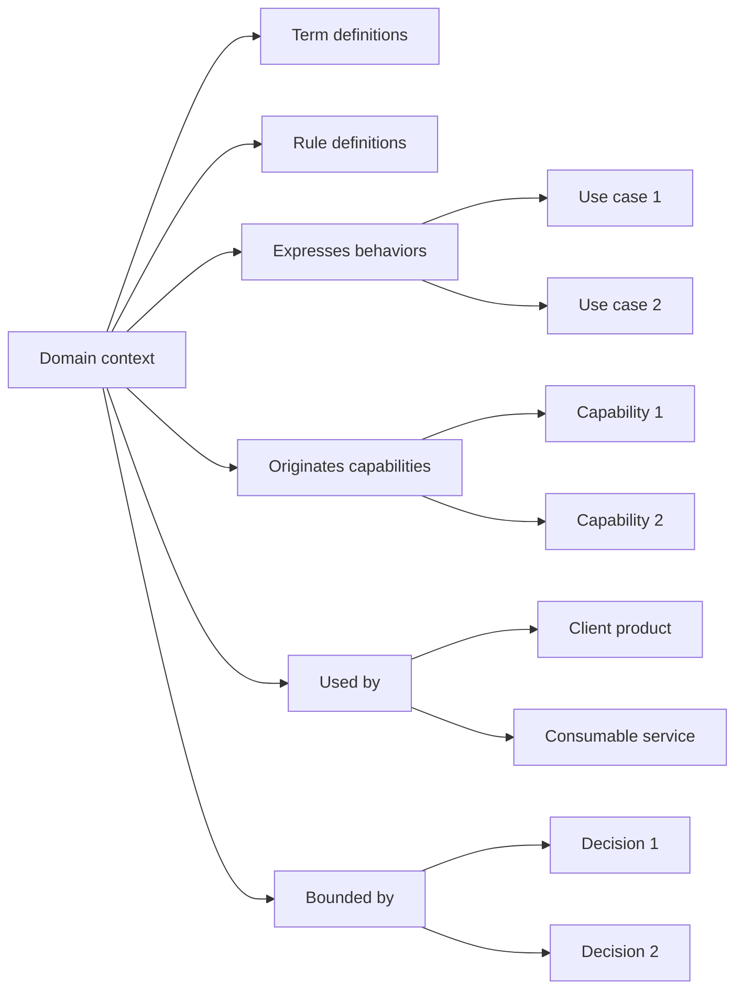

# Perspective "Domain context"

The "Domain context" perspective organizes documentation from the question: **What language, rules, and boundaries belong to this part of the business?**, observed through a domain modeling lens.

This perspective helps understand how part of the business is semantically organized before turning it into products, services, capabilities, or software decisions.

A domain context can represent a conceptual zone of the business where certain terms, rules, behaviors, and responsibilities have a specific meaning.

Not every business scenario needs to be a single domain context.

The same scenario can contain several domain contexts, and the same term can change meaning across different contexts.

## What this perspective orients toward

The "Domain context" perspective orients toward the semantic boundaries of the business.

It helps see:

* what part of the business needs its own language
* what concepts belong together
* what terms have specific meaning within the context
* what rules or invariants belong to this part of the business
* what behaviors are proper to the context
* what capabilities could emerge from this domain
* what products or services use concepts from this context
* what decisions explain its conceptual boundaries

This perspective is useful when the team needs to protect the meaning of the business before designing products, services, or technical structures.

## What it helps answer

The "Domain context" perspective helps answer questions such as:

* What part of the business are we modeling?
* What language belongs to this context?
* What concepts should be kept together?
* What terms change meaning outside this context?
* What rules or invariants must be protected?
* What behaviors really belong to this context?
* What capabilities emerge from this domain?
* What products or services consume or expose this knowledge?
* What decisions explain the context boundaries?

## Useful documents

These documents are usually useful within a domain context perspective:

| Document                                                     | Use within the perspective                                                                                      |
| ------------------------------------------------------------ | --------------------------------------------------------------------------------------------------------------- |
| [Domain vocabulary](../../taxonomy/domain-vocabulary.md)     | Preserves the language, concepts, ambiguous terms, and meanings specific to the context.                        |
| [Context document](../../taxonomy/context-document.md)       | Explains the context where the domain appears, its boundaries, and its relationship with the business scenario. |
| [Process document](../../taxonomy/process-document.md)       | Shows how the domain rules and concepts appear within operational work.                                         |
| [Use case document](../../taxonomy/use-case-document.md)     | Describes specific behaviors that express domain rules or intention.                                            |
| [Capability document](../../taxonomy/capability-document.md) | Identifies stable capabilities that emerge from the domain or depend on its rules.                              |
| [Decision record](../../taxonomy/decision-record.md)         | Preserves decisions about boundaries, names, responsibilities, context separation, or modeling.                 |
| [Validation note](../../taxonomy/validation-note.md)         | Captures evidence that confirms, corrects, or changes the understanding of the domain.                          |
| [Support note](../../taxonomy/support-note.md)               | Preserves early observations, semantic doubts, or local knowledge before formalizing it.                        |

Not all of these documents are mandatory.

The perspective only helps observe which documentation best explains the meaning and boundaries of a part of the business.

## Typical path

A path from a domain context usually shows what language belongs to the context, what rules it protects, and what capabilities or behaviors emerge from that meaning.

Continuity path from the domain context perspective

This path does not mean every domain context must have all of these elements.

It means the domain context perspective helps show what language, rules, behaviors, and capabilities belong to a part of the business, and what products or services depend on that meaning.

## Common stops

A stop is a point in the path where documentation can exist at different depths.

| Stop                | What it helps observe                                                                 |
| ------------------- | ------------------------------------------------------------------------------------- |
| Domain context      | The conceptual zone of the business where language and rules have a specific meaning. |
| Language definition | The words or concepts whose meaning must be preserved within the context.             |
| Rule definition     | The conditions, restrictions, or criteria that must be respected within the context.  |
| Invariant           | A rule that must remain true to preserve domain consistency.                          |
| Use case            | A specific behavior that expresses intention or rules from the context.               |
| Capability          | Something stable that emerges from the domain or depends on its rules.                |
| Client product      | A visible system that uses concepts or behaviors from this context.                   |
| Consumable service  | A software piece that exposes capabilities related to this context.                   |
| Decision            | A choice that explains boundaries, names, responsibilities, or context separation.    |
| Validation          | Evidence that confirms, corrects, or changes the understanding of the domain.         |

## Documentary depth

The domain context perspective helps show how clear the semantic organization of the business is.

| Depth      | Meaning                                                                                            |
| ---------- | -------------------------------------------------------------------------------------------------- |
| Identified | The concept, rule, or boundary exists, but still has little documentation.                         |
| Minimal    | There is enough documentation to avoid nearby confusion.                                           |
| Expanded   | There is more detail because there is ambiguity, risk, dependency, or difference between contexts. |
| Reference  | The knowledge is stable and relevant for design, implementation, or future evolution.              |

Not everything inside a domain context needs the same depth.

One term can be well defined, one rule can be under discussion, and one boundary with another context can be barely identified.

## Risks to avoid

!!! risk "Risk to avoid"

    Do not confuse domain context with technical structure, module, or deployable service.

The "Domain context" perspective should help understand the meaning of a part of the business.

It should not automatically become architecture, folders, microservices, or deployment boundaries.

It is also worth avoiding:

* using technical names before understanding the business language
* mixing terms that mean different things in different contexts
* assuming that every business scenario is a single domain context
* turning every concept into a separate service
* documenting rules without explaining where they apply
* hiding semantic ambiguities behind generic names
* treating vocabulary as a decorative glossary instead of a boundary of meaning

## Continuity principle

!!! principle "Continuity principle"

    The domain context perspective should help preserve the language, rules, and conceptual boundaries of the business before turning them into software.
