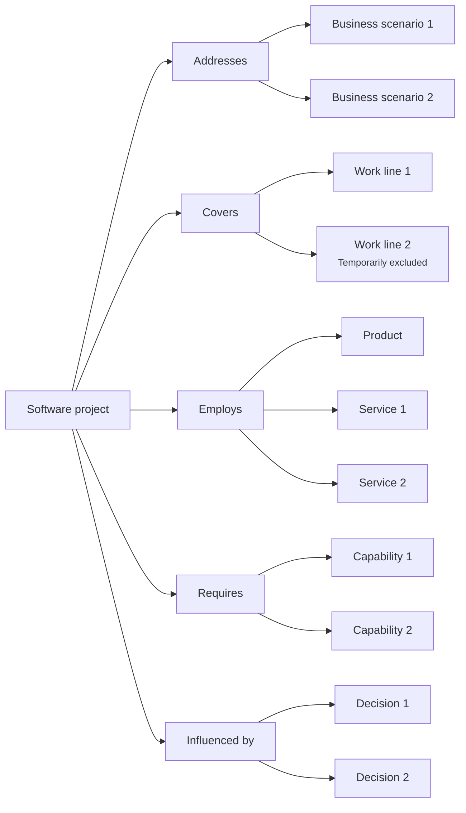

# Perspective "Software project"

The "Software project" perspective organizes documentation from the question: **What tools do I have to address this part of the work?**, observed through a software analysis lens.

In this perspective, "tools" does not only refer to technical tooling.

It refers to the products, services, capabilities, supported processes, decisions, and boundaries that make it possible to intervene in part of the business scenario through software.

This perspective helps understand what a software project intends to cover, what products or services participate, what work lines it includes, and what processes or flows remain inside or outside the scope.

A software project can represent a modernization, an automation, a migration, an integration, an operational improvement, or any organized effort to build, modify, or stabilize software within a business scenario.

## What this perspective orients toward

The "Software project" perspective orients toward the technical and functional scope of an initiative.

It helps see:

* what part of the business scenario the project intends to address
* what products are part of the project
* what services support or enable the work
* what capabilities it needs to build, use, or stabilize
* what work lines, processes, or flows are included
* what parts are excluded, pending, or only mentioned
* what decisions explain the project scope
* what documents explain the project coverage

This perspective is useful when the team needs to understand what software pieces it has available, which ones it must build, and what part of the scenario it intends to intervene in.

## What it helps answer

The "Software project" perspective helps answer questions such as:

* What is this project trying to solve, enable, or stabilize?
* What part of the business scenario does it cover?
* What products participate?
* What services participate?
* What capabilities does the project need?
* What work lines, processes, or flows are included?
* What remains outside the current scope?
* What parts are digitalized, in progress, pending, or excluded?
* What decisions explain the project scope?
* What validations changed the understanding of the project?

## Useful documents

These documents are usually useful within a software project perspective:

| Document                                                     | Use within the perspective                                                                                   |
| ------------------------------------------------------------ | ------------------------------------------------------------------------------------------------------------ |
| [Context document](../../taxonomy/context-document.md)       | Explains the project context, its scope, its boundaries, and the part of the business scenario it addresses. |
| [Domain vocabulary](../../taxonomy/domain-vocabulary.md)     | Preserves the language needed to understand the project and its boundaries.                                  |
| [Process document](../../taxonomy/process-document.md)       | Describes the processes or flows that the project must support, modify, or preserve.                         |
| [Use case document](../../taxonomy/use-case-document.md)     | Explains specific behaviors that the project must enable, change, or preserve.                               |
| [Capability document](../../taxonomy/capability-document.md) | Identifies capabilities that the project needs to build, use, or stabilize.                                  |
| [Decision record](../../taxonomy/decision-record.md)         | Preserves decisions about scope, boundaries, inclusion, exclusion, prioritization, or architecture.          |
| [Validation note](../../taxonomy/validation-note.md)         | Captures evidence that confirms or changes the project direction.                                            |
| [Support note](../../taxonomy/support-note.md)               | Preserves early, uncertain, or local knowledge before giving it formal structure.                            |

Not all of these documents are mandatory.

The perspective only helps observe which documentation best explains the software project.

## Typical path

A path from a software project usually shows what part of the scenario an initiative addresses, what software pieces it employs, and what decisions bound its scope.

Continuity path from the software project perspective

This path does not mean a project must have all of these elements.

It means the software project perspective helps show what the initiative covers, what it excludes, what products or services participate, what capabilities it requires, and what decisions justify that scope.

## Common stops

A stop is a point in the path where documentation can exist at different depths.

| Stop              | What it helps observe                                                                          |
| ----------------- | ---------------------------------------------------------------------------------------------- |
| Software project  | The organized technical initiative that intends to intervene in part of the business scenario. |
| Business scenario | The operational context that the project intends to modify, sustain, or understand.            |
| Work line         | A part of the work that the project covers, mentions, or explicitly excludes.                  |
| Product           | A visible experience or system for users within the project.                                   |
| Service           | A capability, operation, or backend that supports part of the project.                         |
| Capability        | Something the project needs to build, use, stabilize, or preserve.                             |
| Decision          | A choice that explains scope, priority, boundaries, or technical direction.                    |

## Documentary depth

The software project perspective helps show how clear each part of the scope is.

| Depth      | Meaning                                                                             |
| ---------- | ----------------------------------------------------------------------------------- |
| Identified | The part exists in the project, but still has little documentation.                 |
| Minimal    | There is enough documentation to support nearby work.                               |
| Expanded   | There is more detail because there is risk, coordination, ambiguity, or dependency. |
| Reference  | The knowledge is stable and relevant for several future decisions.                  |

Not everything inside a project needs the same depth.

One product can be clearly defined, one service can be under exploration, and one work line can be mentioned but excluded.

## Risks to avoid

!!! risk "Risk to avoid"

    Do not confuse a software project with the full business scenario or a product with the full project.

The "Software project" perspective should help understand the technical and functional coverage of an initiative.

It should not turn the project into a full explanation of the organization or reduce it only to a user interface.

It is also worth avoiding:

* documenting the entire business scenario as if it were part of the project
* hiding what remains outside the scope
* mixing products and services without explaining their relationship
* treating exclusions as nonexistent knowledge
* moving into implementation without preserving scope decisions
* assuming that every project must end in a single product or service
* confusing required capabilities with visible functionality for the user

## Continuity principle

!!! principle "Continuity principle"

    The software project perspective should help understand what part of the business scenario an initiative addresses, what software pieces it uses or needs, and what decisions explain its scope.
