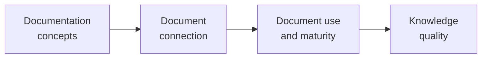
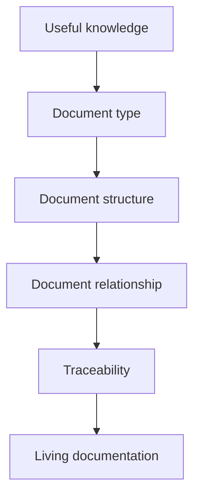

# VSlices Docs Standard Glossary

This glossary defines concepts used by VSlices Docs Standard.

VSlices Docs Standard focuses on preserving useful knowledge through living documentation structures.

This glossary does not redefine every document type. Specific document types are explained in the Docs Standard taxonomy and in their own pages.

These terms help describe what kind of knowledge should be documented, why it matters, and how documents can remain connected to real work.

## How to read this glossary

This glossary is organized around the knowledge that documentation should preserve.

It first defines basic documentation concepts, then concepts for connecting documents, then concepts for document use, and finally concepts for knowledge quality.

Reading path for VSlices Docs Standard terms

This diagram shows one useful way to read the terms. It does not represent a mandatory work sequence.

## Documentation concepts

* **Living documentation**: documentation that evolves together with the system, decisions, domain understanding, implementation, validation, and feedback.

* **Document structure**: the expected shape of a document, including its purpose, sections, relationships, and intended use.

* **Document type**: a reusable form of documentation used to preserve a specific type of knowledge, such as context, process, behavior, capability, decision, or validation.

* **Knowledge artifact**: a preserved piece of knowledge that future work may depend on, such as a document, note, diagram, decision, example, or validation result.

* **Documentation boundary**: the boundary that defines what a document should explain and what should be left to another document.

## Document connection

* **Document relationship**: a connection between documents that helps preserve traceability between context, decisions, processes, behaviors, capabilities, validation, and implementation.

* **Reference**: an explicit link from one document to another document, concept, decision, behavior, or artifact.

* **Traceability**: the ability to follow how knowledge moves between discovery, documentation, design, architecture, implementation, validation, and evolution.

## Document use and maturity

* **Document stage**: the level of maturity, stability, or confidence that a document currently represents.

* **Document affinity**: the natural relationship between a document type and the type of work, knowledge, uncertainty, or lifecycle stage it best supports.

## Knowledge quality

* **Useful knowledge**: knowledge that helps future work understand, decide, implement, validate, maintain, or evolve something more safely.

* **Preserved intent**: the reasoning, meaning, purpose, and constraints that should remain understandable after the original discussion or decision has passed.

* **Documentation drift**: the distance that appears when documentation and the real behavior of the system evolve separately.

* **Outdated knowledge**: documented knowledge that no longer reflects the current understanding, behavior, decision, or implementation.

* **Documentation debt**: accumulated documentation gaps, outdated explanations, missing decisions, or disconnected knowledge that make future work harder.

## Relationship between terms

VSlices Docs Standard helps teams preserve knowledge using the smallest useful document structure.

Relationship between useful knowledge, document structure, and living documentation

This is not a requirement to document everything.

A team should document the knowledge future work depends on, using the smallest structure that preserves enough meaning, context, and intent.

The goal is not more documentation. The goal is less knowledge loss.
