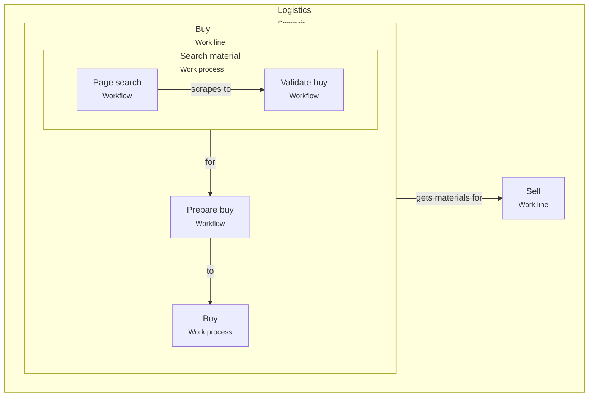

# Shared glossary

This glossary defines shared terms used across VSlices products.

Its purpose is to preserve a common language between [VSlices Design](design/index.md), [VSlices Docs Standard](docs-standard/index.md), [VSlices Method](method/index.md), and [VSlices Framework](framework/index.md).

These terms help connect domain discovery, documentation, design, architecture, implementation, validation, and evolution without forcing every product to redefine the same concepts.

## How to read this glossary

The terms are grouped by the kind of knowledge they help describe:

| Term family | What it helps describe |
| --- | --- |
| [Suite concepts](#suite-concepts) | Shared foundations of VSlices. |
| [Core domain-to-software terms](#core-domain-to-software-terms) | How broad domain knowledge can become concrete software behavior. |
| [Supporting concepts](#supporting-concepts) | Participants, responsibilities, boundaries, abilities, and movement. |
| [Knowledge concepts](#knowledge-concepts) | Assumptions, risks, decisions, validation, and feedback. |

This glossary is not a mandatory process. A team may start from a scenario, workflow, use case, decision, implementation, or validation result.

The important part is to keep terms connected to the knowledge they preserve.

## Suite concepts

- **Continuity**: the preservation of understanding across discovery, documentation, design, architecture, implementation, validation, and evolution.

- **Architectural intent**: the reasoning behind architectural structure, boundaries, decisions, and tradeoffs that should remain understandable as the system evolves.

- **Progressive architecture**: an approach where architectural structure is introduced gradually as the domain, risks, and implementation needs justify it.

## Core domain-to-software terms

- **Scenario**: answers _where are we working?_ It represents the business, organizational, operational, or system context where knowledge is being observed.

    > A scenario may include companies, ecosystems, departments, systems, constraints, people, and surrounding conditions.

- **Work line**: answers _what do we offer or operate?_ It represents an area, department, service, business line, value stream, or stable offering inside a scenario.

    > A work line helps identify what the organization provides or maintains.

- **Work process**: answers _how do we do it?_ It represents the responsibilities, roles, coordination rules, and operational structure used to perform a work line.

    > A work process explains how people, areas, or systems organize work to produce value.

- **Workflow**: answers _what is done?_ It represents the concrete sequence of steps, decisions, handoffs, and responsible participants inside a work process.

    > A workflow makes visible how work moves from one state, actor, system, or responsibility to another.

- **Use case**: answers _what does this behavior mean?_ It represents the expected consequence, validations, rules, outcomes, and domain meaning of an interaction or operation.

    > A use case explains why a behavior matters and what must be true for it to be valid.

## Supporting concepts

- **Actor**: a person, role, system, organization, or external participant that takes part in a scenario, work process, workflow, or use case.

- **Responsibility**: an expected duty, decision, action, or ownership assigned to an actor, role, area, or system.

- **Handoff**: a point where work moves from one actor, role, area, system, or responsibility to another.

- **Boundary**: a limit that separates contexts, responsibilities, concepts, systems, decisions, or ownership areas.

- **Capability**: a stable ability required by the business or system. A capability describes what must be possible, independently from the specific implementation that provides it.

- **Feature**: a concrete behavior, action, or vertical slice that delivers value or supports a validated need inside a domain context.

- **Flow**: a directed movement of work, data, behavior, or control through a system or process. In documentation, a flow may describe business movement. In implementation, it may become an executable structure.

## Knowledge concepts

- **Domain language**: the words and meanings used by people who understand or operate the domain.

- **Assumption**: something the team currently believes to be true but has not fully validated.

- **Risk**: a possible source of failure, misunderstanding, cost, delay, rework, or accidental complexity.

- **Decision**: a selected direction made under a specific context, with accepted tradeoffs and consequences.

- **Validation**: evidence gathered to confirm, reject, or refine an assumption, decision, behavior, document, implementation, or product idea.

- **Feedback**: knowledge produced after a document, decision, feature, workflow, or implementation is used, reviewed, tested, or delivered.

## Relationship between the core terms

The core terms usually move from broad context to concrete behavior:

 

This does not mean every iteration must document all levels. The sequence only describes how knowledge can become more specific.

* A team may start from a scenario when the domain is unclear.
* A team may start from a workflow when the work is already visible.
* A team may start from a use case when the expected behavior is already known.

The important part is to keep the chosen concept connected to the knowledge that supports it.
