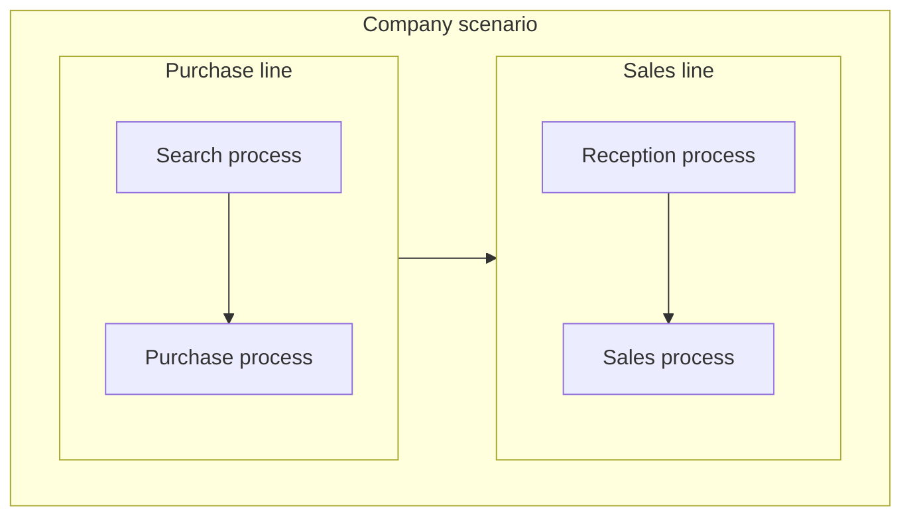
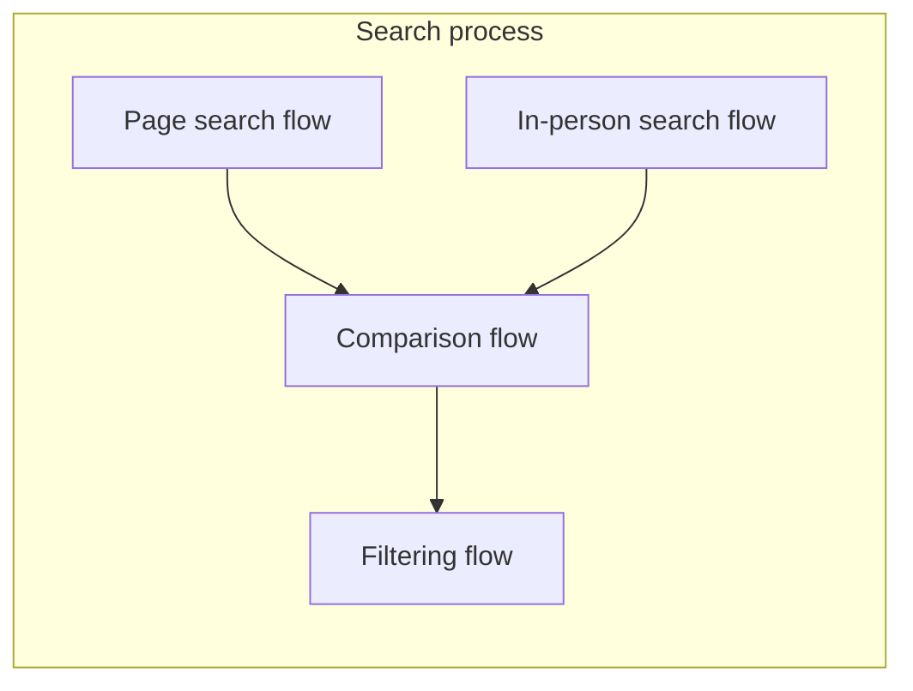
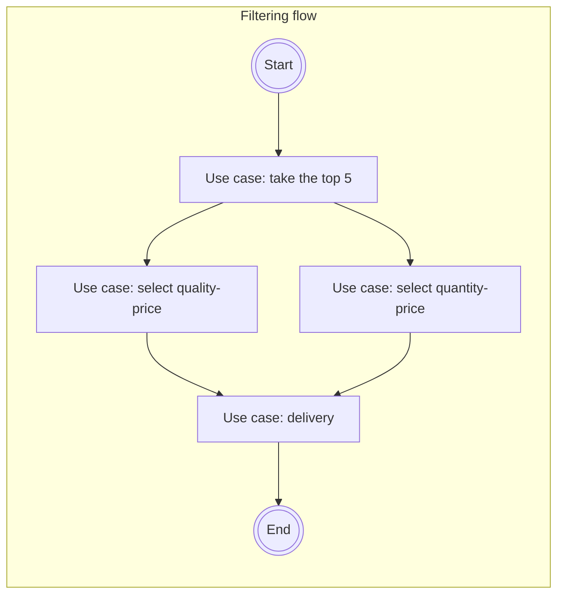

# Shared glossary

This glossary defines shared terms used across VSlices products.

Its purpose is to preserve a common language between VSlices Design, VSlices Docs Standard, VSlices Method, and VSlices Framework.

These terms help connect domain discovery, documentation, architecture, implementation, and evolution without forcing each product to redefine the same concepts.

## Suite concepts

- __Continuity__: the preservation of understanding across discovery, documentation, design, architecture, implementation, validation, and evolution.

- __Architectural intent__: the reasoning behind architectural structure, boundaries, decisions, and tradeoffs that should remain understandable as the system evolves.

- __Progressive architecture__: an approach where architectural structure is introduced gradually as the domain, risks, and implementation needs justify it.

## Core domain-to-software terms

- __Scenario__: answers _where are we working?_. It represents the business, organizational, operational, or system context where knowledge is being observed.

    A scenario may include companies, ecosystems, departments, systems, constraints, people, and surrounding conditions.

- __Work Line__: answers _what do we offer or operate?_. It represents an area, department, service, business line, value stream, or stable offering inside a scenario.

    A work line helps identify what the organization provides or maintains.

- __Work Process__: answers _how do we do it?_. It represents the responsibilities, roles, coordination rules, and operational structure used to execute a work line.

    A work process explains how people, areas, or systems organize work to produce value.

- __Workflow__: answers _what is done?_. It represents the concrete sequence of steps, decisions, handoffs, and responsible participants inside a work process.

    A workflow makes visible how work moves from one state, actor, system, or responsibility to another.

- __Use Case__: answers _what does this behavior mean?_. It represents the expected consequence, validations, rules, outcomes, and domain meaning of an interaction or operation.

    A use case explains why a behavior matters and what must be true for it to be valid.

## Supporting concepts

- __Actor__: a person, role, system, organization, or external participant that takes part in a scenario, work process, workflow, or use case.

- __Responsibility__: an expected duty, decision, action, or ownership assigned to an actor, role, area, or system.

- __Handoff__: a point where work moves from one actor, role, area, system, or responsibility to another.

- __Boundary__: a limit that separates contexts, responsibilities, concepts, systems, decisions, or ownership areas.

- __Capability__: a stable ability required by the business or system. A capability describes what must be possible, independently from the specific implementation that provides it.

- __Feature__: a concrete behavior, action, or vertical slice that delivers value or supports a validated need inside a domain context.

- __Flow__: a directed movement of work, data, behavior, or control through a system or process.

!!! note "Consider the context"

    In documentation, a flow may describe business movement.

    In implementation, it may become an executable structure.

## Knowledge concepts

- __Domain Language__: the words and meanings used by people who understand or operate the domain.

- __Assumption__: something the team currently believes to be true but has not fully validated.

- __Risk__: a possible source of failure, misunderstanding, cost, delay, rework, or accidental complexity.

- __Decision__: a selected direction made under a specific context, with accepted tradeoffs and consequences.

- __Validation__: evidence gathered to confirm, reject, or refine an assumption, decision, behavior, document, implementation, or product idea.

- __Feedback__: knowledge produced after a document, decision, feature, workflow, or implementation is used, reviewed, tested, or delivered.

## Relationship between the core terms

The core terms usually move from broad context to concrete behavior:

Let's detail the search process...

Let's detail the filtering flow...

This does not mean every iteration must document all levels. The sequence only describes how knowledge can become more specific.

* A team may start from a scenario when the domain is unclear.
* A team may start from a workflow when the work is already visible.
* A team may start from a use case when the expected behavior is already known.

The important part is to keep the chosen concept connected to the knowledge that supports it.
