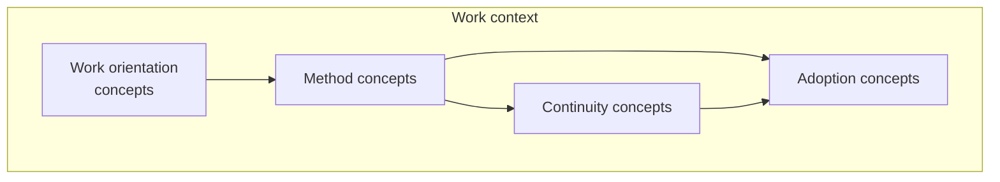
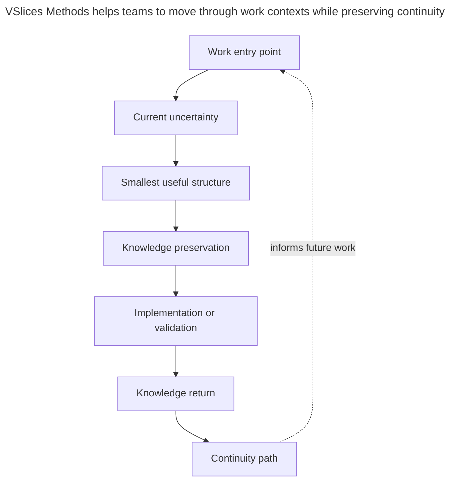

# VSlices Method glossary

This glossary defines terms used by VSlices Method.

VSlices Method focuses on how VSlices Design, VSlices Docs Standard, and VSlices Framework can be used during real work to preserve continuity across discovery, documentation, design, architecture, implementation, validation, and evolution.

These terms help describe how teams move through uncertainty without forcing a rigid process.

## How to read this glossary

Term family group relations

 

This diagram shows a reading path, not a mandatory process.

* **[Method concepts](#method-concepts)**: describe how work moves through uncertainty.
* **[Work orientation concepts](#work-orientation-concepts)**: describe where work can start.
* **[Continuity concepts](#continuity-concepts)**: describe how knowledge stays connected over time.
* **[Adoption concepts](#adoption-concepts)**: describe how much structure is useful in a given context.

A team may begin from context, a problem, a slice, a validation result, an existing implementation, or an adoption concern. The important part is that work remains connected to the knowledge that explains why it exists and how it should evolve.

## Method concepts

These concepts help teams decide how to move through a work context without relying on a rigid process.

* **Continuity path**: the connected path followed by a piece of work across discovery, design reasoning, documentation, architecture, implementation, validation, and evolution.

* **Work entry point**: the place where a team begins a piece of work, such as a scenario, problem, workflow, use case, document, decision, implementation slice, or validation result.

* **Current uncertainty**: the most important lack of understanding that makes the next decision, document, design, or implementation risky.

* **Smallest useful structure**: the minimum amount of process, documentation, design, or implementation structure needed to preserve the knowledge future work depends on.

* **Method guidance**: practical guidance for deciding how to use VSlices products in a specific working context without enforcing a universal process.

## Work orientation concepts

These concepts help identify where work starts, setting an orientation for the team.

* **Context-oriented work**: work that starts from understanding the surrounding scenario, business environment, organization, operation, system, or constraints before narrowing into a specific problem or implementation.

* **Problem-oriented work**: work that starts from a visible tension, need, risk, question, failure, or opportunity that needs to be understood before deciding what to build.

* **Slice-oriented work**: work that starts from a small useful slice of implementation, documentation, validation, or delivery in order to learn safely from real feedback.

* **Validation-oriented work**: work that starts from the need to confirm, reject, or refine an assumption, decision, document, behavior, implementation, or product idea.

* **Evolution-oriented work**: work that starts from changing, extending, correcting, replacing, or improving existing knowledge, documentation, architecture, or implementation.

## Continuity concepts

These concepts help preserve and reconnect domain knowledge, making work understandable after decisions, implementation, or validation.

* **Knowledge preservation**: the act of keeping important understanding available for future work, especially when decisions, behaviors, boundaries, risks, or validations may be forgotten.

* **Knowledge return**: the act of bringing learning from implementation, validation, usage, review, or feedback back into documentation, design reasoning, decisions, and future work.

* **Continuity break**: a point where discovery, documentation, design reasoning, architecture, implementation, validation, or evolution become disconnected from each other.

* **Continuity loop**: the recurring movement from understanding to documentation, design, implementation, validation, learning, and improved understanding.

* **Traceable work**: work whose context, decisions, behavior, documentation, implementation, validation, and future changes can still be followed after the work is done.

## Adoption concepts

These concepts help adjust the amount of structure without adding unnecessary ceremony.

* **Progressive adoption**: adopting VSlices products, documents, patterns, or practices gradually according to real need instead of trying to use the whole suite at once.

* **Local usefulness**: the value a VSlices concept, document, method, or implementation pattern provides in the current context before it is treated as generally useful.

* **Enough structure**: the amount of structure needed to reduce confusion, preserve intent, support decisions, or enable safe evolution without adding unnecessary ceremony.

* **Over-structuring**: adding more process, documentation, abstraction, architecture, or framework structure than the current uncertainty or domain need justifies.

* **Under-structuring**: using too little structure to preserve important knowledge, causing future work to depend on memory, repeated explanations, or fragile assumptions.

## Relationship between the terms

This is not a mandatory sequence.

A team may begin from context, a problem, a slice, a document, an existing implementation, a decision, or validation feedback.

The important part is that the work remains connected to the knowledge that explains why it exists, how it should evolve, and what future work depends on.
