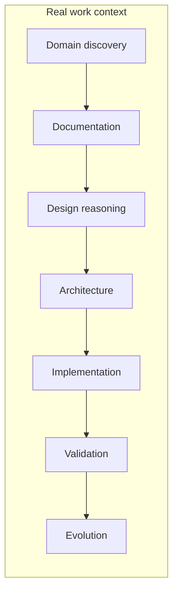

# VSlices Method

VSlices Method explains how to apply VSlices Design and VSlices Docs Standard inside real work contexts.

VSlices Method preserves continuity between stages

 

VSlices Method does not define a rigid process.

It helps teams decide how to move through uncertainty, which working mode fits the current context, and what knowledge should be preserved before moving forward.

## Purpose

VSlices Method exists to guide how teams work with changing contexts. It helps answer questions such as:

* What kind of context are we working in?
* Which design modality should guide this iteration?
* What knowledge do we need before building?
* What knowledge should be preserved while building?
* How does feedback return to the next iteration?

Method connects reasoning, documentation, collaboration, and learning. It does not replace judgment.

## Core idea

VSlices Method follows an important principle:



This means Method should not ask teams to document everything. It should help teams notice what knowledge may be lost if they move forward without preserving it.

The question is not: **Which documents are required by this stage?**, but: **What knowledge do we need to preserve to make the next responsible decision?**

## Relationship with other VSlices products

VSlices Method depends conceptually on:

* **[VSlices Design](../design/index.md)**, which defines design modalities and the shared iteration flow.
* **[VSlices Docs Standard](../docs-standard/index.md)**, which defines document types for preserving knowledge.

VSlices Framework may later implement some ideas in code, but Method does not depend on it. Method should remain useful even when no VSlices Framework code is involved.

## Structure

VSlices Method is organized around:

* **[document-stage affinity](document-stage-affinity.md)**, for understanding how documents may support each stage of work.
* **[patterns](patterns/index.md)**, for recurring Method decisions such as collaboration, modality selection, and learning loops.
* **[integration guides](context-guides/index.md)**, for applying Method in different working contexts.

These sections are guides, not mandatory process steps. Use only what helps preserve continuity for the work at hand.
