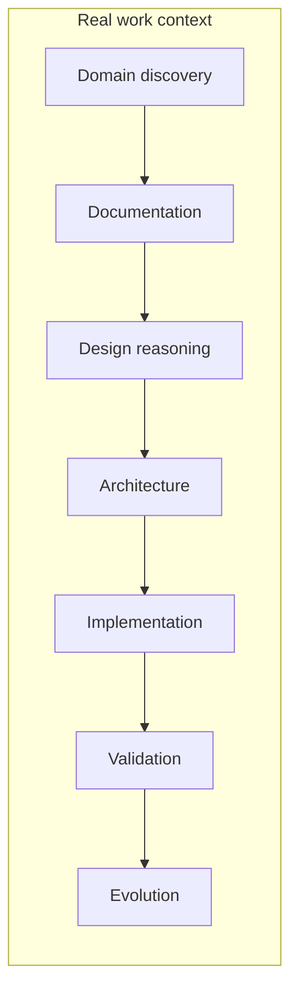

# VSlices Method

VSlices Method explains how to apply VSlices Design and VSlices Docs Standard within real work contexts.

It does not define a rigid process.

It helps teams decide how to move through uncertainty, which work mode fits the current context, and what knowledge should be preserved before moving forward.

!!! principle "Method principle"

    Use the smallest useful structure to preserve continuity during real work.

## Purpose

VSlices Method exists to guide how teams work with changing contexts.

It helps answer questions such as:

* What type of context are we addressing?
* Which design modality should guide this iteration?
* What knowledge do we need before building?
* What knowledge should be preserved while we build?
* How does feedback return to the next iteration?

Method connects reasoning, documentation, collaboration, and learning. It does not replace judgment.

## Core idea

VSlices Method preserves continuity across work stages.

VSlices Method preserves continuity across stages

This does not mean that Method forces teams to move through fixed stages.

It means that discovered, documented, designed, implemented, validated, and learned knowledge should remain connected.

The question is not: **Which documents are required by this stage?**, but: **What knowledge do we need to preserve to make the next responsible decision?**

## What it provides

VSlices Method provides:

* **work guides** for applying VSlices in real contexts without imposing a universal process
* **modality criteria** for deciding when to work from context, problem, slice, validation, or evolution
* **continuity patterns** for keeping knowledge connected between decisions, documentation, implementation, and learning
* **adoption guidance** for introducing VSlices progressively and usefully

## Relationship with the VSlices Suite

VSlices Method connects the suite products during real work.

| Product                                                | Relationship with VSlices Method                                  |
| ------------------------------------------------------ | ----------------------------------------------------------------- |
| **[VSlices Design](../design/index.md)**               | Defines design modalities and reasoning tools.                    |
| **[VSlices Docs Standard](../docs-standard/index.md)** | Defines document types for preserving knowledge.                  |
| **[VSlices Framework](../framework/index.md)**         | May reflect some ideas in code, but Method does not depend on it. |

Method should remain useful even when no VSlices Framework code is involved.

## Structure

VSlices Method is organized around:

* **[patterns](patterns/index.md)**, for recurring Method decisions such as collaboration, modality selection, and learning cycles
* **[integration guides](context-guides/index.md)**, for applying Method in different work contexts

These sections are guides, not mandatory process steps. Use only what helps preserve continuity for the work in progress.
