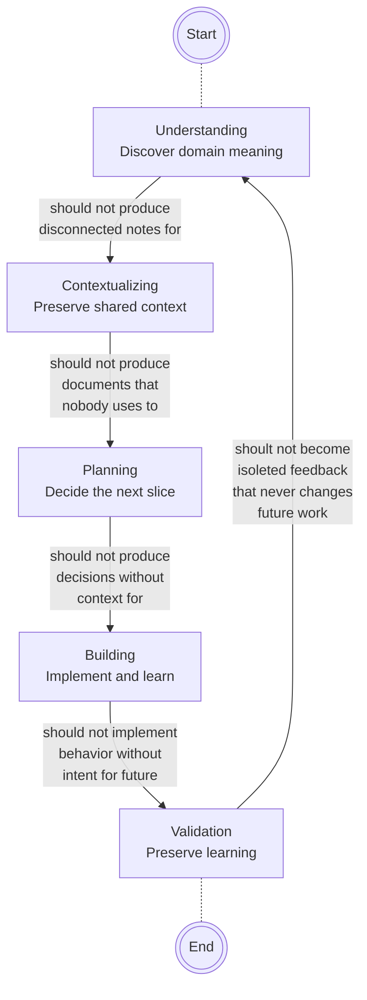

```mermaid
graph TD

  S(((Start)))

  understanding["Understanding<br/>Discover domain meaning"]
  contextualizing["Contextualizing<br/>Preserve shared context"]
  planning["Planning<br/>Decide the next slice"]

  building["Building<br/>Implement and learn"]
  validation["Validation<br/>Preserve learning"]

  F(((End)))

  S -.- understanding

  understanding -- should not produce<br/>disconnected notes for --> contextualizing
  contextualizing -- should not produce<br/>documents that<br/>nobody uses to --> planning
  planning -- should not produce<br/>decisions without<br/>context for --> building
  building -- should not implement<br/>behavior without<br/>intent for future --> validation
  validation -- shoult not become<br/>isoleted feedback<br/>that never changes<br/>future work --> understanding 

  validation -.- F

```
 
