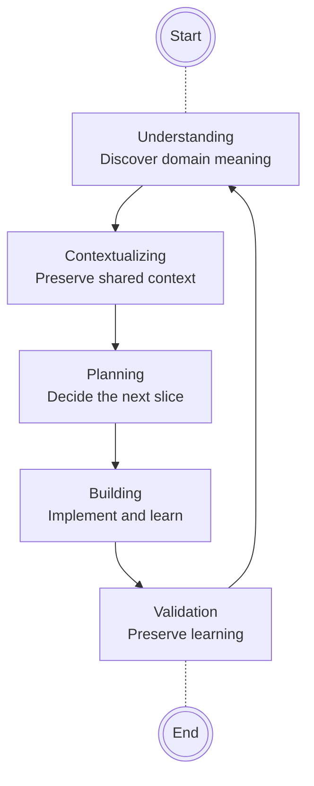

```mermaid
graph TD

  S(((Start)))

  understanding["Understanding<br/>Discover domain meaning"]
  contextualizing["Contextualizing<br/>Preserve shared context"]
  planning["Planning<br/>Decide the next slice"]

  building["Building<br/>Implement and learn"]
  validation["Validation<br/>Preserve learning"]

  F(((End)))

  S -.- understanding

  understanding --> contextualizing
  contextualizing --> planning
  planning --> building
  building --> validation
  validation --> understanding 

  validation -.- F

```
 