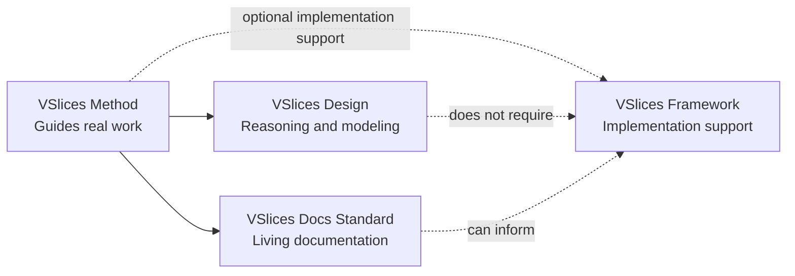

# Suite overview

VSlices is a software engineering suite composed of four connected products:

- VSlices Method
- VSlices Design
- VSlices Docs Standard
- VSlices Framework

Each product can be used independently, but they are designed to work together around the same continuity model.

The purpose of the suite is to reduce the distance between what a team discovers, documents, designs, implements, validates, and evolves.

## The continuity model

VSlices is organized around one core idea:

> Domain understanding should remain visible across documentation, architecture, implementation, and evolution.

Software systems often lose clarity when these activities evolve separately. A team may discover the domain in one place, document decisions somewhere else, discuss architecture in meetings, and implement behavior in code that no longer preserves the original reasoning.

VSlices attempts to reduce that fragmentation by keeping important knowledge connected across:

- discovery
- design reasoning
- documentation
- architecture
- implementation
- validation
- evolution

The four products support different parts of that continuity.

## How the suite connects

The suite is composed of four connected products.

VSlices Method provides the overarching continuity guidance. VSlices Design helps teams reason about systems, uncertainty, boundaries, and business behavior. VSlices Docs Standard helps preserve knowledge through living documentation structures. VSlices Framework may support implementation when executable software is needed, but it is not required for using the rest of the suite.



This relationship is intentionally lightweight. The suite is connected by a shared continuity model, not by a rigid dependency structure.

A team can use VSlices Design without VSlices Framework. A team can use VSlices Docs Standard without adopting a specific architecture. VSlices Method can guide real work even when the implementation uses plain .NET, another framework, or no software framework at all.

## The continuity loop

VSlices can also be understood as a continuity loop.

```text
Discovery
  -> Design reasoning
  -> Living documentation
  -> Implementation
  -> Validation
  -> Evolution
  -> Better understanding
  -> More Discovery
```

This is not a rigid sequence. A team may start from a business context, a problem, a document, a slice of implementation, a decision, or a piece of validation feedback.

The important part is not where the team starts. It is that knowledge does not become disconnected as the system evolves.

## Product roles

### VSlices Design

VSlices Design helps teams understand the business material before committing too early to software structure.

It provides design modalities, reasoning tools, and modeling heuristics for working with different kinds of uncertainty. Design helps answer questions such as:

* What business context are we working in?
* What problem are we actually solving?
* Do we understand enough to build safely?
* Should we explore broadly, analyze a specific problem, or build a small slice to learn?

Design is intentionally independent from VSlices Framework, Docs Standard, and Method. A team can use VSlices Design even if it never uses the rest of the suite.

### VSlices Docs Standard

VSlices Docs Standard helps preserve important knowledge through living documentation structures.

It defines document types for knowledge such as:

* domain language
* contexts
* processes
* use cases
* capabilities
* decisions
* validation
* support notes

Docs Standard does not exist to make teams produce more documents. It exists to help teams preserve the knowledge that future work depends on.

### VSlices Method

VSlices Method explains how Design and Docs Standard can be used during real work. It helps teams decide:

* what kind of context they are working in
* which design modality fits the current uncertainty
* what knowledge should be preserved
* how documentation supports decisions
* how implementation feedback returns to understanding

Method is not a rigid process. It provides guidance for preserving continuity while the team moves through uncertainty.

### VSlices Framework

VSlices Framework is the .NET implementation product. It provides libraries, primitives, and patterns for reflecting domain-oriented knowledge in executable software.

The Framework may include concepts such as:

* flows
* features
* explicit errors
* runtime requirements
* domain types
* traits
* capabilities
* functional composition

The Framework should not hide engineering concepts. It should make useful patterns easier to compose, standardize, test, and evolve.

## A simplified example

A team may start with an unclear business process.

* VSlices Design helps the team understand the context, responsibilities, language, and uncertainty.
* VSlices Docs Standard helps preserve that understanding through context documents, process documents, use case documents, decision records, or validation notes.
* VSlices Method helps the team decide how much structure is useful for the current iteration.
* VSlices Framework may later help implement the behavior with explicit flows, expected errors, domain types, and capabilities.

After implementation, validation may reveal that the original understanding was incomplete. That learning should return to the documents, decisions, design model, and future implementation.

This is the continuity loop.

## Independent adoption

A team does not need to adopt the whole suite at once. A team may use:

* VSlices Design to improve discovery and modeling.
* VSlices Docs Standard to improve documentation structure.
* VSlices Method to guide collaboration and learning.
* VSlices Framework to implement domain-oriented .NET software.

The suite is progressive and composable. Adoption should follow real need, not product completeness.

## Core principle

The four products share one principle:

> Use the smallest useful structure that preserves the knowledge future work depends on.

VSlices does not try to make every team follow the same workflow, architecture, or documentation process.

It tries to help teams keep domain intent, decisions, documentation, implementation, and learning connected as the system changes.
