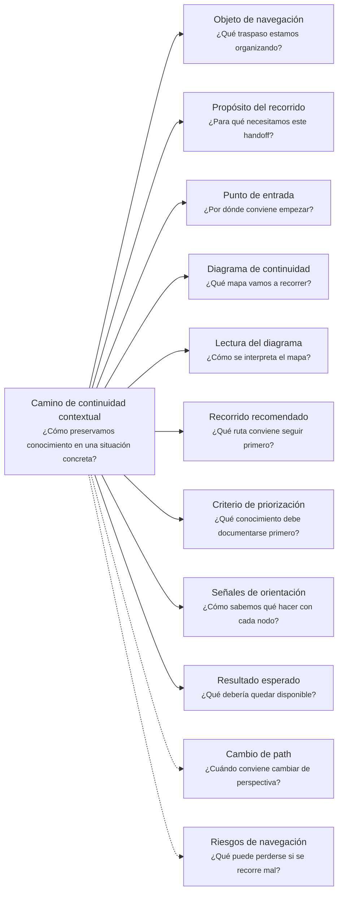
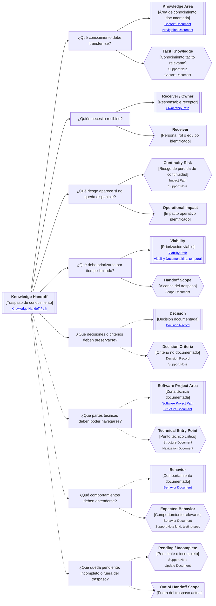

# Camino de continuidad "Knowledge Handoff" de <tema>

## Organización



## Objeto de navegación

<!--
¿Qué traspaso estamos organizando?

Indicar la persona, equipo, proyecto, sistema, célula, responsabilidad o contexto cuyo conocimiento debe transferirse.
-->

Este documento orienta la lectura del Camino de continuidad contextual "Knowledge Handoff" para `<tema>`.

## Propósito del recorrido

<!--
¿Para qué necesitamos este handoff?

Explicar qué continuidad se busca preservar cuando una persona, rol o equipo deja de estar disponible.
-->

Este path busca preservar continuidad cuando una persona, rol o equipo posee conocimiento relevante que debe quedar disponible para otros bajo restricciones reales de tiempo, capacidad o prioridad.

Ayuda a responder:

> ¿Qué conocimiento debe quedar disponible para que el equipo pueda continuar sin depender de una persona específica?

Este path no intenta documentar todo lo que alguien sabe.

Intenta identificar qué conocimiento, si se pierde, afecta continuidad operativa, técnica, de producto, de dominio o de decisión.

## Punto de entrada

<!--
¿Por dónde conviene empezar?

Indicar desde qué situación concreta nace el handoff.
-->

El recorrido debería comenzar desde la situación concreta que genera el traspaso.

Ejemplos:

* salida de una persona del equipo
* cambio de célula
* reemplazo de responsable técnico
* cierre de participación en un proyecto
* traspaso entre equipos
* rotación de ownership
* pérdida de disponibilidad de una persona clave
* transición operacional
* entrega de conocimiento antes de una fecha límite
* preparación de soporte para continuidad futura

## Diagrama de continuidad

<!--
¿Qué mapa vamos a recorrer?

Incluir el Diagrama de Camino de Continuidad asociado a Knowledge Handoff.
El diagrama debe mostrar preguntas de orientación, conceptos relacionados y estado documental de los conceptos conectados.
-->



## Lectura del diagrama

<!--
¿Cómo se interpreta el mapa?

Explicar brevemente cómo leer la semántica visual del Diagrama de Camino de Continuidad.
-->

| Forma       | Significado                                           | Qué hacer al encontrarla                                         |
| ----------- | ----------------------------------------------------- | ---------------------------------------------------------------- |
| `[[texto]]` | Concepto documentado                                  | Revisar el artifact asociado y decidir si sirve para el traspaso |
| `[texto]`   | Pregunta orientadora u orientación definida           | Usarla para priorizar el recorrido                               |
| `>texto]`   | Concepto identificado sin necesidad documental actual | Mantenerlo visible sin documentarlo todavía                      |
| `{{texto}}` | Concepto identificado con necesidad documental        | Evaluar si debe documentarse para no perder continuidad          |

## Recorrido recomendado

<!--
¿Qué ruta conviene seguir primero?

Describir el recorrido principal recomendado para organizar el handoff sin intentar documentarlo todo.
-->

| Orden | Nodo, artifact o concepto  | Por qué revisarlo                                                              |
| ----- | -------------------------- | ------------------------------------------------------------------------------ |
| 1     | Situación de handoff       | Permite entender por qué el traspaso existe y qué restricción lo condiciona    |
| 2     | Áreas de conocimiento      | Permite identificar qué conocimiento relevante posee la persona, rol o equipo  |
| 3     | Receptores u owners        | Permite saber quién necesita recibir, validar o mantener el conocimiento       |
| 4     | Riesgos de continuidad     | Permite priorizar lo que puede romper operación, soporte, decisión o evolución |
| 5     | Viabilidad temporal        | Permite decidir qué cabe en el tiempo disponible                               |
| 6     | Alcance del traspaso       | Permite separar lo que entra, queda fuera o queda pendiente                    |
| 7     | Decisiones y criterios     | Permite preservar por qué se trabaja de cierta forma                           |
| 8     | Puntos técnicos críticos   | Permite navegar zonas del proyecto que otros necesitarán tocar                 |
| 9     | Comportamientos relevantes | Permite entender qué debe ocurrir y cómo reconocer fallos                      |
| 10    | Pendientes e incompletos   | Permite dejar claro qué no alcanzó a transferirse                              |

## Criterio de priorización

<!--
¿Qué conocimiento debe documentarse primero?

Explicar cómo decidir qué entra primero en un handoff.
-->

El conocimiento del handoff debería priorizarse por riesgo de pérdida de continuidad, no por cantidad de información disponible.

Conviene documentar primero aquello que cumple una o más de estas condiciones:

* solo una persona lo entiende
* bloquea operación o soporte
* afecta decisiones frecuentes
* afecta comportamiento crítico
* afecta entregas pendientes
* afecta sistemas o integraciones difíciles de diagnosticar
* contiene criterios no escritos
* explica por qué algo se hizo de una forma específica
* permite que otra persona continúe una tarea sin depender del emisor
* sería costoso reconstruir después

Regla simple:

> No documentamos todo lo que alguien sabe.
> Documentamos lo que el equipo necesita para no perder continuidad.

## Señales de orientación

<!--
¿Cómo sabemos qué hacer con cada nodo?

Registrar señales que ayudan a decidir si conviene seguir, detenerse, documentar, ignorar temporalmente o cambiar de path.
-->

| Señal                                            | Acción sugerida                                          |
| ------------------------------------------------ | -------------------------------------------------------- |
| Nadie más entiende un tema                       | Priorizar como conocimiento crítico                      |
| Hay poco tiempo de traspaso                      | Usar Viability kind: temporal                            |
| El tema afecta operación real                    | Usar Viability kind: operational o Impact                |
| El conocimiento depende de una persona           | Usar Ownership                                           |
| Hay decisiones no registradas                    | Crear Decision Record o Support Note                     |
| El equipo necesita navegar código                | Usar Software Project y Structure Document               |
| El equipo necesita entender comportamiento       | Usar Behavior Document o Support Note kind: testing-spec |
| El tema es amplio e imposible de cubrir completo | Crear Scope Document de handoff                          |
| Algo queda fuera por tiempo                      | Registrarlo como fuera de alcance o pendiente            |
| Un riesgo es alto pero no puede resolverse ahora | Registrar Support Note o Update Document                 |
| El conocimiento ya está documentado              | Referenciarlo en vez de duplicarlo                       |
| El conocimiento solo necesita visibilidad        | Usar nodo `>texto]` y no crear artifact nuevo            |

## Cambio de path

<!--
¿Cuándo conviene cambiar de perspectiva?

Indicar señales que sugieren que otro Continuity Path podría preservar mejor la continuidad buscada.
-->

| Señal                                                                | Path sugerido              |
| -------------------------------------------------------------------- | -------------------------- |
| La pregunta pasa a ser quién entiende, decide o mantiene             | Ownership                  |
| La pregunta pasa a ser qué se ve afectado si falta este conocimiento | Impact                     |
| La pregunta pasa a ser de dónde viene una decisión o implementación  | Traceability               |
| La pregunta pasa a ser si el traspaso cabe en el tiempo disponible   | Viability                  |
| La pregunta pasa a ser qué alcance entra o queda fuera               | Evolution o Scope Document |
| La pregunta pasa a ser cómo vive técnicamente en el proyecto         | Software Project           |
| La pregunta pasa a ser qué comportamiento debe entenderse            | Behavior Document          |
| La pregunta pasa a ser qué parte del negocio explica el conocimiento | Business Scenario          |
| La pregunta pasa a ser qué lenguaje o reglas pertenecen al dominio   | Domain Context             |
| La pregunta pasa a ser cómo navegar una colección de artifacts       | Navigation Document        |

## Resultado esperado

<!--
¿Qué debería quedar disponible?

Indicar qué claridad, orientación o continuidad debería preservarse después de recorrer el path.
-->

Al terminar este recorrido debería quedar disponible:

* qué conocimiento fue transferido
* qué conocimiento era crítico
* quién debe recibir, validar o mantener cada parte
* qué riesgos de continuidad fueron identificados
* qué partes se priorizaron por tiempo, valor o riesgo
* qué decisiones o criterios quedaron preservados
* qué zonas técnicas pueden ser navegadas por el equipo
* qué comportamientos relevantes quedaron explicados
* qué quedó pendiente, incompleto o fuera del traspaso
* qué artifacts existentes deben revisarse
* qué artifacts nuevos fueron necesarios
* qué no se documentó porque no era viable o no era prioritario

## Riesgos de navegación

<!--
¿Qué puede perderse si se recorre mal?

Registrar riesgos de usar el handoff como inventario infinito o como trámite superficial.
-->

| Riesgo de navegación                              | Consecuencia                                                       |
| ------------------------------------------------- | ------------------------------------------------------------------ |
| Intentar documentar todo lo que una persona sabe  | El handoff se vuelve infinito e inviable                           |
| Documentar solo lo más fácil                      | El conocimiento crítico puede quedar fuera                         |
| No priorizar por riesgo de continuidad            | Se gasta tiempo en información de bajo valor                       |
| No definir receptores                             | El conocimiento queda escrito pero no transferido                  |
| No registrar pendientes                           | El equipo asume que todo quedó cubierto                            |
| No registrar decisiones tácitas                   | Se pierde el porqué de la forma actual de trabajo                  |
| Duplicar documentación existente                  | Se genera ruido y riesgo de divergencia                            |
| No separar alcance del handoff                    | El traspaso se vuelve ambiguo                                      |
| Tratar todo como urgente                          | Se pierde capacidad de priorizar                                   |
| Usar el handoff como auditoría personal           | Se transforma en defensa individual y no en continuidad del equipo |
| Interpretar `{{texto}}` como obligación inmediata | Se genera documentación prematura                                  |
| Interpretar `>texto]` como deuda documental       | Se burocratiza conocimiento que solo necesitaba visibilidad        |

## Principio de continuidad

!!! principle "Principio de Continuidad"

```
Un Knowledge Handoff debería ayudar a preservar el conocimiento necesario para que un equipo pueda continuar operando, decidiendo y evolucionando sin depender de una persona específica, priorizando por riesgo de continuidad y viabilidad real de traspaso.
```
