---
artifact:
  kind: continuity-path
  type: knowledge-handoff
  scope: handoff
  target: <handoff-situation-name>
  language: <es|en>

metadata:
  status: <draft|candidate|active|deprecated|superseded>
  relates: []

continuity:
  question: ¿Qué conocimiento debe quedar disponible para que el equipo pueda continuar?
  preserves: handoff-continuity
  connects:
    - artifact: <artifact-id>
      role: <knowledge-area|tacit-knowledge|external-knowledge-source|receiver-owner|receiver|receiver-gap|continuity-risk|operational-impact|risk-validation|viability|handoff-scope|decision|decision-criteria|consistency-criteria|software-project-area|technical-entry-point|service-consumption|behavior|expected-behavior|critical-capability|pending-incomplete|out-of-handoff-scope>

tooling:
  schema:
    version: 0.1.0
  template:
    name: knowledge-handoff.continuity-path
    version: 0.1.0
---

# Camino de continuidad "Knowledge Handoff" de <tema>

## Propósito del recorrido

<!--
¿Para qué necesitamos este handoff?

Explicar qué continuidad se busca preservar cuando una persona, rol o equipo deja de estar disponible.
-->

Este path busca preservar continuidad cuando una persona, rol o equipo posee conocimiento relevante que debe quedar disponible para otros bajo restricciones reales de tiempo, capacidad o prioridad.

Ayuda a responder:

> ¿Qué conocimiento debe quedar disponible para que el equipo pueda continuar sin depender de una persona específica?

Este path no intenta documentar todo lo que alguien sabe.

Intenta identificar qué conocimiento, si se pierde, afecta continuidad operativa, técnica, de producto, de dominio o de decisión.

Es especialmente útil cuando existe una salida del equipo, cambio de célula, rotación de ownership, transición operacional, cierre de participación o pérdida de disponibilidad de una persona clave.

## Punto de entrada

<!--
¿Por dónde empieza este camino?

Indicar la situación concreta que genera el handoff: salida, cambio de rol, traspaso, rotación de ownership, transición operacional o pérdida de disponibilidad.
-->

## Diagrama de continuidad

<!--
¿Qué mapa vamos a recorrer?

Incluir el Diagrama de Camino de Continuidad asociado a Knowledge Handoff.
El diagrama debe mostrar preguntas de orientación, conceptos relacionados y estado documental de los conceptos conectados.
-->

```mermaid
flowchart LR
    A[["<b>Knowledge Handoff</b><br/>[Traspaso de conocimiento]<br/><small><a href='link'>Knowledge Handoff Path</a><br/>Scope Document<br/>Navigation Document</small>"]]

    A --> P1["¿Qué conocimiento debe transferirse?"]
    A --> P2["¿Quién necesita recibirlo?"]
    A --> P3["¿Qué riesgo aparece si no queda disponible?"]
    A --> P4["¿Qué debe priorizarse por tiempo limitado?"]
    A -.-> P5["¿Qué decisiones o criterios deben preservarse?"]
    A -.-> P6["¿Qué partes técnicas deben poder navegarse?"]
    A -.-> P7["¿Qué comportamientos deben entenderse?"]
    A -.-> P8["¿Qué queda pendiente, incompleto o fuera del traspaso?"]

    P1 --> K1[["<b>Knowledge Area</b><br/>[Área de conocimiento documentada]<br/><small><a href='link'>Context Document</a><br/><a href='link'>Navigation Document</a></small>"]]
    P1 --> K2{{"<b>Tacit Knowledge</b><br/>[Conocimiento tácito relevante]<br/><small>Support Note kind: draft<br/>Support Note kind: risk<br/>Context Document<br/>Domain Vocabulary</small>"}}
    P1 -.-> K3{{"<b>External Knowledge Source</b><br/>[Fuente externa de conocimiento]<br/><small>Support Note kind: external<br/>Navigation Document</small>"}}

    P2 --> O1[["<b>Receiver / Owner</b><br/>[Responsable receptor]<br/><small><a href='link'>Ownership Path</a></small>"]]
    P2 --> O2>"<b>Receiver</b><br/>[Persona, rol o equipo identificado]"]
    P2 -.-> O3{{"<b>Receiver Gap</b><br/>[Receptor no claro]<br/><small>Ownership Path<br/>Support Note kind: risk<br/>Viability Document kind: organizational</small>"}}

    P3 --> I1{{"<b>Continuity Risk</b><br/>[Riesgo de pérdida de continuidad]<br/><small>Impact Path<br/>Support Note kind: risk<br/>Viability Document kind: operational</small>"}}
    P3 --> I2>"<b>Operational Impact</b><br/>[Impacto operativo identificado]"]
    P3 -.-> I3{{"<b>Risk Validation</b><br/>[Riesgo a validar]<br/><small>Support Note kind: validation<br/>Support Note kind: result</small>"}}

    P4 --> V1[["<b>Viability</b><br/>[Priorización viable]<br/><small><a href='link'>Viability Path</a><br/><a href='link'>Viability Document kind: temporal</a><br/>Viability Document kind: organizational</small>"]]
    P4 --> S1{{"<b>Handoff Scope</b><br/>[Alcance del traspaso]<br/><small>Scope Document<br/>Support Note kind: risk</small>"}}

    P5 -.-> D1[["<b>Decision</b><br/>[Decisión documentada]<br/><small><a href='link'>Decision Record</a></small>"]]
    P5 -.-> D2{{"<b>Decision Criteria</b><br/>[Criterio no documentado]<br/><small>Decision Record<br/>Support Note kind: draft<br/>Support Note kind: risk</small>"}}
    P5 -.-> C1{{"<b>Consistency Criteria</b><br/>[Regla o criterio a preservar]<br/><small>Consistency Document<br/>Behavior Document</small>"}}

    P6 -.-> T1[["<b>Software Project Area</b><br/>[Zona técnica documentada]<br/><small><a href='link'>Software Project Path</a><br/><a href='link'>Structure Document</a></small>"]]
    P6 -.-> T2{{"<b>Technical Entry Point</b><br/>[Punto técnico crítico]<br/><small>Structure Document<br/>Navigation Document<br/>Support Note kind: external<br/>Support Note kind: risk</small>"}}
    P6 -.-> T3{{"<b>Service Consumption</b><br/>[Consumo técnico crítico]<br/><small>Service Consumption Nexus<br/>Consumable Service Path<br/>Support Note kind: external</small>"}}

    P7 -.-> B1[["<b>Behavior</b><br/>[Comportamiento documentado]<br/><small><a href='link'>Behavior Document</a></small>"]]
    P7 -.-> B2{{"<b>Expected Behavior</b><br/>[Comportamiento relevante]<br/><small>Behavior Document<br/>Support Note kind: testing-spec<br/>Support Note kind: validation<br/>Support Note kind: risk</small>"}}
    P7 -.-> B3{{"<b>Critical Capability</b><br/>[Capacidad crítica a entender]<br/><small>Capability Nexus</small>"}}

    P8 -.-> PND{{"<b>Pending / Incomplete</b><br/>[Pendiente o incompleto]<br/><small>Support Note kind: draft<br/>Support Note kind: risk<br/>Support Note kind: result<br/>Update Document</small>"}}
    P8 -.-> EXC>"<b>Out of Handoff Scope</b><br/>[Fuera del traspaso actual]"]
    P8 -.-> OS1{{"<b>Out of Handoff Scope</b><br/>[Exclusión explícita]<br/><small>Scope Document<br/>Decision Record</small>"}}
```

## Recorrido recomendado

<!--
¿Qué ruta conviene seguir primero?

Describir el recorrido principal recomendado para organizar el handoff sin intentar documentarlo todo.
-->

| Orden | Nodo, artifact o concepto  | Por qué revisarlo                                                              |
| ----- | -------------------------- | ------------------------------------------------------------------------------ |
| 1     | Situación de handoff       | Permite entender por qué el traspaso existe y qué restricción lo condiciona    |
| 2     | Áreas de conocimiento      | Permite identificar qué conocimiento relevante posee la persona, rol o equipo  |
| 3     | Receptores u owners        | Permite saber quién necesita recibir, validar o mantener el conocimiento       |
| 4     | Riesgos de continuidad     | Permite priorizar lo que puede romper operación, soporte, decisión o evolución |
| 5     | Viabilidad temporal        | Permite decidir qué cabe en el tiempo disponible                               |
| 6     | Alcance del traspaso       | Permite separar lo que entra, queda fuera o queda pendiente                    |
| 7     | Decisiones y criterios     | Permite preservar por qué se trabaja de cierta forma                           |
| 8     | Puntos técnicos críticos   | Permite navegar zonas del proyecto que otros necesitarán tocar                 |
| 9     | Comportamientos relevantes | Permite entender qué debe ocurrir y cómo reconocer fallos                      |
| 10    | Pendientes e incompletos   | Permite dejar claro qué no alcanzó a transferirse                              |

## Handoff, ownership y continuidad

<!--
¿Cómo se distingue Knowledge Handoff de Ownership, Impact o documentación general?

Usar esta sección para evitar que el handoff intente documentar todo lo que una persona sabe.
-->

| Concepto              | Cómo se interpreta                                                               | Cuándo usarlo                                                                           |
| --------------------- | -------------------------------------------------------------------------------- | --------------------------------------------------------------------------------------- |
| Knowledge Handoff     | Traspaso priorizado de conocimiento relevante bajo restricciones reales          | Cuando una persona, rol o equipo deja de estar disponible o cambia su responsabilidad   |
| Knowledge Area        | Área de conocimiento que necesita quedar disponible                              | Cuando el equipo debe poder navegar una parte del negocio, producto, servicio o sistema |
| Tacit Knowledge       | Conocimiento relevante que vive en personas y no está suficientemente preservado | Cuando perderlo puede afectar continuidad                                               |
| Receiver / Owner      | Persona, rol o equipo que recibe o sostiene el conocimiento                      | Cuando el handoff necesita receptor claro                                               |
| Continuity Risk       | Riesgo producido por no transferir cierto conocimiento                           | Cuando hay que priorizar qué traspasar primero                                          |
| Handoff Scope         | Límite de lo que entra, queda fuera o queda pendiente en el traspaso             | Cuando el tiempo o capacidad no permiten transferir todo                                |
| Technical Entry Point | Punto técnico que permite navegar una zona crítica del proyecto                  | Cuando el receptor necesita ubicarse rápidamente en la solución                         |
| Pending / Incomplete  | Conocimiento o artifact que no alcanzó a cerrarse                                | Cuando debe quedar explícito qué no fue transferido completamente                       |

## Conceptos complementarios

<!--
¿Qué elementos relacionados ayudan a entender este handoff sin pertenecer necesariamente a la ruta principal?

Usar esta sección solo cuando existan elementos relevantes para preservar continuidad.
No convertirla en lista exhaustiva.
-->

| Concepto complementario | Relación con el handoff | Path o artifact sugerido |
| ----------------------- | ----------------------- | ------------------------ |
| <concepto>              | <relación>              | <path o artifact>        |
