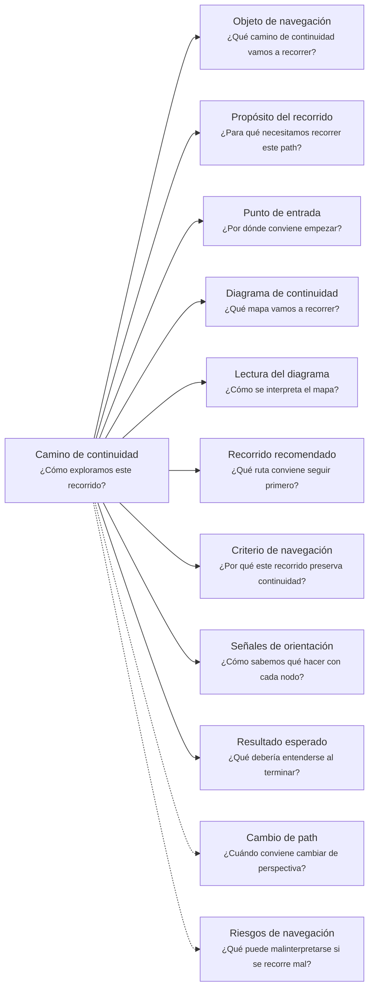
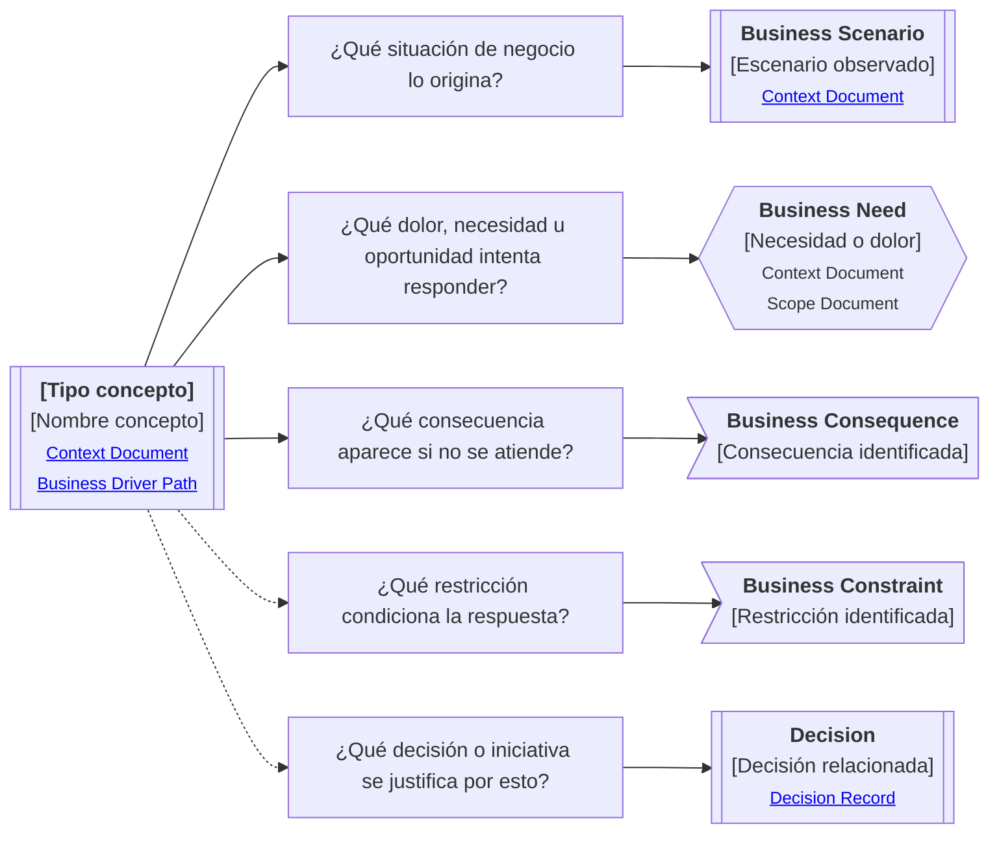

# Camino de continuidad "Motivación de negocio" de <tema>

## Organización

## Objeto de navegación

<!--
¿Qué camino de continuidad vamos a recorrer?

Indicar que este documento orienta la lectura del Business Driver Continuity Path asociado al concepto, artifact, decisión, capacidad, problema o iniciativa indicada.
-->

Este documento orienta la lectura del Camino de continuidad de Motivación de negocio para `<tema>`.

## Propósito del recorrido

<!--
¿Para qué necesitamos recorrer este path?

Explicar qué continuidad de negocio se busca preservar.
No explicar todavía el contexto completo del negocio; eso pertenece a un Documento de Contexto.
-->

Este path busca preservar continuidad entre `<tema>` y la situación de negocio que lo origina, justifica o afecta.

Ayuda a evitar que el concepto se entienda solo como una solución, artifact, decisión técnica o comportamiento aislado, perdiendo la necesidad, dolor, oportunidad, restricción o consecuencia de negocio que le da sentido.

## Punto de entrada

<!--
¿Por dónde conviene empezar?

Indicar el concepto raíz desde donde parte el recorrido.
-->

El recorrido debería comenzar desde el concepto raíz que se quiere seguir.

Ese concepto puede ser:

* un problema
* una necesidad
* una oportunidad
* una restricción
* una capacidad
* una decisión
* una feature
* un artifact
* una iniciativa
* un cambio observado

## Diagrama de continuidad

<!--
¿Qué mapa vamos a recorrer?

Incluir el Diagrama de Camino de Continuidad asociado al Business Driver.
El diagrama debe mostrar preguntas de orientación, conceptos relacionados y estado documental de los conceptos conectados.
-->

## Lectura del diagrama

<!--
¿Cómo se interpreta el mapa?

Explicar brevemente cómo leer la semántica visual del Diagrama de Camino de Continuidad.
-->

| Forma       | Significado                                           | Qué hacer al encontrarla                                                                 |
| ----------- | ----------------------------------------------------- | ---------------------------------------------------------------------------------------- |
| `[[texto]]` | Concepto documentado                                  | Revisar los artifacts asociados si son relevantes para entender la motivación de negocio |
| `[texto]`   | Pregunta orientadora u orientación definida           | Usarla para decidir qué aspecto de la motivación de negocio revisar                      |
| `>texto]`   | Concepto identificado sin necesidad documental actual | Mantenerlo visible sin documentarlo todavía                                              |
| `{{texto}}` | Concepto identificado con necesidad documental        | Evaluar si debe documentarse para no perder intención de negocio                         |

## Recorrido recomendado

<!--
¿Qué ruta conviene seguir primero?

Describir el recorrido principal recomendado para entender el path sin duplicar el contenido de los artifacts conectados.
-->

| Orden | Nodo, artifact o concepto          | Por qué revisarlo                                        |
| ----- | ---------------------------------- | -------------------------------------------------------- |
| 1     | Concepto raíz                      | Permite identificar qué estamos siguiendo                |
| 2     | Situación de negocio               | Permite entender dónde aparece la motivación             |
| 3     | Dolor, necesidad u oportunidad     | Permite entender por qué el concepto importa             |
| 4     | Consecuencia de negocio            | Permite entender qué se pierde si no se atiende          |
| 5     | Restricción o decisión relacionada | Permite entender qué condiciona o justifica la respuesta |

## Criterio de navegación

<!--
¿Por qué este recorrido preserva continuidad?

Explicar la lógica del recorrido recomendado y qué pérdida de intención ayuda a evitar.
-->

Este recorrido preserva continuidad porque conecta el concepto con su razón de negocio.

Ayuda a evitar que una solución, decisión, feature o artifact sea evaluado sin recordar qué situación intentaba mejorar, qué dolor respondía o qué consecuencia buscaba evitar.

## Señales de orientación

<!--
¿Cómo sabemos qué hacer con cada nodo?

Registrar señales que ayudan a decidir si conviene seguir, detenerse, documentar, ignorar temporalmente o cambiar de path.
-->

| Señal                                                         | Acción sugerida                                                                       |
| ------------------------------------------------------------- | ------------------------------------------------------------------------------------- |
| El concepto raíz no tiene contexto de negocio claro           | Revisar o crear un Context Document                                                   |
| Aparece un dolor o necesidad como `{{texto}}`                 | Evaluar documentación antes de avanzar                                                |
| Aparece una consecuencia como `>texto]`                       | Mantener visible, pero no documentar todavía salvo que afecte decisiones              |
| Aparece una restricción que condiciona el alcance             | Revisar o crear un Scope Document si la restricción cambia lo que entra o queda fuera |
| Una decisión aparece justificada por esta motivación          | Revisar o crear un Decision Record si la decisión afecta continuidad futura           |
| La motivación depende de resultados observados                | Revisar o crear una Support Note kind: result                                         |
| La motivación necesita evaluarse contra un criterio           | Revisar o crear una Support Note kind: validation                                     |
| La motivación cambia después de recibir una respuesta externa | Revisar o crear un Feedback Document                                                  |

## Cambio de path

<!--
¿Cuándo conviene cambiar de perspectiva?

Indicar señales que sugieren que otro Continuity Path podría preservar mejor la continuidad buscada.
-->

| Señal                                                                                             | Path sugerido      |
| ------------------------------------------------------------------------------------------------- | ------------------ |
| La pregunta principal pasa a ser dónde ocurre el trabajo                                          | Business Scenario  |
| La pregunta principal pasa a ser cómo se entiende dentro del dominio                              | Domain Context     |
| La pregunta principal pasa a ser qué estructura, implementación o decisión técnica lo materializa | Software Project   |
| La pregunta principal pasa a ser cómo se percibe o entrega valor al usuario                       | Client Product     |
| La pregunta principal pasa a ser qué contrato, entrada, salida o garantía ofrece                  | Consumable Service |
| La pregunta principal pasa a ser quién lo entiende, decide, valida o mantiene                     | Ownership          |
| La pregunta principal pasa a ser qué otros elementos se ven afectados                             | Impact             |
| La pregunta principal pasa a ser de dónde viene y dónde terminó materializándose                  | Traceability       |

## Resultado esperado

<!--
¿Qué debería entenderse al terminar?

Indicar qué claridad, orientación o comprensión debería obtenerse después de recorrer el path.
-->

Al terminar este recorrido debería entenderse:

- qué concepto se está siguiendo
- qué situación de negocio lo origina, justifica o afecta
- qué dolor, necesidad u oportunidad le da sentido
- qué consecuencia aparece si no se atiende
- qué restricción puede condicionar la respuesta
- qué decisión o iniciativa puede estar justificada por esta motivación
- qué referencias, documentos o caminos ayudan a preservar esa intención
- qué conceptos ya están documentados
- qué conceptos requieren documentación
- qué conceptos fueron identificados pero no requieren documentación todavía
- cuándo conviene detenerse o cambiar de path

## Riesgos de navegación

<!--
¿Qué puede malinterpretarse si se recorre mal?

Registrar riesgos de usar el path como documento detallado, leer nodos como obligaciones, documentar demasiado pronto o asumir trazabilidad formal innecesaria.
-->

| Riesgo de navegación                                              | Consecuencia                                                                              |
| ----------------------------------------------------------------- | ----------------------------------------------------------------------------------------- |
| Confundir motivación de negocio con escenario de negocio completo | El path intenta mapear demasiado contexto operativo y pierde foco                         |
| Tratar el diagrama como documento explicativo completo            | Se duplica contenido que debería vivir en artifacts específicos                           |
| Interpretar `{{texto}}` como obligación inmediata                 | Se genera documentación prematura                                                         |
| Interpretar `>texto]` como deuda documental                       | Se burocratizan conceptos que solo necesitaban visibilidad                                |
| Recorrer todas las rutas como obligatorias                        | Se pierde foco y aumenta la carga documental                                              |
| Confundir ruta auxiliar con ruta principal                        | Se prioriza contexto secundario sobre continuidad central                                 |
| Usar el path como trazabilidad formal completa                    | Se agrega complejidad antes de que exista necesidad real                                  |
| Usar la motivación para justificar cualquier cambio               | Se diluye el criterio de intervención y aparecen decisiones poco conectadas con evidencia |
