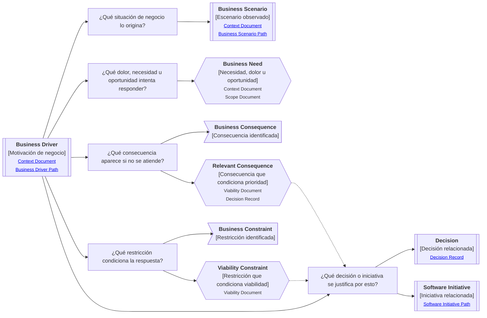

# Camino de continuidad "Motivación de negocio" de <tema>

## Propósito del recorrido

<!--
¿Para qué necesitamos recorrer este path?

Explicar qué continuidad de negocio se busca preservar.
No explicar todavía el contexto completo del negocio; eso pertenece a un Documento de Contexto.
-->

Este path busca preservar continuidad entre `<tema>` y la situación de negocio que lo origina, justifica o afecta.

Ayuda a evitar que el concepto se entienda solo como una solución, artifact, decisión técnica o comportamiento aislado, perdiendo la necesidad, dolor, oportunidad, restricción o consecuencia de negocio que le da sentido.

## Punto de entrada

<!--
¿Por dónde empieza este camino?

Indicar el concepto, necesidad, dolor, oportunidad, decisión, iniciativa o situación de negocio desde donde parte el recorrido.
-->

## Diagrama de continuidad

<!--
¿Qué mapa vamos a recorrer?

Incluir el Diagrama de Camino de Continuidad asociado al Business Driver.
El diagrama debe mostrar preguntas de orientación, conceptos relacionados y estado documental de los conceptos conectados.
-->

## Recorrido recomendado

<!--
¿Qué ruta conviene seguir primero?

Describir el recorrido principal recomendado para entender el path sin duplicar el contenido de los artifacts conectados.
-->

| Orden | Nodo, artifact o concepto         | Por qué revisarlo                                                         |
| ----- | --------------------------------- | ------------------------------------------------------------------------- |
| 1     | Motivación de negocio             | Permite identificar qué estamos siguiendo y por qué podría importar       |
| 2     | Situación de negocio              | Permite entender dónde aparece la motivación                              |
| 3     | Dolor, necesidad u oportunidad    | Permite entender qué empuja a intervenir                                  |
| 4     | Consecuencia de negocio           | Permite entender qué se pierde, empeora o queda expuesto si no se atiende |
| 5     | Restricción de negocio            | Permite entender qué limita o condiciona la respuesta posible             |
| 6     | Decisión o iniciativa relacionada | Permite entender qué respuesta se justifica desde esta motivación         |

## Consecuencias y restricciones

<!--
¿Cómo deben interpretarse consecuencias y restricciones dentro de este path?

Usar esta sección para distinguir qué se identifica, qué requiere evaluación y qué debe conectarse con otros artifacts.
No crear documentos nuevos solo por existir una consecuencia o restricción.
-->

| Concepto             | Cómo se interpreta                                                 | Cuándo conectarlo con otro artifact                                              |
| -------------------- | ------------------------------------------------------------------ | -------------------------------------------------------------------------------- |
| Business Consequence | Algo que ocurre o se pierde si la motivación no se atiende         | Cuando afecta prioridad, riesgo, alcance, viabilidad o decisión                  |
| Business Constraint  | Algo que limita la forma de responder a la motivación              | Cuando condiciona alcance, viabilidad, decisión, implementación o adopción       |
| Relevant Consequence | Consecuencia que pesa lo suficiente para condicionar una respuesta | Cuando justifica una decisión, iniciativa, validación o evaluación de viabilidad |
| Viability Constraint | Restricción que condiciona si la respuesta puede sostenerse        | Cuando requiere Viability Document o Decision Record                             |

## Conceptos complementarios

<!--
¿Qué elementos relacionados ayudan a entender esta motivación sin pertenecer necesariamente a la ruta principal?

Usar esta sección solo cuando existan elementos relevantes para preservar continuidad.
No convertirla en lista exhaustiva.
-->

| Concepto complementario | Relación con la motivación | Path o artifact sugerido |
| ----------------------- | -------------------------- | ------------------------ |
| <concepto>              | <relación>                 | <path o artifact>        |
