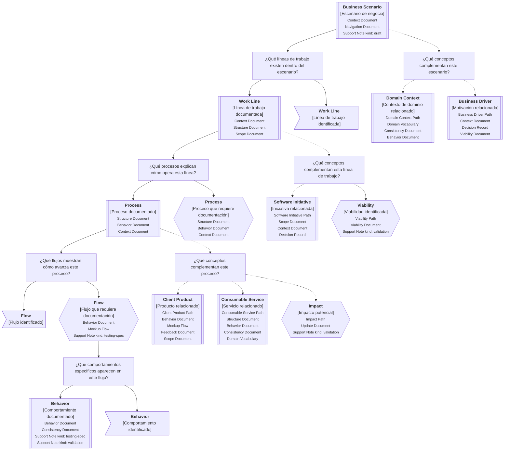

---
artifact:
  kind: continuity-path
  type: business-scenario
  scope: business-scenario
  target: <business-scenario-name>
  language: <es|en>

metadata:
  status: <draft|candidate|active|deprecated|superseded>
  relates: []

continuity:
  question: ¿Dónde ocurre el trabajo y qué elementos ayudan a entender este escenario?
  preserves: operational-continuity
  connects:
    - artifact: <artifact-id>
      role: <work-line|process|flow|behavior|domain-context|business-driver|software-initiative|client-product|consumable-service|impact>

tooling:
  schema:
    version: 0.1.0
  template:
    name: business-scenario.continuity-path
    version: 0.1.0
---

# Camino de continuidad "Escenario de negocio" de <tema>

## Propósito del recorrido

<!--
¿Para qué necesitamos recorrer este path?

Explicar qué continuidad operativa se busca preservar.
No explicar todavía todo el negocio ni toda la organización.
-->

Este path busca preservar continuidad alrededor del contexto operativo donde ocurre el trabajo.

Ayuda a entender dónde aparece el conocimiento antes de enfocarse en proyectos, productos, servicios, decisiones o implementaciones específicas.

Permite recorrer un escenario de negocio desde una mirada amplia hacia líneas de trabajo, procesos, flujos, actores, responsabilidades, reglas operativas, comportamientos relevantes y conceptos relacionados.

## Punto de entrada

<!--
¿Por dónde empieza este camino?

Indicar el escenario, situación operativa o concepto raíz desde donde parte el recorrido.
-->

## Diagrama de continuidad

<!--
¿Qué mapa vamos a recorrer?

Incluir el Diagrama de Camino de Continuidad asociado al Business Scenario.
El diagrama debe mostrar preguntas de orientación, conceptos relacionados y estado documental de los conceptos conectados.
-->

## Recorrido recomendado

<!--
¿Qué ruta conviene seguir primero?

Describir el recorrido principal recomendado para entender el path sin duplicar el contenido de los artifacts conectados.
-->

| Orden | Nodo, artifact o concepto   | Por qué revisarlo                                                                                    |
| ----- | --------------------------- | ---------------------------------------------------------------------------------------------------- |
| 1     | Escenario de negocio        | Permite ubicar dónde ocurre el trabajo                                                               |
| 2     | Líneas de trabajo           | Permiten organizar, entender y segmentar los servicios de valor del escenario                        |
| 3     | Procesos                    | Permiten entender cómo se organiza el trabajo de una línea para producir resultados                  |
| 4     | Flujos                      | Permiten observar secuencias concretas de pasos, decisiones, transferencias o participantes          |
| 5     | Comportamientos específicos | Permiten reconocer qué debe ocurrir dentro de una parte concreta del escenario                       |
| 6     | Conceptos complementarios   | Permiten identificar otros paths, documentos o artifacts que enriquecen la comprensión del escenario |

## Conceptos complementarios

<!--
¿Qué elementos relacionados ayudan a entender este escenario sin pertenecer necesariamente a la ruta principal?

Usar esta sección solo cuando existan elementos relevantes para preservar continuidad.
No convertirla en lista exhaustiva.
-->

| Concepto complementario | Relación con el escenario | Path o artifact sugerido |
| ----------------------- | ------------------------- | ------------------------ |
| <concepto>              | <relación>                | <path o artifact>        |
