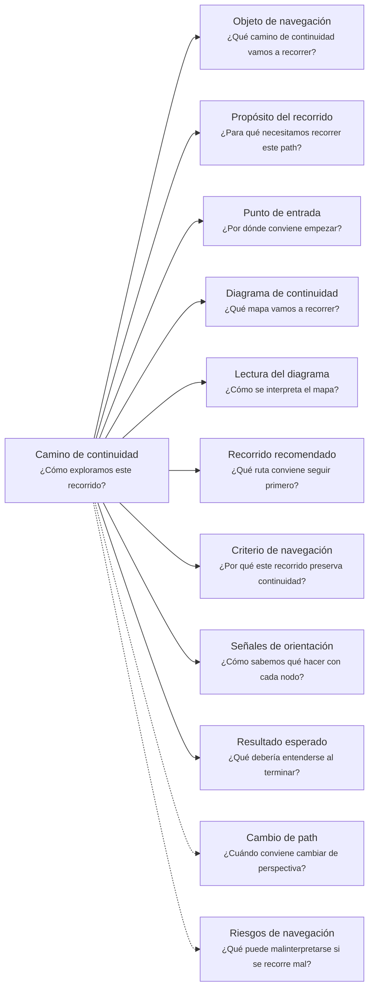
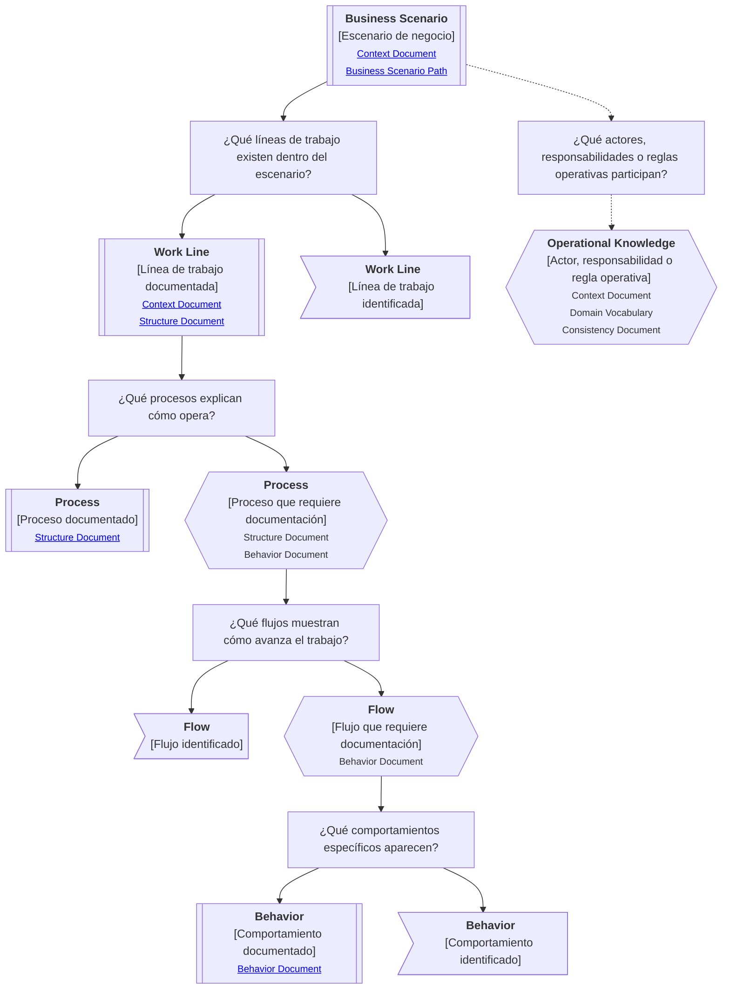

# Camino de continuidad "Escenario de negocio" de <tema>

## Organización

## Objeto de navegación

<!--
¿Qué camino de continuidad vamos a recorrer?

Indicar que este documento orienta la lectura del Business Scenario Continuity Path asociado al escenario, área, operación, línea de negocio, proceso, flujo, iniciativa o situación operativa indicada.
-->

Este documento orienta la lectura del Camino de continuidad de Escenario de negocio para `<tema>`.

## Propósito del recorrido

<!--
¿Para qué necesitamos recorrer este path?

Explicar qué continuidad operativa se busca preservar.
No explicar todavía todo el negocio ni toda la organización.
-->

Este path busca preservar continuidad alrededor del contexto operativo donde ocurre el trabajo.

Ayuda a entender dónde aparece el conocimiento antes de enfocarse en proyectos, productos, servicios, decisiones o implementaciones específicas.

Permite recorrer un escenario de negocio desde una mirada amplia hacia líneas de trabajo, procesos, flujos, actores, responsabilidades, reglas operativas y comportamientos relevantes.

## Punto de entrada

<!--
¿Por dónde conviene empezar?

Indicar el escenario, situación operativa o concepto raíz desde donde parte el recorrido.
-->

El recorrido debería comenzar desde el escenario de negocio o situación operativa que se quiere entender.

Ese punto de entrada puede ser:

* una operación
* una organización
* un ecosistema
* un área de trabajo
* una línea de negocio
* una situación operativa
* una línea de trabajo
* un proceso conocido
* un flujo observado
* una parte del negocio que necesita ser entendida

## Diagrama de continuidad

<!--
¿Qué mapa vamos a recorrer?

Incluir el Diagrama de Camino de Continuidad asociado al Business Scenario.
El diagrama debe mostrar preguntas de orientación, conceptos relacionados y estado documental de los conceptos conectados.
-->

## Lectura del diagrama

<!--
¿Cómo se interpreta el mapa?

Explicar brevemente cómo leer la semántica visual del Diagrama de Camino de Continuidad.
-->

| Forma       | Significado                                           | Qué hacer al encontrarla                                                               |
| ----------- | ----------------------------------------------------- | -------------------------------------------------------------------------------------- |
| `[[texto]]` | Concepto documentado                                  | Revisar los artifacts asociados si son relevantes para entender el escenario operativo |
| `[texto]`   | Pregunta orientadora u orientación definida           | Usarla para decidir qué parte del escenario de negocio revisar                         |
| `>texto]`   | Concepto identificado sin necesidad documental actual | Mantenerlo visible sin documentarlo todavía                                            |
| `{{texto}}` | Concepto identificado con necesidad documental        | Evaluar si debe documentarse para preservar comprensión del escenario                  |

## Recorrido recomendado

<!--
¿Qué ruta conviene seguir primero?

Describir el recorrido principal recomendado para entender el path sin duplicar el contenido de los artifacts conectados.
-->

| Orden | Nodo, artifact o concepto                      | Por qué revisarlo                                                                                 |
| ----- | ---------------------------------------------- | ------------------------------------------------------------------------------------------------- |
| 1     | Escenario de negocio                           | Permite ubicar dónde ocurre el trabajo                                                            |
| 2     | Líneas de trabajo                              | Permiten reconocer ofertas, operaciones, responsabilidades o flujos de valor dentro del escenario |
| 3     | Procesos                                       | Permiten entender cómo se organiza el trabajo para producir resultados                            |
| 4     | Flujos                                         | Permiten observar secuencias concretas de pasos, decisiones, transferencias o participantes       |
| 5     | Comportamientos específicos                    | Permiten reconocer qué debe ocurrir dentro de una parte concreta del escenario                    |
| 6     | Actores, responsabilidades o reglas operativas | Permiten entender quién participa y qué conocimiento operacional condiciona el trabajo            |

## Criterio de navegación

<!--
¿Por qué este recorrido preserva continuidad?

Explicar la lógica del recorrido recomendado y qué pérdida de intención ayuda a evitar.
-->

Este recorrido preserva continuidad porque conecta el conocimiento operativo amplio con partes cada vez más específicas del negocio.

Ayuda a evitar que una feature, decisión, documento, flujo o comportamiento sea entendido sin saber en qué escenario ocurre, qué línea de trabajo lo contiene, qué proceso lo explica o qué operación lo necesita.

## Señales de orientación

<!--
¿Cómo sabemos qué hacer con cada nodo?

Registrar señales que ayudan a decidir si conviene seguir, detenerse, documentar, ignorar temporalmente o cambiar de path.
-->

| Señal                                                                    | Acción sugerida                                                                |
| ------------------------------------------------------------------------ | ------------------------------------------------------------------------------ |
| El escenario completo es demasiado amplio                                | Delimitar una línea de trabajo o proceso antes de documentar más               |
| Una línea de trabajo aparece como `{{texto}}`                            | Evaluar si necesita Context Document o Structure Document                      |
| Un proceso aparece como `{{texto}}`                                      | Evaluar si necesita Structure Document o Behavior Document                     |
| Un flujo aparece como `{{texto}}`                                        | Evaluar si necesita Behavior Document o diagrama asociado                      |
| Un actor, responsabilidad o regla operativa aparece como `{{texto}}`     | Evaluar si necesita Context Document, Domain Vocabulary o Consistency Document |
| Una parte del escenario aparece como `>texto]`                           | Mantener visible sin documentar hasta que afecte el trabajo actual o futuro    |
| La pregunta pasa de dónde ocurre el trabajo a por qué importa intervenir | Cambiar hacia Business Driver Continuity Path                                  |
| La pregunta pasa de operación real a lenguaje o reglas del dominio       | Cambiar hacia Domain Context Continuity Path                                   |

## Cambio de path

<!--
¿Cuándo conviene cambiar de perspectiva?

Indicar señales que sugieren que otro Continuity Path podría preservar mejor la continuidad buscada.
-->

| Señal                                                                                             | Path sugerido      |
| ------------------------------------------------------------------------------------------------- | ------------------ |
| La pregunta principal pasa a ser por qué importa intervenir                                       | Business Driver    |
| La pregunta principal pasa a ser cómo se entiende dentro del dominio                              | Domain Context     |
| La pregunta principal pasa a ser qué estructura, implementación o decisión técnica lo materializa | Software Project   |
| La pregunta principal pasa a ser cómo se percibe o entrega valor al usuario                       | Client Product     |
| La pregunta principal pasa a ser qué contrato, entrada, salida o garantía ofrece                  | Consumable Service |
| La pregunta principal pasa a ser quién lo entiende, decide, valida, mantiene u opera              | Ownership          |
| La pregunta principal pasa a ser qué otros elementos se ven afectados                             | Impact             |
| La pregunta principal pasa a ser de dónde viene y dónde terminó materializándose                  | Traceability       |

## Resultado esperado

<!--
¿Qué debería entenderse al terminar?

Indicar qué claridad, orientación o comprensión debería obtenerse después de recorrer el path.
-->

Al terminar este recorrido debería entenderse:

* dónde ocurre el trabajo dentro del negocio
* qué situación operativa se está intentando entender
* qué líneas de trabajo existen dentro del escenario
* qué procesos o flujos explican cómo opera el escenario
* qué actores, responsabilidades o reglas operativas participan
* qué parte del escenario está siendo documentada, validada o modificada
* qué conocimiento ya está documentado
* qué conocimiento requiere más profundidad
* qué conocimiento fue identificado pero no requiere documentación todavía
* cuándo conviene detenerse o cambiar de path

## Riesgos de navegación

<!--
¿Qué puede malinterpretarse si se recorre mal?

Registrar riesgos de usar el path como documento detallado, leer nodos como obligaciones, documentar demasiado pronto o asumir trazabilidad formal innecesaria.
-->

| Riesgo de navegación                                                            | Consecuencia                                                      |
| ------------------------------------------------------------------------------- | ----------------------------------------------------------------- |
| Convertir el escenario de negocio en un mapa exhaustivo de toda la organización | Se agrega documentación innecesaria y se pierde foco              |
| Documentar líneas de trabajo que no afectan el trabajo actual o futuro          | Se incrementa la carga documental sin preservar continuidad útil  |
| Describir procesos con más detalle del necesario                                | Se retrasa aprendizaje desde validación, diseño o implementación  |
| Confundir escenario de negocio con motivación de negocio                        | Se mezcla dónde ocurre el trabajo con por qué importa intervenir  |
| Confundir contexto operativo con implementación                                 | Se introducen decisiones técnicas antes de entender el territorio |
| Interpretar `{{texto}}` como obligación inmediata                               | Se genera documentación prematura                                 |
| Interpretar `>texto]` como deuda documental                                     | Se burocratizan conceptos que solo necesitaban visibilidad        |
| Recorrer todas las rutas como obligatorias                                      | Se pierde foco y aumenta la carga documental                      |
| Usar el path como trazabilidad formal completa                                  | Se agrega complejidad antes de que exista necesidad real          |

## Principio de continuidad

!!! principle "Principio de Continuidad"

    La perspectiva de escenario de negocio debería ayudar a entender dónde aparece el conocimiento operativo antes de decidir qué parte necesita más profundidad documental.

