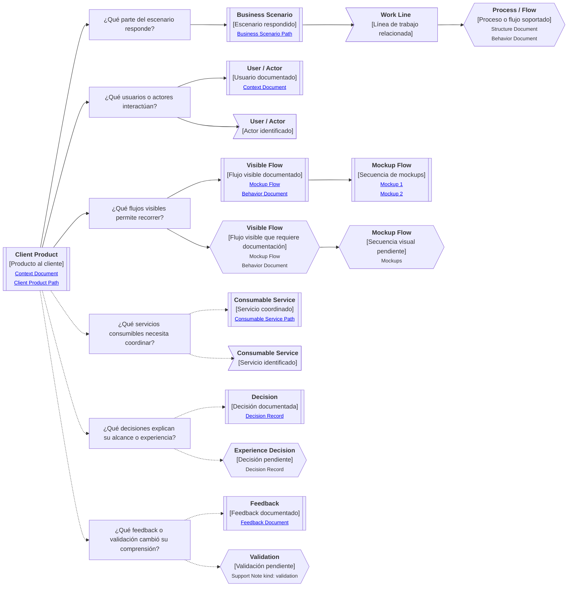

# Camino de continuidad "Producto al cliente" de <tema>

## Propósito del recorrido

<!--
¿Para qué necesitamos recorrer este path?

Explicar qué continuidad de experiencia, flujo visible, uso y aprendizaje se busca preservar.
No explicar todavía la implementación ni los contratos internos que sostienen el producto.
-->

Este path busca preservar continuidad entre `<tema>`, los flujos visibles que una persona puede recorrer con el sistema y el aprendizaje que cambia o confirma esa experiencia.

En esta perspectiva, "cliente" no se refiere únicamente a un cliente externo.

Puede representar una persona usuaria, un operador, un área interna, un equipo de negocio o cualquier actor que interactúa con un sistema de software para realizar trabajo dentro de un escenario de negocio.

Este path ayuda a entender qué experiencia ofrece un producto, qué flujos permite recorrer, qué parte del escenario de negocio responde y qué servicios consumibles, capacidades o procesos necesita coordinar para hacerlo.

También ayuda a preservar continuidad entre la experiencia diseñada y el aprendizaje obtenido desde uso, feedback o validación.

Esto es importante porque el producto al cliente puede cambiar para bien o para mal cuando se descubre que un flujo visible, mockup, pantalla, estado visual o comportamiento esperado no responde realmente a la forma en que las personas usan el sistema o ejecutan el trabajo.

## Punto de entrada

<!--
¿Por dónde empieza este camino?

Indicar el producto, experiencia, flujo visible, mockup flow, pantalla, estado visual, comportamiento expuesto, feedback, validación o parte visible del sistema desde donde parte el recorrido.
-->

## Diagrama de continuidad

<!--
¿Qué mapa vamos a recorrer?

Incluir el Diagrama de Camino de Continuidad asociado al Client Product.
El diagrama debe mostrar preguntas de orientación, conceptos relacionados y estado documental de los conceptos conectados.
-->

## Recorrido recomendado

<!--
¿Qué ruta conviene seguir primero?

Describir el recorrido principal recomendado para entender el path sin duplicar el contenido de los artifacts conectados.
-->

| Orden | Nodo, artifact o concepto           | Por qué revisarlo                                                                     |
| ----- | ----------------------------------- | ------------------------------------------------------------------------------------- |
| 1     | Producto al cliente                 | Permite identificar qué sistema o experiencia visible estamos siguiendo               |
| 2     | Escenario de negocio respondido     | Permite entender qué parte del trabajo el producto ayuda a ejecutar                   |
| 3     | Usuarios o actores                  | Permite entender quién usa, recibe o interactúa con el producto                       |
| 4     | Flujos visibles                     | Permiten entender qué recorridos de uso representa el sistema                         |
| 5     | Mockup Flow                         | Permite representar una secuencia visible de pantallas, vistas o estados del producto |
| 6     | Servicios consumibles coordinados   | Permiten conectar la experiencia visible con piezas de software que la habilitan      |
| 7     | Decisiones de alcance o experiencia | Permiten entender por qué el producto ofrece, omite o limita ciertos flujos           |
| 8     | Feedback o validación               | Permite entender qué aprendizaje confirmó, corrigió o cambió la experiencia esperada  |

## Flujos visibles y mockup flows

<!--
¿Cómo se distinguen flujos visibles, mockup flows y behavior documents dentro de este path?

Usar esta sección para evitar que el producto al cliente se reduzca a una lista plana de acciones.
-->

| Concepto          | Cómo se interpreta                                                                             | Cuándo usarlo                                                                              |
| ----------------- | ---------------------------------------------------------------------------------------------- | ------------------------------------------------------------------------------------------ |
| Visible Flow      | Recorrido visible que una persona sigue dentro del sistema para ejecutar una parte del trabajo | Cuando necesitamos entender qué experiencia o camino de uso ofrece el producto             |
| Mockup Flow       | Secuencia ordenada de mockups que representa un flujo visible                                  | Cuando el flujo se expresa mejor mediante pantallas, vistas, estados o imágenes conectadas |
| Mockup            | Representación de una pantalla, vista, estado visual o superficie del producto                 | Cuando necesitamos mostrar cómo se ve una parte específica del flujo                       |
| Behavior Document | Explicación de qué debe ocurrir dentro del flujo visible                                       | Cuando el comportamiento esperado necesita claridad más allá de la representación visual   |

## Conceptos complementarios

<!--
¿Qué elementos relacionados ayudan a entender este producto sin pertenecer necesariamente a la ruta principal?

Usar esta sección solo cuando existan elementos relevantes para preservar continuidad.
No convertirla en lista exhaustiva.
-->

| Concepto complementario | Relación con el producto | Path o artifact sugerido |
| ----------------------- | ------------------------ | ------------------------ |
| <concepto>              | <relación>               | <path o artifact>        |
