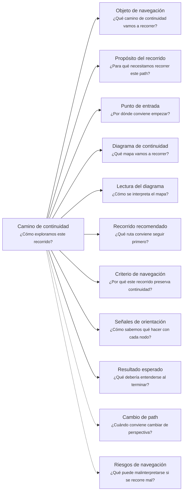

# Camino de continuidad "Producto al cliente" de <tema>

## Organización



## Objeto de navegación

<!--
¿Qué camino de continuidad vamos a recorrer?

Indicar que este documento orienta la lectura del Client Product Continuity Path asociado a un producto, experiencia, pantalla, flujo visible, acción visible, comportamiento expuesto, feedback, validación o superficie usada por clientes o usuarios.
-->

Este documento orienta la lectura del Camino de continuidad de Producto al cliente para `<tema>`.

## Propósito del recorrido

<!--
¿Para qué necesitamos recorrer este path?

Explicar qué continuidad de experiencia, acción visible, uso y aprendizaje se busca preservar.
No explicar todavía la implementación ni los contratos internos que sostienen el producto.
-->

Este path busca preservar continuidad entre `<tema>`, las acciones visibles que una persona puede realizar con el sistema y el aprendizaje que cambia o confirma esa experiencia.

En esta perspectiva, "cliente" no se refiere únicamente a un cliente externo.

Puede representar una persona usuaria, un operador, un área interna, un equipo de negocio o cualquier actor que interactúa con un sistema de software para realizar acciones dentro de un escenario de negocio.

Este path ayuda a entender qué experiencia ofrece un producto, qué acciones permite realizar, qué parte del escenario de negocio responde y qué servicios consumibles, capacidades o procesos necesita coordinar para hacerlo.

También ayuda a preservar continuidad entre la experiencia diseñada y el aprendizaje obtenido desde uso, feedback o validación.

Esto es importante porque el producto al cliente puede cambiar para bien o para mal cuando se descubre que una acción visible, flujo o comportamiento esperado no responde realmente a la forma en que las personas usan el sistema o ejecutan el trabajo.

## Punto de entrada

<!--
¿Por dónde conviene empezar?

Indicar el producto, experiencia, flujo, pantalla, acción visible, comportamiento expuesto, feedback, validación o parte visible del sistema desde donde parte el recorrido.
-->

El recorrido debería comenzar desde el producto o parte visible del producto que se quiere entender o seguir.

Ese punto de entrada puede ser:

* un producto al cliente
* una experiencia de usuario
* una pantalla
* un flujo visible
* una acción visible
* una funcionalidad visible
* una interacción
* una notificación
* una promesa de valor
* una mejora de experiencia
* un feedback recibido
* una validación realizada
* un cambio observado en uso
* una parte del producto afectada por una iniciativa

## Diagrama de continuidad

<!--
¿Qué mapa vamos a recorrer?

Incluir el Diagrama de Camino de Continuidad asociado al Client Product.
El diagrama debe mostrar preguntas de orientación, conceptos relacionados y estado documental de los conceptos conectados.
-->


## Lectura del diagrama

<!--
¿Cómo se interpreta el mapa?

Explicar brevemente cómo leer la semántica visual del Diagrama de Camino de Continuidad.
-->

| Forma       | Significado                                           | Qué hacer al encontrarla                                                                                                  |
| ----------- | ----------------------------------------------------- | ------------------------------------------------------------------------------------------------------------------------- |
| `[[texto]]` | Concepto documentado                                  | Revisar los artifacts asociados si son relevantes para entender la experiencia, acción visible o aprendizaje del producto |
| `[texto]`   | Pregunta orientadora u orientación definida           | Usarla para decidir qué aspecto del producto al cliente revisar                                                           |
| `>texto]`   | Concepto identificado sin necesidad documental actual | Mantenerlo visible sin documentarlo todavía                                                                               |
| `{{texto}}` | Concepto identificado con necesidad documental        | Evaluar si debe documentarse para no perder acción visible, flujo, comportamiento, decisión o aprendizaje                 |

## Recorrido recomendado

<!--
¿Qué ruta conviene seguir primero?

Describir el recorrido principal recomendado para entender el path sin duplicar el contenido de los artifacts conectados.
-->

| Orden | Nodo, artifact o concepto           | Por qué revisarlo                                                                    |
| ----- | ----------------------------------- | ------------------------------------------------------------------------------------ |
| 1     | Producto al cliente                 | Permite identificar qué sistema o experiencia visible estamos siguiendo              |
| 2     | Escenario de negocio respondido     | Permite entender qué parte del trabajo el producto ayuda a ejecutar                  |
| 3     | Usuarios o actores                  | Permite entender quién usa, recibe o interactúa con el producto                      |
| 4     | Acciones visibles                   | Permiten reconocer qué puede hacer el usuario con el sistema                         |
| 5     | Procesos o flujos soportados        | Permiten entender cómo las acciones visibles participan en el trabajo real           |
| 6     | Servicios consumibles coordinados   | Permiten conectar la experiencia visible con piezas de software que la habilitan     |
| 7     | Decisiones de alcance o experiencia | Permiten entender por qué el producto ofrece, omite o limita ciertas acciones        |
| 8     | Feedback o validación               | Permite entender qué aprendizaje confirmó, corrigió o cambió la experiencia esperada |

## Criterio de navegación

<!--
¿Por qué este recorrido preserva continuidad?

Explicar la lógica del recorrido recomendado y qué pérdida de intención ayuda a evitar.
-->

Este recorrido preserva continuidad porque conecta el producto visible con el escenario de negocio que responde, las personas que lo usan, las acciones que permite, los flujos que ayuda a ejecutar, los servicios que coordina y el aprendizaje que cambia su experiencia.

Ayuda a evitar que una pantalla, funcionalidad o flujo sea diseñado como elemento aislado, sin recordar qué trabajo permite realizar, qué expectativa debe cumplir, qué servicio lo habilita o qué feedback modificó su comportamiento esperado.

## Señales de orientación

<!--
¿Cómo sabemos qué hacer con cada nodo?

Registrar señales que ayudan a decidir si conviene seguir, detenerse, documentar, ignorar temporalmente o cambiar de path.
-->

| Señal                                                                | Acción sugerida                                                                             |
| -------------------------------------------------------------------- | ------------------------------------------------------------------------------------------- |
| El producto no tiene escenario de negocio claro                      | Revisar Business Scenario                                                                   |
| El producto no tiene motivación visible clara                        | Revisar Business Driver                                                                     |
| El usuario o actor no está claro                                     | Evaluar Context Document o Business Scenario                                                |
| Una acción visible aparece como `{{texto}}`                          | Evaluar si necesita Behavior Document                                                       |
| Un proceso o flujo soportado aparece como `{{texto}}`                | Evaluar si necesita Structure Document, Behavior Document o validación                      |
| Un servicio sostiene una parte del producto                          | Cambiar hacia Consumable Service si la pregunta pasa a contrato, entrada, salida o garantía |
| Una decisión de alcance o experiencia aparece como `{{texto}}`       | Evaluar si necesita Decision Record                                                         |
| El producto cambia por feedback externo                              | Revisar o crear Feedback Document                                                           |
| Una validación cambia la comprensión del producto                    | Revisar o crear Support Note kind: validation                                               |
| Un feedback contradice el comportamiento esperado                    | Evaluar Behavior Document, Decision Record o nueva validación                               |
| La pregunta pasa a cómo vive técnicamente el producto en un proyecto | Cambiar hacia Software Project                                                              |
| La pregunta pasa a qué iniciativa contiene este producto             | Cambiar hacia Software Initiative                                                           |

## Cambio de path

<!--
¿Cuándo conviene cambiar de perspectiva?

Indicar señales que sugieren que otro Continuity Path podría preservar mejor la continuidad buscada.
-->

| Señal                                                                                     | Path sugerido       |
| ----------------------------------------------------------------------------------------- | ------------------- |
| La pregunta principal pasa a ser dónde ocurre el trabajo                                  | Business Scenario   |
| La pregunta principal pasa a ser por qué importa intervenir                               | Business Driver     |
| La pregunta principal pasa a ser qué lenguaje, reglas o límites pertenecen al negocio     | Domain Context      |
| La pregunta principal pasa a ser qué iniciativa de software aborda esta parte del trabajo | Software Initiative |
| La pregunta principal pasa a ser cómo vive un elemento dentro de un proyecto técnico      | Software Project    |
| La pregunta principal pasa a ser qué contrato, entrada, salida o garantía ofrece          | Consumable Service  |
| La pregunta principal pasa a ser quién entiende, decide, valida o mantiene el producto    | Ownership           |
| La pregunta principal pasa a ser qué otros elementos se ven afectados                     | Impact              |
| La pregunta principal pasa a ser de dónde viene y dónde terminó materializándose          | Traceability        |

## Resultado esperado

<!--
¿Qué debería entenderse al terminar?

Indicar qué claridad, orientación o comprensión debería obtenerse después de recorrer el path.
-->

Al terminar este recorrido debería entenderse:

* qué producto o parte visible del producto se está siguiendo
* qué parte del escenario de negocio responde
* qué usuarios, clientes, áreas o actores interactúan con el producto
* qué acciones visibles permite realizar
* qué procesos o flujos ayuda a ejecutar
* qué servicios consumibles necesita coordinar
* qué capacidades usa, combina o expone a través de la experiencia
* qué decisiones explican su alcance o experiencia
* qué feedback o validación confirmó, corrigió o cambió su comportamiento esperado
* qué conocimiento ya está documentado
* qué conocimiento requiere documentación
* qué conocimiento fue identificado pero no requiere documentación todavía
* cuándo conviene detenerse o cambiar de path

## Riesgos de navegación

<!--
¿Qué puede malinterpretarse si se recorre mal?

Registrar riesgos de usar el path como documento detallado, leer nodos como obligaciones, documentar demasiado pronto o asumir trazabilidad formal innecesaria.
-->

| Riesgo de navegación                                       | Consecuencia                                                                                      |
| ---------------------------------------------------------- | ------------------------------------------------------------------------------------------------- |
| Confundir producto al cliente con iniciativa completa      | Se reduce la iniciativa a una superficie visible y se pierden servicios, capacidades o decisiones |
| Confundir producto con proyecto técnico                    | Se baja demasiado rápido hacia implementación y se pierde la experiencia de uso                   |
| Confundir pantalla con producto                            | Se documenta una interfaz aislada sin preservar acción, flujo, valor o comportamiento             |
| Confundir acción visible con componente visual             | Se describe la interfaz sin explicar qué puede hacer realmente el usuario                         |
| Confundir comportamiento visible con contrato de servicio  | Se mezclan expectativas de usuario con garantías consumibles                                      |
| Diseñar experiencia sin escenario de negocio claro         | El producto puede optimizar una interacción sin responder al trabajo real                         |
| Diseñar acciones visibles sin feedback ni validación       | El producto puede preservar una experiencia incorrecta o insuficiente                             |
| Usar feedback aislado como decisión definitiva             | Se sobrerreacciona a señales insuficientes                                                        |
| Ocultar qué servicios consumibles sostienen la experiencia | Se pierde continuidad entre experiencia visible y capacidades reales                              |
| Documentar todos los flujos visibles                       | Se genera documentación prematura y difícil de mantener                                           |
| Interpretar `{{texto}}` como obligación inmediata          | Se genera documentación prematura                                                                 |
| Interpretar `>texto]` como deuda documental                | Se burocratizan conceptos que solo necesitaban visibilidad                                        |

## Principio de continuidad

!!! principle "Principio de Continuidad"

```
La perspectiva de producto al cliente debería ayudar a preservar la continuidad entre escenario de negocio, acciones visibles, experiencia de uso, servicios coordinados y aprendizaje obtenido desde feedback o validación.
```
