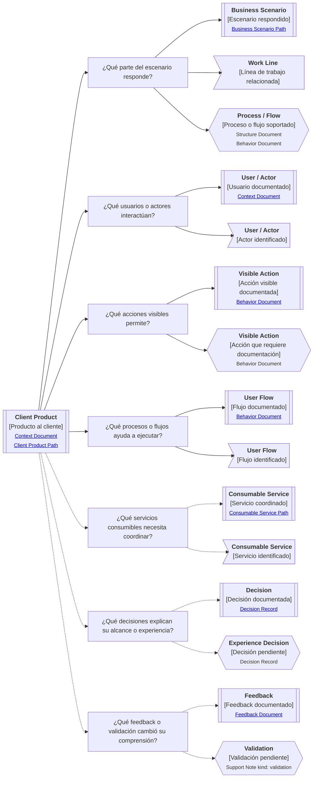

# Camino de continuidad "Producto al cliente" de <tema>

## Propósito del recorrido

<!--
¿Para qué necesitamos recorrer este path?

Explicar qué continuidad de experiencia, acción visible, uso y aprendizaje se busca preservar.
No explicar todavía la implementación ni los contratos internos que sostienen el producto.
-->

Este path busca preservar continuidad entre `<tema>`, las acciones visibles que una persona puede realizar con el sistema y el aprendizaje que cambia o confirma esa experiencia.

En esta perspectiva, "cliente" no se refiere únicamente a un cliente externo.

Puede representar una persona usuaria, un operador, un área interna, un equipo de negocio o cualquier actor que interactúa con un sistema de software para realizar acciones dentro de un escenario de negocio.

Este path ayuda a entender qué experiencia ofrece un producto, qué acciones permite realizar, qué parte del escenario de negocio responde y qué servicios consumibles, capacidades o procesos necesita coordinar para hacerlo.

También ayuda a preservar continuidad entre la experiencia diseñada y el aprendizaje obtenido desde uso, feedback o validación.

Esto es importante porque el producto al cliente puede cambiar para bien o para mal cuando se descubre que una acción visible, flujo o comportamiento esperado no responde realmente a la forma en que las personas usan el sistema o ejecutan el trabajo.

## Punto de entrada

<!--
¿Por dónde conviene empezar?

Indicar el producto, experiencia, flujo, pantalla, acción visible, comportamiento expuesto, feedback, validación o parte visible del sistema desde donde parte el recorrido.
-->

## Diagrama de continuidad

<!--
¿Qué mapa vamos a recorrer?

Incluir el Diagrama de Camino de Continuidad asociado al Client Product.
El diagrama debe mostrar preguntas de orientación, conceptos relacionados y estado documental de los conceptos conectados.
-->

## Lectura del diagrama

<!--
¿Cómo se interpreta el mapa?

Explicar brevemente cómo leer la semántica visual del Diagrama de Camino de Continuidad.
-->

| Forma       | Significado                                           | Qué hacer al encontrarla                                                                                                  |
| ----------- | ----------------------------------------------------- | ------------------------------------------------------------------------------------------------------------------------- |
| `[[texto]]` | Concepto documentado                                  | Revisar los artifacts asociados si son relevantes para entender la experiencia, acción visible o aprendizaje del producto |
| `[texto]`   | Pregunta orientadora u orientación definida           | Usarla para decidir qué aspecto del producto al cliente revisar                                                           |
| `>texto]`   | Concepto identificado sin necesidad documental actual | Mantenerlo visible sin documentarlo todavía                                                                               |
| `{{texto}}` | Concepto identificado con necesidad documental        | Evaluar si debe documentarse para no perder acción visible, flujo, comportamiento, decisión o aprendizaje                 |

## Recorrido recomendado

<!--
¿Qué ruta conviene seguir primero?

Describir el recorrido principal recomendado para entender el path sin duplicar el contenido de los artifacts conectados.
-->

| Orden | Nodo, artifact o concepto           | Por qué revisarlo                                                                    |
| ----- | ----------------------------------- | ------------------------------------------------------------------------------------ |
| 1     | Producto al cliente                 | Permite identificar qué sistema o experiencia visible estamos siguiendo              |
| 2     | Escenario de negocio respondido     | Permite entender qué parte del trabajo el producto ayuda a ejecutar                  |
| 3     | Usuarios o actores                  | Permite entender quién usa, recibe o interactúa con el producto                      |
| 4     | Acciones visibles                   | Permiten reconocer qué puede hacer el usuario con el sistema                         |
| 5     | Procesos o flujos soportados        | Permiten entender cómo las acciones visibles participan en el trabajo real           |
| 6     | Servicios consumibles coordinados   | Permiten conectar la experiencia visible con piezas de software que la habilitan     |
| 7     | Decisiones de alcance o experiencia | Permiten entender por qué el producto ofrece, omite o limita ciertas acciones        |
| 8     | Feedback o validación               | Permite entender qué aprendizaje confirmó, corrigió o cambió la experiencia esperada |

## Conceptos complementarios

<!--
¿Qué elementos relacionados ayudan a entender este escenario sin pertenecer necesariamente a la ruta principal?

Usar esta sección solo cuando existan elementos relevantes para preservar continuidad.
No convertirla en lista exhaustiva.
-->

| Concepto complementario | Relación con el escenario | Path o artifact sugerido |
| ----------------------- | ------------------------- | ------------------------ |
| <concepto>              | <relación>                | <path o artifact>        |
