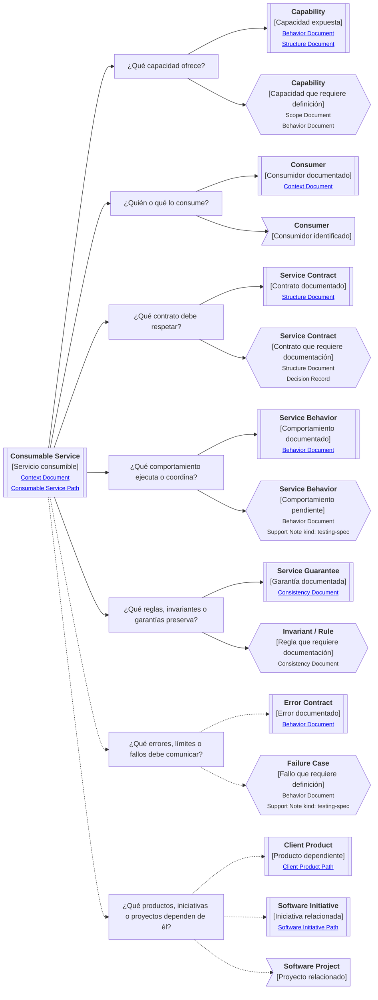

# Camino de continuidad "Servicio consumible" de <tema>

## Propósito del recorrido

<!--
¿Para qué necesitamos recorrer este path?

Explicar qué continuidad de contrato, capacidad expuesta, consumo y garantías se busca preservar.
No explicar todavía la experiencia humana visible ni la implementación interna del servicio.
-->

Este path busca preservar continuidad entre `<tema>`, la capacidad que expone para ser consumida y las garantías que entrega a quienes dependen de ella.

En esta perspectiva, "servicio consumible" no se refiere únicamente a un microservicio.

Puede representar una API, endpoint, comando, consulta, integración, evento, job, operación backend, módulo expuesto, contrato interno o cualquier pieza de software que otro producto, sistema, proceso o actor técnico puede consumir para ejecutar o coordinar comportamiento.

Este path ayuda a entender qué ofrece un servicio, quién lo consume, qué entradas espera, qué salidas entrega, qué errores puede devolver, qué reglas respeta y qué garantías debe preservar.

También ayuda a evitar que un servicio se documente solo como implementación interna, perdiendo su contrato, su propósito de consumo y las expectativas de quienes dependen de él.

## Punto de entrada

<!--
¿Por dónde conviene empezar?

Indicar el servicio, contrato, operación, endpoint, evento, comando, integración o capacidad expuesta desde donde parte el recorrido.
-->

## Diagrama de continuidad

<!--
¿Qué mapa vamos a recorrer?

Incluir el Diagrama de Camino de Continuidad asociado al Consumable Service.
El diagrama debe mostrar preguntas de orientación, conceptos relacionados y estado documental de los conceptos conectados.
-->

## Recorrido recomendado

<!--
¿Qué ruta conviene seguir primero?

Describir el recorrido principal recomendado para entender el path sin duplicar el contenido de los artifacts conectados.
-->

| Orden | Nodo, artifact o concepto                       | Por qué revisarlo                                                                           |
| ----- | ----------------------------------------------- | ------------------------------------------------------------------------------------------- |
| 1     | Servicio consumible                             | Permite identificar qué pieza o capacidad consumible estamos siguiendo                      |
| 2     | Capacidad ofrecida                              | Permite entender qué puede hacer otro sistema, producto o proceso al consumirlo             |
| 3     | Consumidores                                    | Permite entender quién depende del servicio y desde qué contexto lo usa                     |
| 4     | Contrato                                        | Permite reconocer entradas, salidas, protocolo, evento, comando o forma de consumo esperada |
| 5     | Comportamiento ejecutado o coordinado           | Permite entender qué ocurre cuando el servicio es consumido                                 |
| 6     | Reglas, invariantes o garantías                 | Permiten entender qué debe mantenerse verdadero para que el servicio sea confiable          |
| 7     | Errores, límites o fallos                       | Permiten entender cómo el servicio comunica que algo no pudo cumplirse                      |
| 8     | Productos, iniciativas o proyectos dependientes | Permiten entender qué podría verse afectado si el servicio cambia                           |

## Conceptos complementarios

<!--
¿Qué elementos relacionados ayudan a entender este escenario sin pertenecer necesariamente a la ruta principal?

Usar esta sección solo cuando existan elementos relevantes para preservar continuidad.
No convertirla en lista exhaustiva.
-->

| Concepto complementario | Relación con el escenario | Path o artifact sugerido |
| ----------------------- | ------------------------- | ------------------------ |
| <concepto>              | <relación>                | <path o artifact>        |
