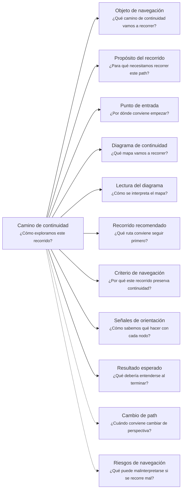

# Camino de continuidad "Servicio consumible" de <tema>

## Organización



## Objeto de navegación

<!--
¿Qué camino de continuidad vamos a recorrer?

Indicar que este documento orienta la lectura del Consumable Service Continuity Path asociado a un servicio, API, endpoint, comando, contrato, evento, integración, operación consumible o capacidad expuesta.
-->

Este documento orienta la lectura del Camino de continuidad de Servicio consumible para `<tema>`.

## Propósito del recorrido

<!--
¿Para qué necesitamos recorrer este path?

Explicar qué continuidad de contrato, capacidad expuesta, consumo y garantías se busca preservar.
No explicar todavía la experiencia humana visible ni la implementación interna del servicio.
-->

Este path busca preservar continuidad entre `<tema>`, la capacidad que expone para ser consumida y las garantías que entrega a quienes dependen de ella.

En esta perspectiva, "servicio consumible" no se refiere únicamente a un microservicio.

Puede representar una API, endpoint, comando, consulta, integración, evento, job, operación backend, módulo expuesto, contrato interno o cualquier pieza de software que otro producto, sistema, proceso o actor técnico puede consumir para ejecutar o coordinar comportamiento.

Este path ayuda a entender qué ofrece un servicio, quién lo consume, qué entradas espera, qué salidas entrega, qué errores puede devolver, qué reglas respeta y qué garantías debe preservar.

También ayuda a evitar que un servicio se documente solo como implementación interna, perdiendo su contrato, su propósito de consumo y las expectativas de quienes dependen de él.

## Punto de entrada

<!--
¿Por dónde conviene empezar?

Indicar el servicio, contrato, operación, endpoint, evento, comando, integración o capacidad expuesta desde donde parte el recorrido.
-->

El recorrido debería comenzar desde el servicio consumible o parte consumible del servicio que se quiere entender o seguir.

Ese punto de entrada puede ser:

* una API
* un endpoint
* una operación
* un comando
* una consulta
* un evento
* una integración
* un contrato interno
* una capacidad expuesta
* un job consumido indirectamente
* una operación backend
* una dependencia consumida por un producto
* una pieza de software usada por otro sistema

## Diagrama de continuidad

<!--
¿Qué mapa vamos a recorrer?

Incluir el Diagrama de Camino de Continuidad asociado al Consumable Service.
El diagrama debe mostrar preguntas de orientación, conceptos relacionados y estado documental de los conceptos conectados.
-->


## Lectura del diagrama

<!--
¿Cómo se interpreta el mapa?

Explicar brevemente cómo leer la semántica visual del Diagrama de Camino de Continuidad.
-->

| Forma       | Significado                                           | Qué hacer al encontrarla                                                                                     |
| ----------- | ----------------------------------------------------- | ------------------------------------------------------------------------------------------------------------ |
| `[[texto]]` | Concepto documentado                                  | Revisar los artifacts asociados si son relevantes para entender el contrato, consumo o garantía del servicio |
| `[texto]`   | Pregunta orientadora u orientación definida           | Usarla para decidir qué aspecto consumible del servicio revisar                                              |
| `>texto]`   | Concepto identificado sin necesidad documental actual | Mantenerlo visible sin documentarlo todavía                                                                  |
| `{{texto}}` | Concepto identificado con necesidad documental        | Evaluar si debe documentarse para no perder contrato, comportamiento, error, regla o garantía                |

## Recorrido recomendado

<!--
¿Qué ruta conviene seguir primero?

Describir el recorrido principal recomendado para entender el path sin duplicar el contenido de los artifacts conectados.
-->

| Orden | Nodo, artifact o concepto                       | Por qué revisarlo                                                                           |
| ----- | ----------------------------------------------- | ------------------------------------------------------------------------------------------- |
| 1     | Servicio consumible                             | Permite identificar qué pieza o capacidad consumible estamos siguiendo                      |
| 2     | Capacidad ofrecida                              | Permite entender qué puede hacer otro sistema, producto o proceso al consumirlo             |
| 3     | Consumidores                                    | Permite entender quién depende del servicio y desde qué contexto lo usa                     |
| 4     | Contrato                                        | Permite reconocer entradas, salidas, protocolo, evento, comando o forma de consumo esperada |
| 5     | Comportamiento ejecutado o coordinado           | Permite entender qué ocurre cuando el servicio es consumido                                 |
| 6     | Reglas, invariantes o garantías                 | Permiten entender qué debe mantenerse verdadero para que el servicio sea confiable          |
| 7     | Errores, límites o fallos                       | Permiten entender cómo el servicio comunica que algo no pudo cumplirse                      |
| 8     | Productos, iniciativas o proyectos dependientes | Permiten entender qué podría verse afectado si el servicio cambia                           |

## Criterio de navegación

<!--
¿Por qué este recorrido preserva continuidad?

Explicar la lógica del recorrido recomendado y qué pérdida de intención ayuda a evitar.
-->

Este recorrido preserva continuidad porque conecta el servicio con la capacidad que ofrece, los consumidores que dependen de él, el contrato que deben respetar ambas partes y las garantías que hacen confiable su consumo.

Ayuda a evitar que una API, endpoint, evento, comando o integración se entienda solo como implementación interna, sin preservar qué promete, qué espera recibir, qué devuelve, qué errores comunica y qué comportamiento coordina.

## Señales de orientación

<!--
¿Cómo sabemos qué hacer con cada nodo?

Registrar señales que ayudan a decidir si conviene seguir, detenerse, documentar, ignorar temporalmente o cambiar de path.
-->

| Señal                                                          | Acción sugerida                                                                         |
| -------------------------------------------------------------- | --------------------------------------------------------------------------------------- |
| El servicio no tiene capacidad ofrecida clara                  | Evaluar Scope Document o Behavior Document                                              |
| El consumidor del servicio no está claro                       | Revisar Context Document, Client Product o Software Initiative                          |
| El contrato aparece como `{{texto}}`                           | Evaluar si necesita Structure Document o Decision Record                                |
| El comportamiento del servicio aparece como `{{texto}}`        | Evaluar si necesita Behavior Document                                                   |
| Una regla o garantía aparece como `{{texto}}`                  | Evaluar si necesita Consistency Document                                                |
| Un error o caso de fallo aparece como `{{texto}}`              | Evaluar si necesita Behavior Document o Support Note kind: testing-spec                 |
| Una dependencia aparece como `>texto]`                         | Mantener visible sin documentar salvo que condicione consumo, evolución o confiabilidad |
| Un producto consume el servicio                                | Cambiar hacia Client Product si la pregunta pasa a experiencia o acción visible         |
| Una iniciativa depende del servicio                            | Cambiar hacia Software Initiative si la pregunta pasa a cobertura funcional             |
| El servicio empieza a describirse desde implementación interna | Cambiar hacia Software Project                                                          |

## Cambio de path

<!--
¿Cuándo conviene cambiar de perspectiva?

Indicar señales que sugieren que otro Continuity Path podría preservar mejor la continuidad buscada.
-->

| Señal                                                                                     | Path sugerido       |
| ----------------------------------------------------------------------------------------- | ------------------- |
| La pregunta principal pasa a ser dónde ocurre el trabajo                                  | Business Scenario   |
| La pregunta principal pasa a ser por qué importa intervenir                               | Business Driver     |
| La pregunta principal pasa a ser qué lenguaje, reglas o límites pertenecen al negocio     | Domain Context      |
| La pregunta principal pasa a ser qué iniciativa de software aborda esta parte del trabajo | Software Initiative |
| La pregunta principal pasa a ser cómo vive un elemento dentro de un proyecto técnico      | Software Project    |
| La pregunta principal pasa a ser qué puede hacer una persona usuaria con el sistema       | Client Product      |
| La pregunta principal pasa a ser quién entiende, decide, valida o mantiene el servicio    | Ownership           |
| La pregunta principal pasa a ser qué otros elementos se ven afectados                     | Impact              |
| La pregunta principal pasa a ser de dónde viene y dónde terminó materializándose          | Traceability        |

## Resultado esperado

<!--
¿Qué debería entenderse al terminar?

Indicar qué claridad, orientación o comprensión debería obtenerse después de recorrer el path.
-->

Al terminar este recorrido debería entenderse:

* qué servicio consumible se está siguiendo
* qué capacidad ofrece
* quién o qué consume el servicio
* qué contrato debe respetarse
* qué entradas, salidas, comandos, eventos o protocolos participan
* qué comportamiento ejecuta o coordina
* qué reglas, invariantes o garantías preserva
* qué errores, límites o fallos debe comunicar
* qué productos, iniciativas o proyectos dependen de él
* qué conocimiento ya está documentado
* qué conocimiento requiere documentación
* qué conocimiento fue identificado pero no requiere documentación todavía
* cuándo conviene detenerse o cambiar de path

## Riesgos de navegación

<!--
¿Qué puede malinterpretarse si se recorre mal?

Registrar riesgos de usar el path como documento detallado, leer nodos como obligaciones, documentar demasiado pronto o asumir trazabilidad formal innecesaria.
-->

| Riesgo de navegación                                                | Consecuencia                                                                   |
| ------------------------------------------------------------------- | ------------------------------------------------------------------------------ |
| Confundir servicio consumible con microservicio                     | Se impone una arquitectura específica antes de entender la capacidad ofrecida  |
| Confundir servicio consumible con implementación interna            | Se pierde el contrato que otros productos o sistemas necesitan consumir        |
| Confundir contrato con comportamiento completo                      | Se documenta forma de consumo, pero se pierde qué debe ocurrir                 |
| Confundir comportamiento visible de usuario con contrato consumible | Se mezclan expectativas humanas con garantías entre piezas de software         |
| Ocultar errores o fallos esperados                                  | Los consumidores no pueden responder correctamente ante resultados no exitosos |
| Documentar todos los endpoints, eventos o comandos                  | Se genera documentación prematura y difícil de mantener                        |
| Interpretar `{{texto}}` como obligación inmediata                   | Se genera documentación prematura                                              |
| Interpretar `>texto]` como deuda documental                         | Se burocratizan conceptos que solo necesitaban visibilidad                     |
| Cambiar el contrato sin revisar consumidores                        | Se rompe continuidad con productos, iniciativas o proyectos dependientes       |
| Usar el servicio para justificar separación técnica prematura       | Se crean servicios o límites técnicos sin evidencia suficiente                 |

## Principio de continuidad

!!! principle "Principio de Continuidad"

```
La perspectiva de servicio consumible debería ayudar a preservar la continuidad entre capacidad ofrecida, contrato, consumidores, comportamiento, errores y garantías sin confundir consumo de software con implementación interna o arquitectura obligatoria.
```
