# Camino de continuidad "Servicio consumible" de <tema>

## Propósito del recorrido

<!--
¿Para qué necesitamos recorrer este path?

Explicar qué continuidad de capacidad consumible, forma de consumo, representación de dominio y garantías se busca preservar.
No explicar todavía la experiencia humana visible ni la implementación interna del servicio.
-->

Este path busca preservar continuidad entre `<tema>`, la capacidad que expone para ser consumida, la forma correcta de consumirla y los elementos de dominio que representa.

En esta perspectiva, "servicio consumible" no se refiere únicamente a un microservicio.

Puede representar una API, endpoint, comando, consulta, integración, evento, job, operación backend, módulo expuesto, contrato interno o cualquier pieza de software que otro producto, sistema, proceso o actor técnico puede consumir para ejecutar o coordinar comportamiento.

Este path ayuda a entender qué capacidad ofrece un servicio, quién lo consume, cómo debe consumirse, qué conceptos de dominio representa, qué reglas o invariantes preserva, qué garantías entrega y qué errores, límites o fallos comunica cuando algo no puede cumplirse.

También ayuda a evitar que un servicio se documente solo como contrato técnico o implementación interna, perdiendo su lenguaje de dominio, su propósito de consumo y las expectativas de quienes dependen de él.

## Punto de entrada

<!--
¿Por dónde empieza este camino?

Indicar el servicio, operación, endpoint, evento, comando, consulta, integración, capability o capacidad expuesta desde donde parte el recorrido.
-->

## Diagrama de continuidad

<!--
¿Qué mapa vamos a recorrer?

Incluir el Diagrama de Camino de Continuidad asociado al Consumable Service.
El diagrama debe mostrar preguntas de orientación, conceptos relacionados y estado documental de los conceptos conectados.
-->

```mermaid
flowchart LR
    A[["<b>Consumable Service</b><br/>[Servicio consumible]<br/><small><a href='link'>Context Document</a><br/><a href='link'>Structure Document</a><br/><a href='link'>Behavior Document</a><br/><a href='link'>Consumable Service Path</a></small>"]]

    A --> P1["¿Qué capacidad ofrece?"]
    A --> P2["¿Quién o qué lo consume?"]
    A --> P3["¿Cómo debe consumirse?"]
    A --> P4["¿Qué elementos de dominio representa?"]
    A -.-> P5["¿Qué productos, iniciativas o proyectos dependen de él?"]
    A -.-> P6["¿Qué decisiones explican su forma de consumo?"]

    P1 --> C1[["<b>Capability</b><br/>[Capacidad expuesta]<br/><small><a href='link'>Capability Nexus</a><br/><a href='link'>Behavior Document</a><br/><a href='link'>Structure Document</a><br/><a href='link'>Consistency Document</a></small>"]]
    P1 --> C2{{"<b>Capability</b><br/>[Capacidad que requiere definición]<br/><small>Capability Nexus<br/>Scope Document<br/>Behavior Document<br/>Structure Document<br/>Support Note kind: draft<br/>Support Note kind: risk</small>"}}

    P2 --> CN1[["<b>Consumer</b><br/>[Consumidor documentado]<br/><small><a href='link'>Context Document</a></small>"]]
    P2 --> CN2>"<b>Consumer</b><br/>[Consumidor identificado]"]
    P2 -.-> CN3{{"<b>Consumer Risk</b><br/>[Riesgo de consumidor]<br/><small>Support Note kind: risk<br/>Support Note kind: validation</small>"}}

    P3 --> CU1[["<b>Consumption Model</b><br/>[Forma de consumo documentada]<br/><small>Support Note kind: external<br/>Structure Document<br/>Behavior Document</small>"]]
    P3 --> CU2{{"<b>Consumption Model</b><br/>[Forma de consumo que requiere documentación]<br/><small>Support Note kind: external<br/>Structure Document<br/>Behavior Document<br/>Consistency Document<br/>Support Note kind: testing-spec<br/>Support Note kind: risk</small>"}}

    CU1 --> EX1[["<b>External Reference</b><br/>[Spec externa referenciada]<br/><small>Support Note kind: external<br/>OpenAPI / Swagger<br/>AsyncAPI<br/>Schema<br/>Event Contract</small>"]]

    CU1 --> I1>"<b>Input</b><br/>[Entrada esperada]"]
    CU1 --> O1>"<b>Output</b><br/>[Salida esperada]"]
    CU1 --> M1>"<b>Consumption Mode</b><br/>[Comando, consulta, evento, integración o proceso]"]

    P3 -.-> NX1{{"<b>Service Consumption Nexus</b><br/>[Consumo compuesto]<br/><small>Support Note kind: external<br/>Structure Document<br/>Behavior Document<br/>Consistency Document<br/>Decision Record</small>"}}

    P4 --> D1[["<b>Domain Concept</b><br/>[Concepto de dominio representado]<br/><small><a href='link'>Domain Context Path</a><br/><a href='link'>Domain Vocabulary</a></small>"]]
    P4 --> R1[["<b>Domain Rule</b><br/>[Regla documentada]<br/><small><a href='link'>Consistency Document</a></small>"]]
    P4 --> G1[["<b>Service Guarantee</b><br/>[Garantía documentada]<br/><small><a href='link'>Consistency Document</a><br/><a href='link'>Behavior Document</a></small>"]]
    P4 --> E1{{"<b>Expected Error</b><br/>[Error, límite o fallo esperado]<br/><small>Behavior Document<br/>Consistency Document<br/>Support Note kind: testing-spec<br/>Support Note kind: risk</small>"}}
    P4 -.-> DR1{{"<b>Domain Representation Risk</b><br/>[Riesgo de representación]<br/><small>Support Note kind: risk<br/>Support Note kind: validation</small>"}}

    P5 -.-> CP1[["<b>Client Product</b><br/>[Producto dependiente]<br/><small><a href='link'>Client Product Path</a></small>"]]
    P5 -.-> SI1[["<b>Software Initiative</b><br/>[Iniciativa relacionada]<br/><small><a href='link'>Software Initiative Path</a></small>"]]
    P5 -.-> SP1[["<b>Software Project</b><br/>[Proyecto relacionado]<br/><small><a href='link'>Software Project Path</a></small>"]]
    P5 -.-> IMP1{{"<b>Service Impact</b><br/>[Impacto potencial]<br/><small>Impact Path<br/>Support Note kind: risk</small>"}}

    P6 -.-> DEC1[["<b>Decision</b><br/>[Decisión documentada]<br/><small><a href='link'>Decision Record</a></small>"]]
    P6 -.-> DEC2{{"<b>Service Decision</b><br/>[Decisión pendiente]<br/><small>Decision Record<br/>Support Note kind: draft<br/>Support Note kind: risk</small>"}}
    P6 -.-> UP1{{"<b>Service Update</b><br/>[Actualización requerida]<br/><small>Update Document<br/>Decision Record<br/>Structure Document</small>"}}
```

## Recorrido recomendado

<!--
¿Qué ruta conviene seguir primero?

Describir el recorrido principal recomendado para entender el path sin duplicar el contenido de los artifacts conectados.
-->

| Orden | Nodo, artifact o concepto                       | Por qué revisarlo                                                                                             |
| ----- | ----------------------------------------------- | ------------------------------------------------------------------------------------------------------------- |
| 1     | Servicio consumible                             | Permite identificar qué pieza o capacidad consumible estamos siguiendo                                        |
| 2     | Capacidad ofrecida                              | Permite entender qué puede hacer otro sistema, producto o proceso al consumirlo                               |
| 3     | Consumidores                                    | Permite entender quién depende del servicio y desde qué contexto lo usa                                       |
| 4     | Forma de consumo                                | Permite entender cómo debe consumirse: comando, consulta, evento, integración, operación o proceso            |
| 5     | Elementos de dominio representados              | Permiten entender qué conceptos, reglas, invariantes, garantías y errores del dominio aparecen en el servicio |
| 6     | Productos, iniciativas o proyectos dependientes | Permiten entender qué podría verse afectado si el servicio cambia                                             |
| 7     | Decisiones sobre forma de consumo               | Permiten entender por qué el servicio se consume de esa forma y no de otra                                    |

## Consumo y dominio representado

<!--
¿Cómo se distingue la forma de consumo de los elementos de dominio representados?

Usar esta sección para evitar que el servicio consumible se reduzca a contrato técnico tradicional.
-->

| Concepto          | Cómo se interpreta                                                | Cuándo usarlo                                                                                                   |
| ----------------- | ----------------------------------------------------------------- | --------------------------------------------------------------------------------------------------------------- |
| Consumption Model | Forma esperada de consumir el servicio                            | Cuando necesitamos entender si se consume como comando, consulta, evento, integración, job, operación o proceso |
| Input             | Información que el consumidor debe entregar para usar el servicio | Cuando la entrada afecta reglas, validación, errores o significado de dominio                                   |
| Output            | Información que el consumidor puede esperar como resultado        | Cuando la salida comunica estado, resultado, decisión, error o representación del dominio                       |
| Domain Concept    | Concepto del dominio representado o manipulado por el servicio    | Cuando el servicio no debe entenderse solo como endpoint o función técnica                                      |
| Domain Rule       | Regla que condiciona qué puede ocurrir al consumir el servicio    | Cuando el consumidor debe respetar condiciones del dominio                                                      |
| Service Guarantee | Garantía que el servicio preserva o comunica al consumidor        | Cuando otros sistemas o productos dependen de esa confianza                                                     |
| Expected Error    | Error, límite o fallo esperado expresado desde el dominio         | Cuando el servicio debe comunicar que algo no puede cumplirse sin esconderlo como fallo técnico genérico        |

## Conceptos complementarios

<!--
¿Qué elementos relacionados ayudan a entender este servicio sin pertenecer necesariamente a la ruta principal?

Usar esta sección solo cuando existan elementos relevantes para preservar continuidad.
No convertirla en lista exhaustiva.
-->

| Concepto complementario | Relación con el servicio | Path o artifact sugerido |
| ----------------------- | ------------------------ | ------------------------ |
| <concepto>              | <relación>               | <path o artifact>        |
