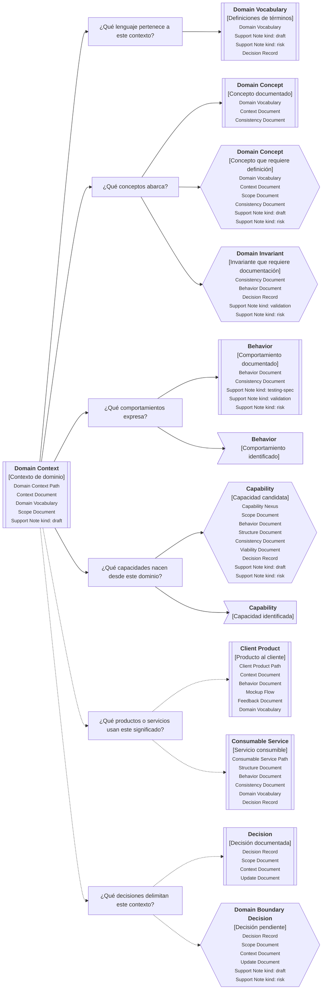

---
artifact:
  kind: continuity-path
  type: domain-context
  scope: domain-context
  target: <domain-context-name>
  language: <es|en>

metadata:
  status: <draft|candidate|active|deprecated|superseded>
  relates: []

continuity:
  question: ¿Qué lenguaje, conceptos, reglas y comportamientos pertenecen a este contexto?
  preserves: semantic-continuity
  connects:
    - artifact: <artifact-id>
      role: <language|domain-concept|domain-invariant|behavior|capability|client-product|consumable-service|decision|boundary>

tooling:
  schema:
    version: 0.1.0
  template:
    name: domain-context.continuity-path
    version: 0.1.0
---

# Camino de continuidad "Contexto de dominio" de <tema>

## Propósito del recorrido

<!--
¿Para qué necesitamos recorrer este path?

Explicar qué continuidad semántica del negocio se busca preservar.
No explicar todavía todo el escenario operativo; eso pertenece al Camino de continuidad de Escenario de negocio.
-->

Este path busca preservar continuidad entre `<tema>` y el lenguaje, conceptos, reglas, comportamientos, responsabilidades y límites conceptuales que pertenecen a una parte específica del negocio.

Ayuda a entender cómo se organiza semánticamente una parte del negocio antes de convertirla en productos, servicios, capacidades, decisiones de software o estructuras técnicas.

Un contexto de dominio puede representar una zona conceptual del negocio donde ciertos términos, reglas, comportamientos y responsabilidades tienen un significado específico.

No todo escenario de negocio necesita ser un único contexto de dominio.

Un mismo escenario puede contener varios contextos de dominio, y un mismo término puede cambiar de significado entre contextos distintos.

## Punto de entrada

<!--
¿Por dónde empieza este camino?

Indicar la parte del negocio, zona conceptual, término, regla, comportamiento, capacidad, límite semántico o ambigüedad desde donde parte el recorrido.
-->

## Diagrama de continuidad

<!--
¿Qué mapa vamos a recorrer?

Incluir el Diagrama de Camino de Continuidad asociado al Domain Context.
El diagrama debe mostrar preguntas de orientación, conceptos relacionados y estado documental de los conceptos conectados.
-->

## Recorrido recomendado

<!--
¿Qué ruta conviene seguir primero?

Describir el recorrido principal recomendado para entender el path sin duplicar el contenido de los artifacts conectados.
-->

| Orden | Nodo, artifact o concepto                  | Por qué revisarlo                                                                                            |
| ----- | ------------------------------------------ | ------------------------------------------------------------------------------------------------------------ |
| 1     | Contexto de dominio                        | Permite identificar qué zona conceptual del negocio estamos siguiendo                                        |
| 2     | Lenguaje del contexto                      | Permite entender qué términos y significados pertenecen a esta parte del negocio                             |
| 3     | Conceptos, reglas e invariantes            | Permite reconocer qué significados y condiciones deben respetarse dentro del contexto                        |
| 4     | Comportamientos propios                    | Permite entender qué acciones o respuestas expresan intención del dominio                                    |
| 5     | Capacidades candidatas                     | Permite reconocer qué capacidades podrían nacer desde este dominio                                           |
| 6     | Productos o servicios que usan el contexto | Permite entender qué piezas dependen de este significado                                                     |
| 7     | Decisiones de límite                       | Permite entender por qué ciertos conceptos, nombres o responsabilidades pertenecen aquí y no a otro contexto |

## Conceptos complementarios

<!--
¿Qué elementos relacionados ayudan a entender este contexto sin pertenecer necesariamente a la ruta principal?

Usar esta sección solo cuando existan elementos relevantes para preservar continuidad.
No convertirla en lista exhaustiva.
-->

| Concepto complementario | Relación con el contexto | Path o artifact sugerido |
| ----------------------- | ------------------------ | ------------------------ |
| <concepto>              | <relación>               | <path o artifact>        |
