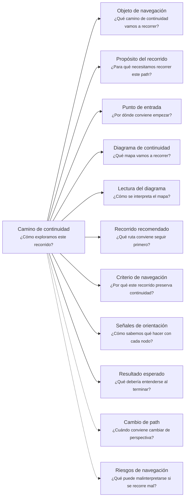
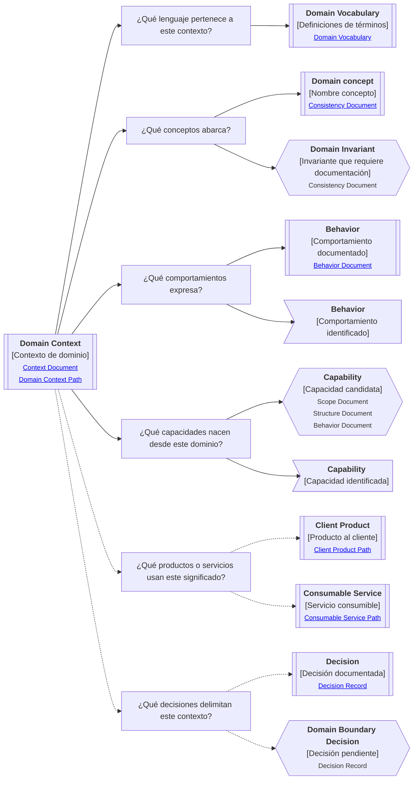

# Camino de continuidad "Contexto de dominio" de <tema>

## Organización



## Objeto de navegación

<!--
¿Qué camino de continuidad vamos a recorrer?

Indicar que este documento orienta la lectura del Domain Context Continuity Path asociado a una parte del negocio, zona conceptual, lenguaje, reglas, comportamientos, capacidades o límites semánticos.
-->

Este documento orienta la lectura del Camino de continuidad de Contexto de dominio para `<tema>`.

## Propósito del recorrido

<!--
¿Para qué necesitamos recorrer este path?

Explicar qué continuidad semántica del negocio se busca preservar.
No explicar todavía todo el escenario operativo; eso pertenece al Camino de continuidad de Escenario de negocio.
-->

Este path busca preservar continuidad entre `<tema>` y el lenguaje, reglas, comportamientos, responsabilidades y límites conceptuales que pertenecen a una parte específica del negocio.

Ayuda a entender cómo se organiza semánticamente una parte del negocio antes de convertirla en productos, servicios, capacidades, decisiones de software o estructuras técnicas.

Un contexto de dominio puede representar una zona conceptual del negocio donde ciertos términos, reglas, comportamientos y responsabilidades tienen un significado específico.

No todo escenario de negocio necesita ser un único contexto de dominio.

Un mismo escenario puede contener varios contextos de dominio, y un mismo término puede cambiar de significado entre contextos distintos.

## Punto de entrada

<!--
¿Por dónde conviene empezar?

Indicar la parte del negocio, zona conceptual, término, regla, comportamiento, capacidad o límite semántico desde donde parte el recorrido.
-->

El recorrido debería comenzar desde la parte del negocio o zona conceptual que se quiere entender o seguir.

Ese punto de entrada puede ser:

* una parte del negocio
* una zona conceptual
* un término del dominio
* una regla de negocio
* una invariante
* un comportamiento propio del contexto
* una responsabilidad del dominio
* una capacidad candidata
* una frontera conceptual
* una ambigüedad semántica
* un término que cambia de significado entre contextos
* una decisión que delimita un contexto

## Diagrama de continuidad

<!--
¿Qué mapa vamos a recorrer?

Incluir el Diagrama de Camino de Continuidad asociado al Domain Context.
El diagrama debe mostrar preguntas de orientación, conceptos relacionados y estado documental de los conceptos conectados.
-->



## Lectura del diagrama

<!--
¿Cómo se interpreta el mapa?

Explicar brevemente cómo leer la semántica visual del Diagrama de Camino de Continuidad.
-->

| Forma       | Significado                                           | Qué hacer al encontrarla                                                                                   |
| ----------- | ----------------------------------------------------- | ---------------------------------------------------------------------------------------------------------- |
| `[[texto]]` | Concepto documentado                                  | Revisar los artifacts asociados si son relevantes para entender el lenguaje, reglas o límites del contexto |
| `[texto]`   | Pregunta orientadora u orientación definida           | Usarla para decidir qué aspecto semántico del dominio revisar                                              |
| `>texto]`   | Concepto identificado sin necesidad documental actual | Mantenerlo visible sin documentarlo todavía                                                                |
| `{{texto}}` | Concepto identificado con necesidad documental        | Evaluar si debe documentarse para no perder significado, regla, comportamiento o límite conceptual         |

## Recorrido recomendado

<!--
¿Qué ruta conviene seguir primero?

Describir el recorrido principal recomendado para entender el path sin duplicar el contenido de los artifacts conectados.
-->

| Orden | Nodo, artifact o concepto                  | Por qué revisarlo                                                                                            |
| ----- | ------------------------------------------ | ------------------------------------------------------------------------------------------------------------ |
| 1     | Contexto de dominio                        | Permite identificar qué zona conceptual del negocio estamos siguiendo                                        |
| 2     | Lenguaje del contexto                      | Permite entender qué términos y significados pertenecen a esta parte del negocio                             |
| 3     | Reglas o invariantes                       | Permite reconocer qué condiciones deben respetarse dentro del contexto                                       |
| 4     | Comportamientos propios                    | Permite entender qué acciones o respuestas expresan intención del dominio                                    |
| 5     | Capacidades candidatas                     | Permite reconocer qué capacidades podrían nacer desde este dominio                                           |
| 6     | Productos o servicios que usan el contexto | Permite entender qué piezas dependen de este significado                                                     |
| 7     | Decisiones de límite                       | Permite entender por qué ciertos conceptos, nombres o responsabilidades pertenecen aquí y no a otro contexto |

## Criterio de navegación

<!--
¿Por qué este recorrido preserva continuidad?

Explicar la lógica del recorrido recomendado y qué pérdida de intención ayuda a evitar.
-->

Este recorrido preserva continuidad porque conecta una parte del negocio con su lenguaje propio, sus reglas, sus comportamientos, sus capacidades derivadas y los límites que explican dónde ese significado aplica.

Ayuda a evitar que el mismo término sea usado con sentidos distintos sin hacerlo visible, que una regla quede separada del contexto donde aplica o que una capacidad, producto o servicio se diseñe sin preservar el significado de negocio que lo sostiene.

## Señales de orientación

<!--
¿Cómo sabemos qué hacer con cada nodo?

Registrar señales que ayudan a decidir si conviene seguir, detenerse, documentar, ignorar temporalmente o cambiar de path.
-->

| Señal                                                      | Acción sugerida                                                                             |
| ---------------------------------------------------------- | ------------------------------------------------------------------------------------------- |
| Un término cambia de significado entre contextos           | Revisar o crear Domain Vocabulary                                                           |
| Un término aparece como `{{texto}}`                        | Evaluar si necesita Domain Vocabulary                                                       |
| Una regla aparece sin límite de aplicación claro           | Evaluar si necesita Consistency Document o Context Document                                 |
| Una invariante aparece como `{{texto}}`                    | Evaluar si necesita Consistency Document                                                    |
| Un comportamiento mezcla reglas de varios contextos        | Revisar límites del Domain Context                                                          |
| Un comportamiento aparece como `{{texto}}`                 | Evaluar si necesita Behavior Document                                                       |
| Una capacidad nace desde reglas estables del dominio       | Evaluar qué artifact responde mejor: Scope Document, Structure Document o Behavior Document |
| Una frontera conceptual está en discusión                  | Evaluar si necesita Decision Record                                                         |
| Un producto usa conceptos del contexto                     | Cambiar hacia Client Product si la pregunta pasa a experiencia o acciones visibles          |
| Un servicio expone conceptos del contexto                  | Cambiar hacia Consumable Service si la pregunta pasa a contrato, consumo o garantías        |
| El path empieza a hablar de módulos, carpetas o despliegue | Cambiar hacia Software Project o detener el recorrido técnico prematuro                     |

## Cambio de path

<!--
¿Cuándo conviene cambiar de perspectiva?

Indicar señales que sugieren que otro Continuity Path podría preservar mejor la continuidad buscada.
-->

| Señal                                                                                     | Path sugerido       |
| ----------------------------------------------------------------------------------------- | ------------------- |
| La pregunta principal pasa a ser dónde ocurre el trabajo                                  | Business Scenario   |
| La pregunta principal pasa a ser por qué importa intervenir                               | Business Driver     |
| La pregunta principal pasa a ser qué iniciativa de software aborda esta parte del trabajo | Software Initiative |
| La pregunta principal pasa a ser cómo vive un elemento dentro de un proyecto técnico      | Software Project    |
| La pregunta principal pasa a ser qué puede hacer una persona usuaria con el sistema       | Client Product      |
| La pregunta principal pasa a ser qué contrato, entrada, salida o garantía ofrece          | Consumable Service  |
| La pregunta principal pasa a ser quién entiende, decide, valida o mantiene el contexto    | Ownership           |
| La pregunta principal pasa a ser qué otros elementos se ven afectados                     | Impact              |
| La pregunta principal pasa a ser de dónde viene y dónde terminó materializándose          | Traceability        |

## Resultado esperado

<!--
¿Qué debería entenderse al terminar?

Indicar qué claridad, orientación o comprensión debería obtenerse después de recorrer el path.
-->

Al terminar este recorrido debería entenderse:

* qué contexto de dominio se está siguiendo
* qué parte del negocio necesita lenguaje propio
* qué conceptos pertenecen juntos
* qué términos tienen significado específico dentro del contexto
* qué términos cambian de significado fuera de este contexto
* qué reglas o invariantes deben protegerse
* qué comportamientos pertenecen realmente a este contexto
* qué capacidades podrían surgir desde este dominio
* qué productos o servicios usan conceptos de este contexto
* qué decisiones explican sus límites conceptuales
* qué conocimiento ya está documentado
* qué conocimiento requiere documentación
* qué conocimiento fue identificado pero no requiere documentación todavía
* cuándo conviene detenerse o cambiar de path

## Riesgos de navegación

<!--
¿Qué puede malinterpretarse si se recorre mal?

Registrar riesgos de usar el path como documento detallado, leer nodos como obligaciones, documentar demasiado pronto o asumir trazabilidad formal innecesaria.
-->

| Riesgo de navegación                                                   | Consecuencia                                                                                         |
| ---------------------------------------------------------------------- | ---------------------------------------------------------------------------------------------------- |
| Confundir contexto de dominio con estructura técnica                   | Se convierte una zona semántica del negocio en módulo, carpeta, servicio o despliegue prematuramente |
| Confundir contexto de dominio con escenario de negocio completo        | Se asume que toda operación comparte un único lenguaje o límite conceptual                           |
| Usar nombres técnicos antes de entender el lenguaje del negocio        | El software empieza a nombrar el dominio desde implementación y no desde significado                 |
| Mezclar términos que significan cosas distintas en contextos distintos | Se pierde precisión semántica y aparecen reglas ambiguas                                             |
| Documentar todos los términos detectados                               | Se genera vocabulario prematuro y difícil de mantener                                                |
| Documentar reglas sin explicar dónde aplican                           | Las reglas pierden su límite de validez dentro del negocio                                           |
| Ocultar ambigüedades semánticas detrás de nombres genéricos            | Se preserva confusión como si fuera conocimiento estable                                             |
| Tratar el vocabulario como glosario decorativo                         | Se pierde su función como límite de significado                                                      |
| Interpretar `{{texto}}` como obligación inmediata                      | Se genera documentación prematura                                                                    |
| Interpretar `>texto]` como deuda documental                            | Se burocratizan conceptos que solo necesitaban visibilidad                                           |
| Saltar desde dominio a implementación demasiado pronto                 | Se pierde intención conceptual antes de diseñar o construir                                          |

## Principio de continuidad

!!! principle "Principio de Continuidad"

```
La perspectiva de contexto de dominio debería ayudar a preservar el lenguaje, las reglas, los comportamientos y los límites conceptuales de una parte del negocio antes de convertirlos en productos, servicios, capacidades o software.
```
