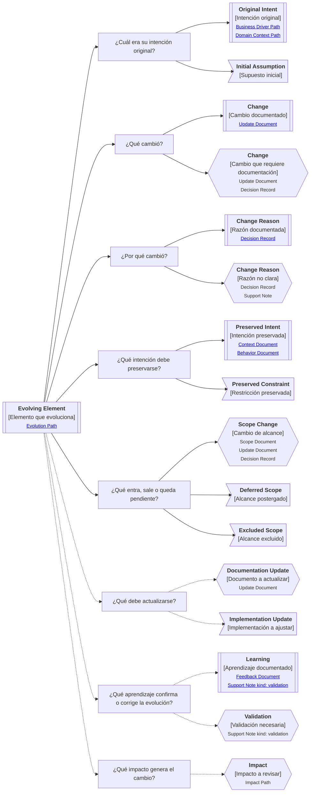

# Camino de continuidad "Evolución" de <tema>

## Propósito del recorrido

<!--
¿Para qué necesitamos recorrer este path?

Explicar qué continuidad de cambio, alcance, intención preservada, actualización y aprendizaje se busca sostener.
-->

Este path busca preservar continuidad cuando `<tema>` cambia en el tiempo.

Ayuda a entender qué cambió, por qué cambió, qué intención debe seguir viva, qué alcance entra o sale, qué decisiones explican la evolución, qué aprendizaje la justifica y qué artifacts deben actualizarse para no perder continuidad.

Este path es especialmente útil cuando aparecen cambios de alcance, cambios de dirección, nuevas restricciones, feedback de usuarios, validaciones, reemplazos, exclusiones, postergaciones o ajustes importantes de comprensión.

En esta perspectiva, evolución no significa documentar cada cambio menor.

Significa seguir cambios que pueden alterar intención, alcance, comportamiento esperado, reglas, decisiones relevantes, productos, servicios o continuidad futura.

## Punto de entrada

<!--
¿Por dónde empieza este camino?

Indicar el elemento, cambio, alcance, feedback, validación, decisión, restricción o artifact cuya evolución se quiere seguir.
-->

## Diagrama de continuidad

<!--
¿Qué mapa vamos a recorrer?

Incluir el Diagrama de Camino de Continuidad asociado a Evolution.
El diagrama debe mostrar preguntas de orientación, conceptos relacionados y estado documental de los conceptos conectados.
-->

## Recorrido recomendado

<!--
¿Qué ruta conviene seguir primero?

Describir el recorrido principal recomendado para entender el path sin duplicar el contenido de los artifacts conectados.
-->

| Orden | Nodo, artifact o concepto                   | Por qué revisarlo                                                 |
| ----- | ------------------------------------------- | ----------------------------------------------------------------- |
| 1     | Elemento que evoluciona                     | Permite identificar qué cambio estamos siguiendo                  |
| 2     | Intención original                          | Permite entender qué no debería perderse al cambiar               |
| 3     | Cambio realizado o propuesto                | Permite reconocer qué se modificó                                 |
| 4     | Razón del cambio                            | Permite entender por qué la evolución era necesaria               |
| 5     | Intención preservada                        | Permite distinguir evolución de ruptura accidental                |
| 6     | Cambio de alcance                           | Permite entender qué entra, sale, se posterga o queda excluido    |
| 7     | Documentación o implementación a actualizar | Permite mantener continuidad entre conocimiento y materialización |
| 8     | Aprendizaje o validación                    | Permite entender qué evidencia confirmó o corrigió la evolución   |
| 9     | Impacto del cambio                          | Permite identificar qué otros elementos pueden verse afectados    |

## Cambio, actualización y aprendizaje

<!--
¿Cómo se distinguen los elementos principales de evolución?

Usar esta sección para evitar confundir Evolution con Update Document, Scope Document, Feedback Document o Impact Path.
-->

| Concepto        | Cómo se interpreta                                                     | Cuándo usarlo                                                                              |
| --------------- | ---------------------------------------------------------------------- | ------------------------------------------------------------------------------------------ |
| Evolution       | Cambio relevante en el tiempo que debe preservar intención             | Cuando necesitamos entender cómo algo cambió sin perder su razón de ser                    |
| Change          | Modificación realizada o propuesta                                     | Cuando necesitamos identificar qué cambió                                                  |
| Change Reason   | Razón que explica por qué el cambio ocurrió o debería ocurrir          | Cuando el cambio necesita justificarse                                                     |
| Scope Change    | Cambio en lo que entra, sale, se posterga o queda excluido             | Cuando la evolución modifica alcance                                                       |
| Update Document | Artifact que explica qué debe actualizarse                             | Cuando documentos, estructura, comportamiento o implementación deben ajustarse             |
| Learning        | Aprendizaje obtenido desde uso, feedback, validación o aplicación real | Cuando la evolución se apoya en evidencia o comprensión nueva                              |
| Impact          | Elementos afectados por el cambio                                      | Cuando necesitamos revisar consecuencias sobre otros artifacts, paths o partes del sistema |

## Conceptos complementarios

<!--
¿Qué elementos relacionados ayudan a entender esta evolución sin pertenecer necesariamente a la ruta principal?

Usar esta sección solo cuando existan elementos relevantes para preservar continuidad.
No convertirla en lista exhaustiva.
-->

| Concepto complementario | Relación con la evolución | Path o artifact sugerido |
| ----------------------- | ------------------------- | ------------------------ |
| <concepto>              | <relación>                | <path o artifact>        |
