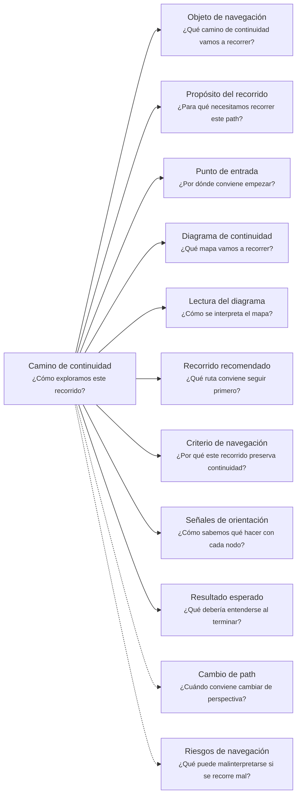

# Camino de continuidad "Evolución" de <tema>

## Organización



## Objeto de navegación

<!--
¿Qué camino de continuidad vamos a recorrer?

Indicar que este documento orienta la lectura del Evolution Continuity Path asociado a un concepto, alcance, decisión, artifact, producto, servicio, comportamiento, capacidad, regla, estructura o parte del sistema que cambia en el tiempo.
-->

Este documento orienta la lectura del Camino de continuidad de Evolución para `<tema>`.

## Propósito del recorrido

<!--
¿Para qué necesitamos recorrer este path?

Explicar qué continuidad de cambio, alcance, intención preservada, actualización y aprendizaje se busca sostener.
-->

Este path busca preservar continuidad cuando `<tema>` cambia en el tiempo.

Ayuda a entender qué cambió, por qué cambió, qué intención debe seguir viva, qué alcance entra o sale, qué decisiones explican la evolución, qué aprendizaje la justifica y qué artifacts deben actualizarse para no perder continuidad.

Este path es especialmente útil cuando aparecen cambios de alcance, cambios de dirección, nuevas restricciones, feedback de usuarios, validaciones, reemplazos, exclusiones, postergaciones o ajustes importantes de comprensión.

En esta perspectiva, evolución no significa documentar cada cambio menor.

Significa seguir cambios que pueden alterar intención, alcance, comportamiento esperado, reglas, decisiones relevantes, productos, servicios o continuidad futura.

## Punto de entrada

<!--
¿Por dónde conviene empezar?

Indicar el elemento cuyo cambio o evolución se quiere seguir.
-->

El recorrido debería comenzar desde el elemento cuya evolución se quiere entender.

Ese punto de entrada puede ser:

* un cambio de alcance
* una inclusión nueva
* una exclusión nueva
* una reducción de alcance
* una ampliación de alcance
* una postergación
* una decisión de reemplazo
* una nueva restricción
* un feedback recibido
* una validación realizada
* una idea del cliente que cambió
* una feature que cambió de forma
* un producto que cambió su experiencia
* un servicio que cambió su contrato
* una regla que cambió su aplicación
* una documentación que quedó obsoleta
* una implementación que necesita ajustarse

## Diagrama de continuidad

<!--
¿Qué mapa vamos a recorrer?

Incluir el Diagrama de Camino de Continuidad asociado a Evolution.
El diagrama debe mostrar preguntas de orientación, conceptos relacionados y estado documental de los conceptos conectados.
-->


## Lectura del diagrama

<!--
¿Cómo se interpreta el mapa?

Explicar brevemente cómo leer la semántica visual del Diagrama de Camino de Continuidad.
-->

| Forma       | Significado                                           | Qué hacer al encontrarla                                                                           |
| ----------- | ----------------------------------------------------- | -------------------------------------------------------------------------------------------------- |
| `[[texto]]` | Concepto documentado                                  | Revisar los artifacts asociados si ayudan a entender la evolución del elemento                     |
| `[texto]`   | Pregunta orientadora u orientación definida           | Usarla para decidir qué aspecto del cambio revisar                                                 |
| `>texto]`   | Concepto identificado sin necesidad documental actual | Mantenerlo visible sin documentarlo todavía                                                        |
| `{{texto}}` | Concepto identificado con necesidad documental        | Evaluar si debe documentarse para no perder intención, alcance, razón, actualización o aprendizaje |

## Recorrido recomendado

<!--
¿Qué ruta conviene seguir primero?

Describir el recorrido principal recomendado para entender el path sin duplicar el contenido de los artifacts conectados.
-->

| Orden | Nodo, artifact o concepto                   | Por qué revisarlo                                                 |
| ----- | ------------------------------------------- | ----------------------------------------------------------------- |
| 1     | Elemento que evoluciona                     | Permite identificar qué cambio estamos siguiendo                  |
| 2     | Intención original                          | Permite entender qué no debería perderse al cambiar               |
| 3     | Cambio realizado o propuesto                | Permite reconocer qué se modificó                                 |
| 4     | Razón del cambio                            | Permite entender por qué la evolución era necesaria               |
| 5     | Intención preservada                        | Permite distinguir evolución de ruptura accidental                |
| 6     | Cambio de alcance                           | Permite entender qué entra, sale, se posterga o queda excluido    |
| 7     | Documentación o implementación a actualizar | Permite mantener continuidad entre conocimiento y materialización |
| 8     | Aprendizaje o validación                    | Permite entender qué evidencia confirmó o corrigió la evolución   |
| 9     | Impacto del cambio                          | Permite identificar qué otros elementos pueden verse afectados    |

## Criterio de navegación

<!--
¿Por qué este recorrido preserva continuidad?

Explicar la lógica del recorrido recomendado y qué pérdida de intención ayuda a evitar.
-->

Este recorrido preserva continuidad porque conecta el cambio con la intención que debe seguir viva.

Ayuda a manejar cambios de alcance, dirección o comprensión sin tratar cada cambio como una ruptura total ni como una simple actualización aislada.

También ayuda a evitar que una nueva idea, validación, restricción o decisión modifique el trabajo sin explicar qué reemplaza, qué conserva, qué excluye, qué posterga y qué documentación necesita actualizarse.

## Señales de orientación

<!--
¿Cómo sabemos qué hacer con cada nodo?

Registrar señales que ayudan a decidir si conviene seguir, detenerse, documentar, ignorar temporalmente o cambiar de path.
-->

| Señal                                                  | Acción sugerida                                           |
| ------------------------------------------------------ | --------------------------------------------------------- |
| El cambio no tiene intención original clara            | Revisar Business Driver, Domain Context o Traceability    |
| El cliente cambia una idea que altera alcance          | Evaluar Scope Document, Decision Record y Update Document |
| Una parte entra al alcance actual                      | Evaluar Scope Document y artifacts afectados              |
| Una parte sale del alcance actual                      | Registrar exclusión si afecta continuidad futura          |
| Una parte queda postergada                             | Mantener visible si puede afectar decisiones futuras      |
| El cambio modifica comportamiento esperado             | Evaluar Behavior Document o Support Note kind: validation |
| El cambio modifica lenguaje, regla o límite conceptual | Cambiar hacia Domain Context                              |
| El cambio modifica experiencia visible                 | Cambiar hacia Client Product                              |
| El cambio modifica contrato o garantía                 | Cambiar hacia Consumable Service                          |
| El cambio modifica estructura técnica                  | Cambiar hacia Software Project                            |
| El cambio afecta otros elementos                       | Cambiar hacia Impact                                      |
| El cambio reemplaza una decisión previa                | Evaluar Decision Record                                   |
| El cambio deja documentación obsoleta                  | Evaluar Update Document                                   |
| El cambio nace de feedback o validación                | Revisar Feedback Document o Support Note kind: validation |
| El cambio depende de quién decide o valida             | Cambiar hacia Ownership                                   |

## Cambio de path

<!--
¿Cuándo conviene cambiar de perspectiva?

Indicar señales que sugieren que otro Continuity Path podría preservar mejor la continuidad buscada.
-->

| Señal                                                            | Path sugerido       |
| ---------------------------------------------------------------- | ------------------- |
| La pregunta pasa a ser dónde ocurre el trabajo                   | Business Scenario   |
| La pregunta pasa a ser por qué importa intervenir                | Business Driver     |
| La pregunta pasa a ser qué significado, regla o límite cambió    | Domain Context      |
| La pregunta pasa a ser qué iniciativa contiene el cambio         | Software Initiative |
| La pregunta pasa a ser qué experiencia cambia                    | Client Product      |
| La pregunta pasa a ser qué contrato cambia                       | Consumable Service  |
| La pregunta pasa a ser dónde vive técnicamente el cambio         | Software Project    |
| La pregunta pasa a ser qué otros elementos se ven afectados      | Impact              |
| La pregunta pasa a ser de dónde viene y dónde se materializó     | Traceability        |
| La pregunta pasa a ser quién decide, valida o mantiene el cambio | Ownership           |

## Resultado esperado

<!--
¿Qué debería entenderse al terminar?

Indicar qué claridad, orientación o comprensión debería obtenerse después de recorrer el path.
-->

Al terminar este recorrido debería entenderse:

* qué elemento está evolucionando
* cuál era su intención original
* qué cambió o se propone cambiar
* por qué cambió
* qué intención, regla, comportamiento o decisión debe preservarse
* qué entra al alcance actual
* qué sale del alcance actual
* qué queda postergado o pendiente
* qué documentación debe actualizarse
* qué implementación podría necesitar ajuste
* qué feedback o validación confirmó o corrigió la evolución
* qué otros elementos pueden verse afectados
* cuándo conviene detenerse o cambiar de path

## Riesgos de navegación

<!--
¿Qué puede malinterpretarse si se recorre mal?

Registrar riesgos de usar el path como documento detallado, leer nodos como obligaciones, documentar demasiado pronto o asumir trazabilidad formal innecesaria.
-->

| Riesgo de navegación                                         | Consecuencia                                                 |
| ------------------------------------------------------------ | ------------------------------------------------------------ |
| Confundir evolución con cambio libre                         | Se modifica el elemento sin preservar intención              |
| Confundir cambio de idea con decisión validada               | Se formalizan volteretas sin evidencia ni criterio           |
| Tratar todo cambio menor como camino de evolución            | Se genera burocracia y ruido histórico                       |
| No registrar cambios que alteran alcance o comportamiento    | Se pierde continuidad futura                                 |
| Actualizar documentación sin validar el nuevo comportamiento | Se preserva conocimiento incorrecto                          |
| Actualizar implementación sin actualizar documentación       | Se rompe continuidad entre software y conocimiento           |
| Mantener información obsoleta sin marcarla                   | Se confunden versiones anteriores con intención actual       |
| Ocultar exclusiones o postergaciones importantes             | Se pierde memoria de por qué algo quedó fuera                |
| Usar evolución como trazabilidad exhaustiva                  | Se documenta historia innecesaria en vez de cambio relevante |
| Interpretar `{{texto}}` como obligación inmediata            | Se genera documentación prematura                            |
| Tratar toda evolución como decisión estratégica              | Se sobredimensionan ajustes pequeños                         |
| Usar el path para aceptar cualquier cambio sin criterio      | Se pierde foco y el alcance se vuelve inestable              |

## Principio de continuidad

!!! principle "Principio de Continuidad"

```
La perspectiva de evolución debería ayudar a manejar cambios de alcance, dirección o comprensión preservando la intención que debe seguir viva, lo que cambia, lo que queda fuera y el aprendizaje que justifica la evolución.
```
