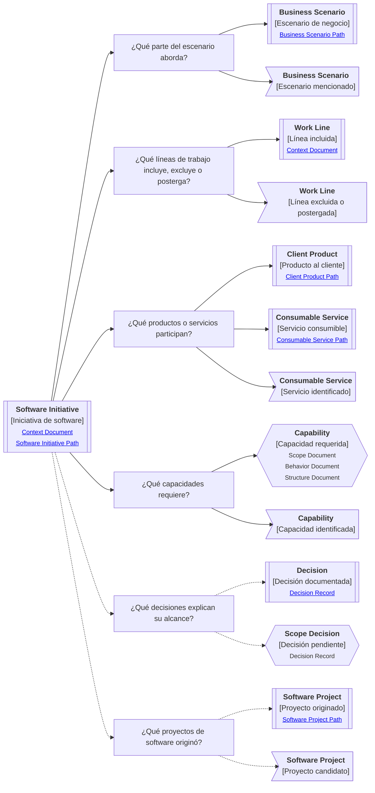

# Camino de continuidad "Iniciativa de software" de <tema>

## Propósito del recorrido

<!--
¿Para qué necesitamos recorrer este path?

Explicar qué continuidad de cobertura funcional, alcance de intervención y materialización por software se busca preservar.
No explicar todavía la estructura interna de los proyectos de software originados; eso pertenece al Camino de continuidad de Proyecto de software.
-->

Este path busca preservar continuidad entre una parte del escenario de negocio y las herramientas de software que permiten abordarla.

En esta perspectiva, "herramientas" no se refiere solo a tooling técnico.

Se refiere a productos, servicios, capacidades, procesos soportados, decisiones, límites y proyectos de software que permiten intervenir una parte del trabajo mediante software.

Ayuda a entender qué intenta cubrir una iniciativa, qué piezas participan, qué queda dentro o fuera del alcance y qué decisiones explican esa cobertura.

También ayuda a separar la cobertura funcional de una iniciativa de su materialización técnica concreta.

## Punto de entrada

<!--
¿Por dónde empieza este camino?

Indicar la iniciativa, esfuerzo, mejora, modernización, migración, integración o parte del trabajo desde donde parte el recorrido.
-->

## Diagrama de continuidad

<!--
¿Qué mapa vamos a recorrer?

Incluir el Diagrama de Camino de Continuidad asociado al Software Initiative.
El diagrama debe mostrar preguntas de orientación, conceptos relacionados y estado documental de los conceptos conectados.
-->



!!! note "¿Qué proyectos originó?"

```
Una iniciativa de software puede originar uno o varios proyectos de software.

Esta pregunta ayuda a separar la cobertura funcional de la iniciativa de la materialización técnica concreta donde los elementos viven, evolucionan y se mantienen.

Cuando la pregunta principal pasa a ser cómo vive un concepto dentro de un proyecto, conviene continuar el recorrido en el Camino de continuidad "Proyecto de software".
```

## Recorrido recomendado

<!--
¿Qué ruta conviene seguir primero?

Describir el recorrido principal recomendado para entender el path sin duplicar el contenido de los artifacts conectados.
-->

| Orden | Nodo, artifact o concepto                            | Por qué revisarlo                                                                        |
| ----- | ---------------------------------------------------- | ---------------------------------------------------------------------------------------- |
| 1     | Iniciativa de software                               | Permite identificar qué esfuerzo organizado estamos siguiendo                            |
| 2     | Escenario de negocio abordado                        | Permite entender qué parte del trabajo intenta intervenir                                |
| 3     | Líneas de trabajo incluidas, excluidas o postergadas | Permite entender la cobertura real de la iniciativa                                      |
| 4     | Productos o servicios participantes                  | Permite reconocer qué piezas de software entregan, sostienen o habilitan la intervención |
| 5     | Capacidades requeridas                               | Permite entender qué necesita construir, usar, estabilizar o preservar la iniciativa     |
| 6     | Decisiones de alcance                                | Permite entender por qué ciertas partes entran, quedan fuera o se postergan              |
| 7     | Proyectos de software originados                     | Permite conectar la iniciativa con su materialización técnica concreta                   |

## Cobertura y materialización

<!--
¿Cómo se distingue la cobertura de la iniciativa de su materialización técnica?

Usar esta sección para evitar confundir iniciativa de software con proyecto de software.
-->

| Concepto            | Cómo se interpreta                                                       | Cuándo usarlo                                                                          |
| ------------------- | ------------------------------------------------------------------------ | -------------------------------------------------------------------------------------- |
| Software Initiative | Esfuerzo organizado para abordar una parte del trabajo mediante software | Cuando necesitamos entender cobertura, intención, alcance y piezas participantes       |
| Client Product      | Producto visible que participa en la iniciativa                          | Cuando la iniciativa entrega o modifica experiencia de uso                             |
| Consumable Service  | Servicio consumible que participa en la iniciativa                       | Cuando la iniciativa expone, coordina o consume capacidades entre sistemas o productos |
| Capability          | Capacidad requerida para que la iniciativa pueda sostenerse              | Cuando la iniciativa necesita construir, usar, estabilizar o preservar una capacidad   |
| Software Project    | Materialización técnica originada por la iniciativa                      | Cuando necesitamos entender dónde viven técnicamente los elementos dentro del proyecto |

## Conceptos complementarios

<!--
¿Qué elementos relacionados ayudan a entender esta iniciativa sin pertenecer necesariamente a la ruta principal?

Usar esta sección solo cuando existan elementos relevantes para preservar continuidad.
No convertirla en lista exhaustiva.
-->

| Concepto complementario | Relación con la iniciativa | Path o artifact sugerido |
| ----------------------- | -------------------------- | ------------------------ |
| <concepto>              | <relación>                 | <path o artifact>        |
