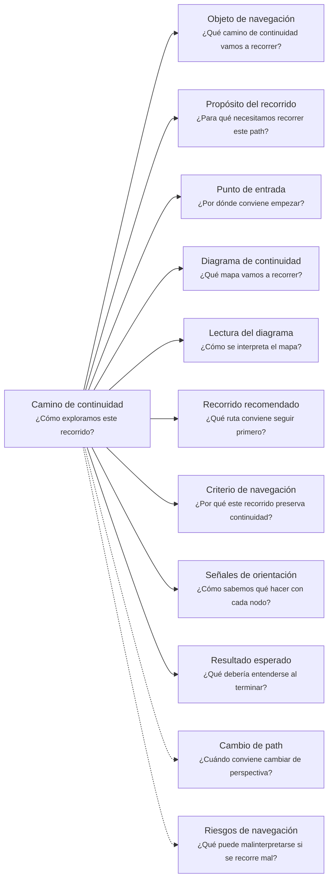
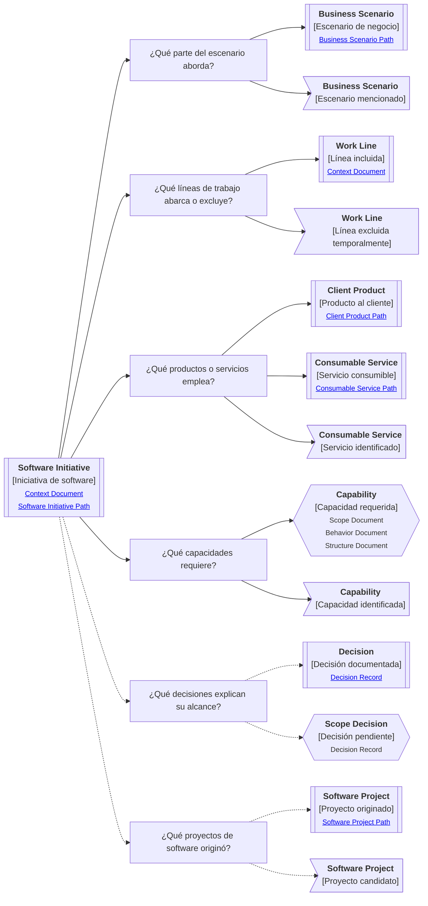

# Camino de continuidad "Iniciativa de software" de <tema>

## Organización



## Objeto de navegación

<!--
¿Qué camino de continuidad vamos a recorrer?

Indicar que este documento orienta la lectura del Software Initiative Continuity Path asociado a una modernización, automatización, migración, integración, estabilización, mejora operativa o esfuerzo organizado de software.
-->

Este documento orienta la lectura del Camino de continuidad de Iniciativa de software para `<tema>`.

## Propósito del recorrido

<!--
¿Para qué necesitamos recorrer este path?

Explicar qué continuidad de alcance técnico y funcional se busca preservar.
No explicar todavía la estructura interna de los proyectos de software originados; eso pertenece al Camino de continuidad de Proyecto de software.
-->

Este path busca preservar continuidad entre una parte del escenario de negocio y las herramientas de software que permiten abordarla.

En esta perspectiva, "herramientas" no se refiere solo a tooling técnico.

Se refiere a productos, servicios, capacidades, procesos soportados, decisiones, límites y proyectos de software que permiten intervenir una parte del trabajo mediante software.

Ayuda a entender qué intenta cubrir una iniciativa, qué piezas participan, qué queda dentro o fuera del alcance y qué decisiones explican esa cobertura.

## Punto de entrada

<!--
¿Por dónde conviene empezar?

Indicar la iniciativa, esfuerzo, mejora, modernización, migración, integración o parte del trabajo desde donde parte el recorrido.
-->

El recorrido debería comenzar desde la iniciativa de software que se quiere entender o seguir.

Ese punto de entrada puede ser:

* una modernización
* una automatización
* una migración
* una integración
* una estabilización
* una mejora operativa
* una iniciativa de producto
* una iniciativa técnica
* una intervención sobre un proceso
* una intervención sobre una línea de trabajo
* una parte del escenario que se quiere digitalizar, modificar o sostener

## Diagrama de continuidad

<!--
¿Qué mapa vamos a recorrer?

Incluir el Diagrama de Camino de Continuidad asociado al Software Initiative.
El diagrama debe mostrar preguntas de orientación, conceptos relacionados y estado documental de los conceptos conectados.
-->



!!! note "¿Qué proyectos dio origen?"

```
Una iniciativa de software puede originar uno o varios proyectos de software.

Esta pregunta ayuda a separar la cobertura funcional de la iniciativa de la materialización técnica concreta donde los elementos viven, evolucionan y se mantienen.

Cuando la pregunta principal pasa a ser cómo vive un concepto dentro de un proyecto, conviene continuar el recorrido en el Camino de continuidad "Proyecto de software".
```

## Lectura del diagrama

<!--
¿Cómo se interpreta el mapa?

Explicar brevemente cómo leer la semántica visual del Diagrama de Camino de Continuidad.
-->

| Forma       | Significado                                           | Qué hacer al encontrarla                                                                      |
| ----------- | ----------------------------------------------------- | --------------------------------------------------------------------------------------------- |
| `[[texto]]` | Concepto documentado                                  | Revisar los artifacts asociados si son relevantes para entender la cobertura de la iniciativa |
| `[texto]`   | Pregunta orientadora u orientación definida           | Usarla para decidir qué aspecto de la iniciativa revisar                                      |
| `>texto]`   | Concepto identificado sin necesidad documental actual | Mantenerlo visible sin documentarlo todavía                                                   |
| `{{texto}}` | Concepto identificado con necesidad documental        | Evaluar si debe documentarse para no perder alcance, cobertura o decisión de la iniciativa    |

## Recorrido recomendado

<!--
¿Qué ruta conviene seguir primero?

Describir el recorrido principal recomendado para entender el path sin duplicar el contenido de los artifacts conectados.
-->

| Orden | Nodo, artifact o concepto               | Por qué revisarlo                                                                        |
| ----- | --------------------------------------- | ---------------------------------------------------------------------------------------- |
| 1     | Iniciativa de software                  | Permite identificar qué esfuerzo organizado estamos siguiendo                            |
| 2     | Escenario de negocio abordado           | Permite entender qué parte del trabajo intenta intervenir                                |
| 3     | Líneas de trabajo incluidas o excluidas | Permite entender la cobertura real de la iniciativa                                      |
| 4     | Productos o servicios participantes     | Permite reconocer qué piezas de software entregan, sostienen o habilitan la intervención |
| 5     | Capacidades requeridas                  | Permite entender qué necesita construir, usar, estabilizar o preservar la iniciativa     |
| 6     | Decisiones de alcance                   | Permite entender por qué ciertas partes entran, quedan fuera o se postergan              |
| 7     | Proyectos de software originados        | Permite conectar la iniciativa con su materialización técnica concreta                   |

## Criterio de navegación

<!--
¿Por qué este recorrido preserva continuidad?

Explicar la lógica del recorrido recomendado y qué pérdida de intención ayuda a evitar.
-->

Este recorrido preserva continuidad porque conecta una iniciativa de software con la parte del escenario de negocio que intenta abordar y con las piezas de software que permiten intervenirla.

Ayuda a evitar que el proyecto se entienda solo como una interfaz, un repositorio, una arquitectura o una lista de tareas técnicas, perdiendo qué cobertura funcional tiene, qué excluye, qué capacidades requiere y qué decisiones justifican su alcance.

## Señales de orientación

<!--
¿Cómo sabemos qué hacer con cada nodo?

Registrar señales que ayudan a decidir si conviene seguir, detenerse, documentar, ignorar temporalmente o cambiar de path.
-->

| Señal                                                                 | Acción sugerida                                                                             |
| --------------------------------------------------------------------- | ------------------------------------------------------------------------------------------- |
| La iniciativa no tiene escenario de negocio claro                     | Revisar Business Scenario                                                                   |
| La iniciativa no tiene motivación clara                               | Revisar Business Driver                                                                     |
| Una línea de trabajo aparece como incluida o excluida sin explicación | Evaluar si necesita Context Document, Scope Document o Decision Record                      |
| Un producto participa en la iniciativa                                | Cambiar hacia Client Product si la pregunta pasa a experiencia o valor visible              |
| Un servicio participa en la iniciativa                                | Cambiar hacia Consumable Service si la pregunta pasa a contrato, entrada, salida o garantía |
| Una capacidad aparece como `{{texto}}`                                | Evaluar qué artifact responde mejor: Scope Document, Behavior Document o Structure Document |
| Una decisión de alcance aparece como `{{texto}}`                      | Evaluar si necesita Decision Record                                                         |
| Un proyecto originado aparece como `[[texto]]`                        | Seguir hacia Software Project si se necesita entender su materialización técnica            |
| Un proyecto candidato aparece como `>texto]`                          | Mantener visible sin documentar hasta que exista intención real de materializarlo           |
| La iniciativa empieza a describir implementación interna              | Cambiar hacia Software Project                                                              |

## Cambio de path

<!--
¿Cuándo conviene cambiar de perspectiva?

Indicar señales que sugieren que otro Continuity Path podría preservar mejor la continuidad buscada.
-->

| Señal                                                                                    | Path sugerido      |
| ---------------------------------------------------------------------------------------- | ------------------ |
| La pregunta principal pasa a ser dónde ocurre el trabajo                                 | Business Scenario  |
| La pregunta principal pasa a ser por qué importa intervenir                              | Business Driver    |
| La pregunta principal pasa a ser qué lenguaje, reglas o límites pertenecen al negocio    | Domain Context     |
| La pregunta principal pasa a ser cómo vive un elemento dentro de un proyecto técnico     | Software Project   |
| La pregunta principal pasa a ser cómo se percibe o entrega valor al usuario              | Client Product     |
| La pregunta principal pasa a ser qué contrato, entrada, salida o garantía ofrece         | Consumable Service |
| La pregunta principal pasa a ser quién entiende, decide, valida o mantiene la iniciativa | Ownership          |
| La pregunta principal pasa a ser qué otros elementos se ven afectados                    | Impact             |
| La pregunta principal pasa a ser de dónde viene y dónde terminó materializándose         | Traceability       |

## Resultado esperado

<!--
¿Qué debería entenderse al terminar?

Indicar qué claridad, orientación o comprensión debería obtenerse después de recorrer el path.
-->

Al terminar este recorrido debería entenderse:

* qué iniciativa de software se está siguiendo
* qué parte del escenario de negocio intenta abordar
* qué líneas de trabajo, procesos o flujos incluye, excluye o deja pendientes
* qué productos participan
* qué servicios participan
* qué capacidades necesita construir, usar, estabilizar o preservar
* qué decisiones explican su alcance
* qué proyectos de software originó o podría originar
* qué conocimiento ya está documentado
* qué conocimiento requiere documentación
* qué conocimiento fue identificado pero no requiere documentación todavía
* cuándo conviene detenerse o cambiar de path

## Riesgos de navegación

<!--
¿Qué puede malinterpretarse si se recorre mal?

Registrar riesgos de usar el path como documento detallado, leer nodos como obligaciones, documentar demasiado pronto o asumir trazabilidad formal innecesaria.
-->

| Riesgo de navegación                                               | Consecuencia                                                                                   |
| ------------------------------------------------------------------ | ---------------------------------------------------------------------------------------------- |
| Confundir iniciativa de software con proyecto de software          | Se mezcla cobertura funcional con materialización técnica                                      |
| Confundir iniciativa de software con escenario de negocio completo | Se intenta documentar más negocio del que la iniciativa realmente aborda                       |
| Confundir producto con iniciativa completa                         | Se reduce el alcance a una superficie visible y se pierden servicios, capacidades o decisiones |
| Confundir servicio con iniciativa completa                         | Se reduce la iniciativa a una pieza técnica y se pierde cobertura funcional                    |
| Ocultar qué queda fuera del alcance                                | Se pierde continuidad sobre exclusiones, pendientes y decisiones de priorización               |
| Tratar exclusiones temporales como conocimiento inexistente        | Se borra contexto que puede ser necesario para evolución futura                                |
| Documentar todas las piezas mencionadas                            | Se genera documentación prematura y difícil de mantener                                        |
| Interpretar `{{texto}}` como obligación inmediata                  | Se genera documentación prematura                                                              |
| Interpretar `>texto]` como deuda documental                        | Se burocratizan conceptos que solo necesitaban visibilidad                                     |
| Usar la iniciativa para justificar implementación prematura        | Se baja demasiado rápido hacia proyecto de software sin validar cobertura ni alcance           |

## Principio de continuidad

!!! principle "Principio de Continuidad"

```
La perspectiva de iniciativa de software debería ayudar a entender qué parte del escenario de negocio aborda un esfuerzo de software, qué piezas usa o necesita y qué proyectos técnicos origina sin confundir cobertura funcional con materialización técnica.
```
