---
artifact:
  kind: continuity-path
  type: viability
  scope: <feature|capability|initiative|product|service|project|decision|change|artifact>
  target: <viability-subject-name>
  language: <es>

metadata:
  status: <draft|candidate|active|deprecated|superseded>
  relates: 
    - relation: <references/referenced-by|complements|depends-on|owned-by|derived-from|updates|supersedes/superseded-by>
      target: <artifact-id>

continuity:
  question: ¿Puede sostenerse esto bajo las condiciones actuales?
  preserves: viability-continuity
  connects:
    - artifact: <artifact-id>
      role: <evaluated-object|viability-kind|viability-criterion|necessary-condition|known-restriction|initial-evaluation|inviability-risk|viability-alternative|review-condition>

tooling:
  schema:
    version: 0.1.0
  template:
    name: viability.continuity-path
    version: 0.1.0
---

# Camino de continuidad "Viabilidad" de <tema>

## Propósito del recorrido

<!--
¿Para qué necesitamos recorrer este path?

Explicar qué continuidad de viabilidad se busca preservar.
No limitar la viabilidad a costo económico; el kind indica la dimensión evaluada.
-->

Este path busca preservar continuidad entre `<tema>`, las condiciones que hacen posible abordarlo y las restricciones que podrían volverlo inviable.

Ayuda a entender si un concepto, iniciativa, cambio, feature, capability, servicio, producto, experimento, decisión o artifact puede sostenerse bajo las condiciones actuales.

En esta perspectiva, viabilidad no significa únicamente viabilidad económica.

Puede referirse a viabilidad económica, técnica, operacional, temporal, organizacional, de adopción u otra dimensión relevante según el kind evaluado.

Este path ayuda a evitar que una idea avance solo porque parece valiosa, deseable o técnicamente interesante, sin revisar si existen las condiciones necesarias para realizarla, sostenerla, validarla o evolucionarla.

## Punto de entrada

<!--
¿Por dónde empieza este camino?

Indicar el concepto, iniciativa, cambio, feature, capability, servicio, producto, experimento, decisión, artifact o alternativa cuya viabilidad se quiere evaluar.
-->

## Diagrama de continuidad

<!--
¿Qué mapa vamos a recorrer?

Incluir el Diagrama de Camino de Continuidad asociado a Viability.
El diagrama debe mostrar preguntas de orientación, conceptos relacionados y estado documental de los conceptos conectados.
-->

```mermaid
flowchart LR
    A[["<b>Viability Subject</b><br/>[Objeto evaluado]<br/><small>Viability Path<br/>Viability Document<br/>Context Document<br/>Support Note kind: draft<br/>Decision Record</small>"]]

    A --> P1["¿Qué estamos evaluando?"]
    A --> P2["¿Qué kind de viabilidad aplica?"]
    A --> P3["¿Qué significa que sea viable para este kind?"]
    A --> P4["¿Qué condiciones deben cumplirse?"]
    A --> P5["¿Qué restricciones limitan la viabilidad?"]
    A --> P6["¿Qué tan viable parece ahora?"]
    A -.-> P7["¿Qué podría volverlo inviable?"]
    A -.-> P8["¿Qué alternativa lo haría más viable?"]
    A -.-> P9["¿Cuándo debe reevaluarse?"]

    P1 --> O1[["<b>Evaluated Object</b><br/>[Objeto evaluado]<br/><small>Viability Document<br/>Context Document<br/>Scope Document</small>"]]
    P1 --> O2>"<b>Candidate Object</b><br/>[Objeto identificado]<br/><small>Support Note kind: draft<br/>Context Document<br/>Scope Document</small>"]

    P2 --> K1[["<b>Viability Kind</b><br/>[Kind definido]<br/><small>Viability Document</small>"]]
    P2 --> K2{{"<b>Viability Kind</b><br/>[Kind no claro]<br/><small>Viability Document<br/>Decision Record<br/>Support Note kind: draft</small>"}}

    P3 --> VC1[["<b>Viability Criterion</b><br/>[Criterio definido]<br/><small>Viability Document<br/>Consistency Document</small>"]]
    P3 --> VC2{{"<b>Viability Criterion</b><br/>[Criterio no claro]<br/><small>Viability Document<br/>Decision Record<br/>Support Note kind: validation</small>"}}

    P4 --> C1[["<b>Necessary Condition</b><br/>[Condición documentada]<br/><small>Viability Document<br/>Scope Document<br/>Structure Document</small>"]]
    P4 --> C2{{"<b>Necessary Condition</b><br/>[Condición que requiere definición]<br/><small>Viability Document<br/>Scope Document<br/>Support Note kind: draft</small>"}}

    P5 --> R1[["<b>Known Restriction</b><br/>[Restricción documentada]<br/><small>Viability Document<br/>Scope Document<br/>Context Document</small>"]]
    P5 --> R2>"<b>Known Restriction</b><br/>[Restricción identificada]<br/><small>Context Document<br/>Scope Document<br/>Support Note kind: draft</small>"]

    P6 --> E1[["<b>Initial Evaluation</b><br/>[Evaluación inicial]<br/><small>Viability Document<br/>Support Note kind: result<br/>Support Note kind: validation<br/>Decision Record</small>"]]
    P6 --> E2{{"<b>Evaluation Gap</b><br/>[Evaluación insuficiente]<br/><small>Viability Document<br/>Support Note kind: validation<br/>Support Note kind: draft<br/>Feedback Document</small>"}}

    P7 -.-> IV1{{"<b>Inviability Risk</b><br/>[Riesgo de inviabilidad]<br/><small>Viability Document<br/>Support Note kind: validation<br/>Support Note kind: risk<br/>Decision Record<br/>Scope Document</small>"}}

    P8 -.-> ALT1>"<b>Viability Alternative</b><br/>[Alternativa identificada]<br/><small>Scope Document<br/>Support Note kind: draft<br/>Viability Document</small>"]
    P8 -.-> ALT2{{"<b>Smaller Alternative</b><br/>[Alternativa más pequeña]<br/><small>Scope Document<br/>Decision Record<br/>Viability Document</small>"}}

    P9 -.-> RV1{{"<b>Review Condition</b><br/>[Condición de revisión]<br/><small>Viability Document<br/>Update Document<br/>Decision Record<br/>Support Note kind: validation</small>"}}
```

## Recorrido recomendado

<!--
¿Qué ruta conviene seguir primero?

Describir el recorrido principal recomendado para entender el path sin duplicar el contenido de los artifacts conectados.
-->

| Orden | Nodo, artifact o concepto  | Por qué revisarlo                                                      |
| ----- | -------------------------- | ---------------------------------------------------------------------- |
| 1     | Objeto evaluado            | Permite identificar qué elemento se está evaluando                     |
| 2     | Kind de viabilidad         | Permite saber qué dimensión de viabilidad se está observando           |
| 3     | Criterio de viabilidad     | Permite entender qué significa que el elemento sea viable en ese kind  |
| 4     | Condiciones necesarias     | Permite reconocer qué debe cumplirse para sostener la viabilidad       |
| 5     | Restricciones conocidas    | Permite entender qué limita o condiciona la viabilidad                 |
| 6     | Evaluación inicial         | Permite registrar qué tan viable parece con la información disponible  |
| 7     | Riesgos de inviabilidad    | Permite identificar qué podría volverlo inviable                       |
| 8     | Alternativas de viabilidad | Permite encontrar una versión más pequeña, más simple o más sostenible |
| 9     | Condiciones de revisión    | Permite saber cuándo reevaluar la viabilidad                           |

## Kind, criterio y evaluación

<!--
¿Cómo se distinguen kind, criterio, condiciones, restricciones y evaluación?

Usar esta sección para evitar que la viabilidad se reduzca a una opinión general.
-->

| Concepto              | Cómo se interpreta                                                          | Cuándo usarlo                                                                                                    |
| --------------------- | --------------------------------------------------------------------------- | ---------------------------------------------------------------------------------------------------------------- |
| Viability Path        | Camino para preservar continuidad alrededor de una evaluación de viabilidad | Cuando necesitamos entender si algo puede sostenerse bajo condiciones actuales                                   |
| Viability Document    | Documento que registra la evaluación de viabilidad                          | Cuando la viabilidad necesita quedar explícita como artifact                                                     |
| Viability Kind        | Dimensión desde la cual se evalúa la viabilidad                             | Cuando necesitamos distinguir viabilidad económica, técnica, operacional, temporal, organizacional o de adopción |
| Viability Criterion   | Criterio que define qué significa viable para ese kind                      | Cuando necesitamos evitar evaluaciones ambiguas                                                                  |
| Necessary Condition   | Condición que debe cumplirse para sostener la viabilidad                    | Cuando la viabilidad depende de algo que debe existir o mantenerse                                               |
| Known Restriction     | Restricción que limita o condiciona la viabilidad                           | Cuando algo reduce, bloquea o modifica la forma viable de avanzar                                                |
| Initial Evaluation    | Evaluación inicial según la información disponible                          | Cuando necesitamos registrar qué tan viable parece ahora                                                         |
| Viability Alternative | Alternativa que puede hacer más viable el elemento evaluado                 | Cuando una versión más pequeña, simple o sostenible puede preservar intención con menor costo o riesgo           |

## Conceptos complementarios

<!--
¿Qué elementos relacionados ayudan a entender esta viabilidad sin pertenecer necesariamente a la ruta principal?

Usar esta sección solo cuando existan elementos relevantes para preservar continuidad.
No convertirla en lista exhaustiva.
-->

| Concepto complementario | Relación con la viabilidad | Path o artifact sugerido |
| ----------------------- | -------------------------- | ------------------------ |
| <concepto>              | <relación>                 | <path o artifact>        |
