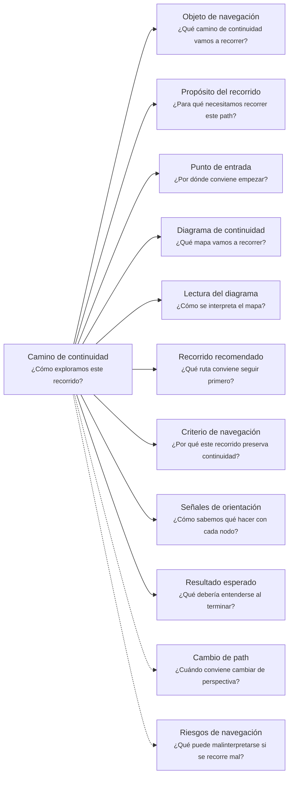

# Camino de continuidad "Viabilidad" de <tema>

## Organización



## Objeto de navegación

<!--
¿Qué camino de continuidad vamos a recorrer?

Indicar que este documento orienta la lectura del Viability Continuity Path asociado a un concepto, iniciativa, cambio, feature, capability, servicio, producto, experimento, decisión o artifact cuya viabilidad necesita evaluarse.
-->

Este documento orienta la lectura del Camino de continuidad de Viabilidad para `<tema>`.

## Propósito del recorrido

<!--
¿Para qué necesitamos recorrer este path?

Explicar qué continuidad de viabilidad se busca preservar.
No limitar la viabilidad a costo económico; el kind indica la dimensión evaluada.
-->

Este path busca preservar continuidad entre `<tema>`, las condiciones que hacen posible abordarlo y las restricciones que podrían volverlo inviable.

Ayuda a entender si un concepto, iniciativa, cambio, feature, capability, servicio, producto, experimento, decisión o artifact puede sostenerse bajo las condiciones actuales.

En esta perspectiva, viabilidad no significa únicamente viabilidad económica.

Puede referirse a viabilidad económica, técnica, operacional, temporal, organizacional, de adopción u otra dimensión relevante según el kind evaluado.

Este path ayuda a evitar que una idea avance solo porque parece valiosa, deseable o técnicamente interesante, sin revisar si existen las condiciones necesarias para realizarla, sostenerla, validarla o evolucionarla.

## Punto de entrada

<!--
¿Por dónde conviene empezar?

Indicar el elemento cuya viabilidad se quiere entender.
-->

El recorrido debería comenzar desde el elemento cuya viabilidad se quiere evaluar.

Ese punto de entrada puede ser:

* una iniciativa
* un cambio de alcance
* una feature
* una capability
* un producto al cliente
* un servicio consumible
* una decisión
* un experimento
* un artifact
* una automatización
* una integración
* una migración
* una mejora operativa
* una alternativa de solución
* una inversión propuesta
* una evolución de alcance

## Diagrama de continuidad

<!--
¿Qué mapa vamos a recorrer?

Incluir el Diagrama de Camino de Continuidad asociado a Viability.
El diagrama debe mostrar preguntas de orientación, conceptos relacionados y estado documental de los conceptos conectados.
-->


## Lectura del diagrama

<!--
¿Cómo se interpreta el mapa?

Explicar brevemente cómo leer la semántica visual del Diagrama de Camino de Continuidad.
-->

| Forma       | Significado                                           | Qué hacer al encontrarla                                                                                        |
| ----------- | ----------------------------------------------------- | --------------------------------------------------------------------------------------------------------------- |
| `[[texto]]` | Concepto documentado                                  | Revisar los artifacts asociados si ayudan a entender la viabilidad del elemento                                 |
| `[texto]`   | Pregunta orientadora u orientación definida           | Usarla para decidir qué aspecto de viabilidad revisar                                                           |
| `>texto]`   | Concepto identificado sin necesidad documental actual | Mantenerlo visible sin documentarlo todavía                                                                     |
| `{{texto}}` | Concepto identificado con necesidad documental        | Evaluar si debe documentarse para no perder criterio, condición, restricción, evaluación o riesgo de viabilidad |

## Recorrido recomendado

<!--
¿Qué ruta conviene seguir primero?

Describir el recorrido principal recomendado para entender el path sin duplicar el contenido de los artifacts conectados.
-->

| Orden | Nodo, artifact o concepto  | Por qué revisarlo                                                      |
| ----- | -------------------------- | ---------------------------------------------------------------------- |
| 1     | Objeto evaluado            | Permite identificar qué elemento se está evaluando                     |
| 2     | Kind de viabilidad         | Permite saber qué dimensión de viabilidad se está observando           |
| 3     | Criterio de viabilidad     | Permite entender qué significa que el elemento sea viable en ese kind  |
| 4     | Condiciones necesarias     | Permite reconocer qué debe cumplirse para sostener la viabilidad       |
| 5     | Restricciones conocidas    | Permite entender qué limita o condiciona la viabilidad                 |
| 6     | Evaluación inicial         | Permite registrar qué tan viable parece con la información disponible  |
| 7     | Riesgos de inviabilidad    | Permite identificar qué podría volverlo inviable                       |
| 8     | Alternativas de viabilidad | Permite encontrar una versión más pequeña, más simple o más sostenible |
| 9     | Condiciones de revisión    | Permite saber cuándo reevaluar la viabilidad                           |

## Criterio de navegación

<!--
¿Por qué este recorrido preserva continuidad?

Explicar la lógica del recorrido recomendado y qué pérdida de intención ayuda a evitar.
-->

Este recorrido preserva continuidad porque conecta una idea, decisión, cambio o iniciativa con las condiciones reales que permiten abordarla.

Ayuda a evitar que algo avance solo por deseo, presión, entusiasmo técnico o valor aparente, sin revisar si es viable bajo la dimensión relevante.

También ayuda a preservar por qué una alternativa fue reducida, postergada, descartada, mantenida manualmente, validada primero o convertida en una versión más pequeña.

## Señales de orientación

<!--
¿Cómo sabemos qué hacer con cada nodo?

Registrar señales que ayudan a decidir si conviene seguir, detenerse, documentar, ignorar temporalmente o cambiar de path.
-->

| Señal                                                                  | Acción sugerida                                               |
| ---------------------------------------------------------------------- | ------------------------------------------------------------- |
| No está claro qué se está evaluando                                    | Revisar Objeto evaluado o Scope Document                      |
| No está claro el kind de viabilidad                                    | Definir kind antes de evaluar                                 |
| La viabilidad depende de costo, inversión o valor esperado             | Usar kind economic                                            |
| La viabilidad depende de tecnología, integración o complejidad técnica | Usar kind technical                                           |
| La viabilidad depende de operación, soporte o uso real                 | Usar kind operational                                         |
| La viabilidad depende de tiempo, capacidad o calendario                | Usar kind temporal                                            |
| La viabilidad depende de personas, roles o coordinación                | Usar kind organizational                                      |
| La viabilidad depende de adopción o experiencia esperada               | Usar kind adoption                                            |
| Una condición necesaria aparece como `{{texto}}`                       | Evaluar si necesita Viability Document o Decision Record      |
| Una restricción cambia el alcance posible                              | Cambiar hacia Evolution o revisar Scope Document              |
| La evaluación inicial es insuficiente                                  | Revisar Support Note kind: validation                         |
| Aparece una alternativa más pequeña                                    | Evaluar Scope Document, Decision Record o Software Initiative |
| Una señal de alerta se vuelve real                                     | Reevaluar Viability Document y considerar Evolution           |
| La viabilidad depende de quién decide o financia                       | Cambiar hacia Ownership                                       |

## Cambio de path

<!--
¿Cuándo conviene cambiar de perspectiva?

Indicar señales que sugieren que otro Continuity Path podría preservar mejor la continuidad buscada.
-->

| Señal                                                                           | Path sugerido       |
| ------------------------------------------------------------------------------- | ------------------- |
| La pregunta pasa a ser por qué importa intervenir                               | Business Driver     |
| La pregunta pasa a ser dónde ocurre el trabajo                                  | Business Scenario   |
| La pregunta pasa a ser qué lenguaje, reglas o límites condicionan la viabilidad | Domain Context      |
| La pregunta pasa a ser qué iniciativa aborda el trabajo viable                  | Software Initiative |
| La pregunta pasa a ser cómo cambia alcance, dirección o comprensión             | Evolution           |
| La pregunta pasa a ser qué otros elementos se ven afectados por una restricción | Impact              |
| La pregunta pasa a ser quién decide, financia, valida o sostiene la viabilidad  | Ownership           |
| La pregunta pasa a ser de dónde viene la evaluación o decisión                  | Traceability        |
| La pregunta pasa a ser cómo vive técnicamente la solución viable                | Software Project    |
| La pregunta pasa a ser qué experiencia viable puede ofrecerse                   | Client Product      |
| La pregunta pasa a ser qué contrato viable puede ofrecerse                      | Consumable Service  |

## Resultado esperado

<!--
¿Qué debería entenderse al terminar?

Indicar qué claridad, orientación o comprensión debería obtenerse después de recorrer el path.
-->

Al terminar este recorrido debería entenderse:

* qué elemento se está evaluando
* qué kind de viabilidad se está observando
* qué significa que sea viable en esa dimensión
* qué condiciones deben cumplirse para sostener la viabilidad
* qué restricciones limitan la viabilidad
* qué tan viable parece ahora con la información disponible
* qué podría volverlo inviable
* qué alternativa podría hacerlo más viable
* qué supuestos sostienen la evaluación
* qué señales indicarían pérdida de viabilidad
* cuándo debería reevaluarse
* qué conocimiento ya está documentado
* qué conocimiento requiere documentación
* qué conocimiento fue identificado pero no requiere documentación todavía

## Riesgos de navegación

<!--
¿Qué puede malinterpretarse si se recorre mal?

Registrar riesgos de usar el path como documento detallado, leer nodos como obligaciones, documentar demasiado pronto o asumir evaluación formal innecesaria.
-->

| Riesgo de navegación                                             | Consecuencia                                                                              |
| ---------------------------------------------------------------- | ----------------------------------------------------------------------------------------- |
| Confundir viabilidad con deseo                                   | Se avanza con algo valioso pero inviable bajo las condiciones actuales                    |
| Confundir viabilidad económica con viabilidad completa           | Se ignoran restricciones técnicas, operativas, temporales, organizacionales o de adopción |
| Evaluar todas las dimensiones siempre                            | Se genera burocracia y análisis innecesario                                               |
| No definir el kind evaluado                                      | La evaluación se vuelve ambigua y difícil de usar                                         |
| Convertir viabilidad en planificación completa                   | El documento pierde foco y duplica otros artifacts                                        |
| Tratar una evaluación inicial como verdad definitiva             | Se conserva una conclusión que puede quedar obsoleta                                      |
| Ocultar supuestos de viabilidad                                  | Se pierde claridad sobre qué podría cambiar la evaluación                                 |
| Ignorar señales de pérdida de viabilidad                         | Se sostiene una solución que ya no conviene                                               |
| Usar viabilidad para bloquear exploración temprana               | Se mata aprendizaje antes de validar hipótesis pequeñas                                   |
| Usar viabilidad para justificar recortes sin preservar intención | Se reduce alcance perdiendo el valor esperado                                             |
| Interpretar `{{texto}}` como obligación inmediata                | Se genera documentación prematura                                                         |
| Interpretar `>texto]` como deuda documental                      | Se burocratizan conceptos que solo necesitaban visibilidad                                |

## Principio de continuidad

!!! principle "Principio de Continuidad"

```
La perspectiva de viabilidad debería ayudar a preservar la continuidad entre intención, condiciones, restricciones, alcance viable y decisión de avanzar, reducir, postergar, validar o descartar sin convertir toda idea en planificación completa.
```
