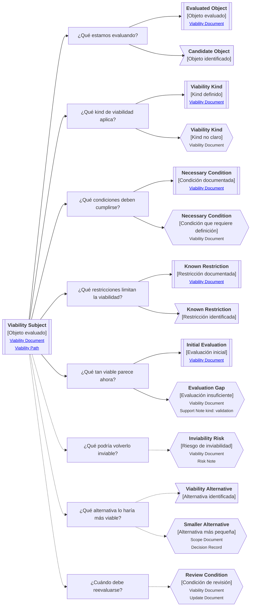

# Camino de continuidad "Viabilidad" de <tema>

## Propósito del recorrido

<!--
¿Para qué necesitamos recorrer este path?

Explicar qué continuidad de viabilidad se busca preservar.
No limitar la viabilidad a costo económico; el kind indica la dimensión evaluada.
-->

Este path busca preservar continuidad entre `<tema>`, las condiciones que hacen posible abordarlo y las restricciones que podrían volverlo inviable.

Ayuda a entender si un concepto, iniciativa, cambio, feature, capability, servicio, producto, experimento, decisión o artifact puede sostenerse bajo las condiciones actuales.

En esta perspectiva, viabilidad no significa únicamente viabilidad económica.

Puede referirse a viabilidad económica, técnica, operacional, temporal, organizacional, de adopción u otra dimensión relevante según el kind evaluado.

Este path ayuda a evitar que una idea avance solo porque parece valiosa, deseable o técnicamente interesante, sin revisar si existen las condiciones necesarias para realizarla, sostenerla, validarla o evolucionarla.

## Punto de entrada

<!--
¿Por dónde conviene empezar?

Indicar el elemento cuya viabilidad se quiere entender.
-->

El recorrido debería comenzar desde el elemento cuya viabilidad se quiere evaluar.

Ese punto de entrada puede ser:

* una iniciativa
* un cambio de alcance
* una feature
* una capability
* un producto al cliente
* un servicio consumible
* una decisión
* un experimento
* un artifact
* una automatización
* una integración
* una migración
* una mejora operativa
* una alternativa de solución
* una inversión propuesta
* una evolución de alcance

## Diagrama de continuidad

<!--
¿Qué mapa vamos a recorrer?

Incluir el Diagrama de Camino de Continuidad asociado a Viability.
El diagrama debe mostrar preguntas de orientación, conceptos relacionados y estado documental de los conceptos conectados.
-->

## Recorrido recomendado

<!--
¿Qué ruta conviene seguir primero?

Describir el recorrido principal recomendado para entender el path sin duplicar el contenido de los artifacts conectados.
-->

| Orden | Nodo, artifact o concepto  | Por qué revisarlo                                                      |
| ----- | -------------------------- | ---------------------------------------------------------------------- |
| 1     | Objeto evaluado            | Permite identificar qué elemento se está evaluando                     |
| 2     | Kind de viabilidad         | Permite saber qué dimensión de viabilidad se está observando           |
| 3     | Criterio de viabilidad     | Permite entender qué significa que el elemento sea viable en ese kind  |
| 4     | Condiciones necesarias     | Permite reconocer qué debe cumplirse para sostener la viabilidad       |
| 5     | Restricciones conocidas    | Permite entender qué limita o condiciona la viabilidad                 |
| 6     | Evaluación inicial         | Permite registrar qué tan viable parece con la información disponible  |
| 7     | Riesgos de inviabilidad    | Permite identificar qué podría volverlo inviable                       |
| 8     | Alternativas de viabilidad | Permite encontrar una versión más pequeña, más simple o más sostenible |
| 9     | Condiciones de revisión    | Permite saber cuándo reevaluar la viabilidad                           |

## Conceptos complementarios

<!--
¿Qué elementos relacionados ayudan a entender este escenario sin pertenecer necesariamente a la ruta principal?

Usar esta sección solo cuando existan elementos relevantes para preservar continuidad.
No convertirla en lista exhaustiva.
-->

| Concepto complementario | Relación con el escenario | Path o artifact sugerido |
| ----------------------- | ------------------------- | ------------------------ |
| <concepto>              | <relación>                | <path o artifact>        |
