---
artifact:
  kind: continuity-path
  type: impact
  scope: <concept|rule|behavior|capability|product|service|project|dependency|decision|change|artifact>
  target: <impact-source-name>
  language: es

metadata:
  status: <draft|candidate|active|deprecated|superseded>
  relates: 
    - relation: <references|referenced-by|complements|depends-on|owned-by|derived-from|updates|supersedes|superseded-by>
      target: <artifact-id>

continuity:
  question: ¿Qué se ve afectado si esto cambia, falla, aparece, se elimina o evoluciona?
  preserves: impact-continuity
  connects:
    - artifact: <artifact-id>
      role: <domain-concept|domain-rule|domain-invariant|domain-update|client-product|visible-flow|product-update|consumable-service|consumption-model|service-consumption-nexus|software-project|technical-structure|technical-dependency|external-dependency|decision|viability|documentation-update|affected-artifact-set|validation|feedback>

tooling:
  schema:
    version: 0.1.0
  template:
    name: impact.continuity-path
    version: 0.1.0
---

# Camino de continuidad "Impacto" de <tema>

## Propósito del recorrido

<!--
¿Para qué necesitamos recorrer este path?

Explicar qué continuidad de efectos, consecuencias, dependencias y propagación de cambios se busca preservar.
-->

Este path busca preservar continuidad sobre qué puede verse afectado cuando `<tema>` cambia, aparece, se elimina, se valida, falla o evoluciona.

Ayuda a entender relaciones de impacto entre conceptos, reglas, decisiones, productos, servicios, capacidades, comportamientos, documentos, equipos y partes técnicas del sistema.

Este path es útil cuando no basta con entender un elemento en sí mismo, porque su modificación puede afectar otras piezas del negocio, del producto, del servicio, de la documentación o del proyecto de software.

En esta perspectiva, impacto no significa documentar todas las relaciones posibles.

Significa seguir los efectos relevantes de un cambio para evitar inconsistencias, rupturas, pérdida de intención o actualización incompleta.

## Punto de entrada

<!--
¿Por dónde empieza este camino?

Indicar el cambio, decisión, concepto, comportamiento, producto, servicio, validación, feedback, dependencia o elemento cuyo impacto se quiere seguir.
-->

## Diagrama de continuidad

<!--
¿Qué mapa vamos a recorrer?

Incluir el Diagrama de Camino de Continuidad asociado a Impact.
El diagrama debe mostrar preguntas de orientación, conceptos relacionados y estado documental de los conceptos conectados.
-->

```mermaid
flowchart LR
    A[["<b>Impact Source</b><br/>[Elemento que genera impacto]<br/><small><a href='link'>Impact Path</a><br/>Support Note kind: risk</small>"]]

    A --> P1["¿Qué conceptos o reglas del dominio afecta?"]
    A --> P2["¿Qué productos o flujos visibles afecta?"]
    A --> P3["¿Qué servicios o formas de consumo afecta?"]
    A -.-> P4["¿Qué proyectos o estructuras técnicas afecta?"]
    A -.-> P5["¿Qué decisiones deben revisarse?"]
    A -.-> P6["¿Qué documentación debe actualizarse?"]
    A -.-> P7["¿Qué validación necesita repetirse?"]

    P1 --> D1[["<b>Domain Concept</b><br/>[Concepto afectado]<br/><small><a href='link'>Domain Context Path</a><br/>Domain Vocabulary<br/>Context Document</small>"]]
    P1 --> D2>"<b>Domain Rule</b><br/>[Regla afectada]"]
    P1 --> D3{{"<b>Domain Invariant</b><br/>[Invariante afectada]<br/><small>Consistency Document<br/>Behavior Document<br/>Support Note kind: validation<br/>Support Note kind: risk</small>"}}
    P1 -.-> DU1{{"<b>Domain Update</b><br/>[Actualización de dominio requerida]<br/><small>Update Document<br/>Decision Record</small>"}}

    P2 --> Pdt1[["<b>Client Product</b><br/>[Producto afectado]<br/><small><a href='link'>Client Product Path</a></small>"]]
    P2 --> VF1{{"<b>Visible Flow</b><br/>[Flujo visible afectado]<br/><small>Mockup Flow<br/>Behavior Document<br/>Scope Document<br/>Support Note kind: validation<br/>Support Note kind: risk</small>"}}
    P2 -.-> FU1{{"<b>Product Update</b><br/>[Actualización de producto requerida]<br/><small>Update Document<br/>Feedback Document</small>"}}

    P3 --> S1[["<b>Consumable Service</b><br/>[Servicio afectado]<br/><small><a href='link'>Consumable Service Path</a></small>"]]
    P3 --> CM1{{"<b>Consumption Model</b><br/>[Forma de consumo afectada]<br/><small>Structure Document<br/>Behavior Document<br/>Consistency Document<br/>Support Note kind: external<br/>Support Note kind: risk</small>"}}
    P3 --> DE1>"<b>Domain Element</b><br/>[Elemento de dominio representado]"]
    P3 -.-> SCN1{{"<b>Service Consumption</b><br/>[Consumo compuesto afectado]<br/><small>Service Consumption Nexus<br/>Support Note kind: external<br/>Update Document</small>"}}

    P4 -.-> SP1[["<b>Software Project</b><br/>[Proyecto afectado]<br/><small><a href='link'>Software Project Path</a></small>"]]
    P4 -.-> TS1{{"<b>Technical Structure</b><br/>[Estructura técnica afectada]<br/><small>Structure Document<br/>Decision Record<br/>Update Document<br/>Support Note kind: risk</small>"}}
    P4 -.-> TD1>"<b>Technical Dependency</b><br/>[Dependencia afectada]"]
    P4 -.-> EX1{{"<b>External Dependency</b><br/>[Dependencia externa afectada]<br/><small>Support Note kind: external<br/>Support Note kind: risk</small>"}}

    P5 -.-> DEC1{{"<b>Decision</b><br/>[Decisión a revisar]<br/><small>Decision Record<br/>Support Note kind: draft<br/>Support Note kind: risk<br/>Update Document</small>"}}
    P5 -.-> VI1{{"<b>Viability</b><br/>[Viabilidad a reevaluar]<br/><small>Viability Document<br/>Support Note kind: validation</small>"}}

    P6 -.-> UP1{{"<b>Documentation Update</b><br/>[Documento a actualizar]<br/><small>Update Document<br/>Navigation Document<br/>Support Note kind: risk</small>"}}
    P6 -.-> AS1>"<b>Affected Artifact Set</b><br/>[Conjunto de artifacts afectados]"]

    P7 -.-> V1{{"<b>Validation</b><br/>[Validación a repetir]<br/><small>Support Note kind: validation<br/>Support Note kind: testing-spec<br/>Support Note kind: result<br/>Support Note kind: risk</small>"}}
    P7 -.-> FB1{{"<b>Feedback</b><br/>[Feedback a revisar]<br/><small>Feedback Document</small>"}}
```

## Recorrido recomendado

<!--
¿Qué ruta conviene seguir primero?

Describir el recorrido principal recomendado para entender el path sin duplicar el contenido de los artifacts conectados.
-->

| Orden | Nodo, artifact o concepto                  | Por qué revisarlo                                                               |
| ----- | ------------------------------------------ | ------------------------------------------------------------------------------- |
| 1     | Elemento que genera impacto                | Permite identificar la fuente del impacto                                       |
| 2     | Conceptos o reglas del dominio afectados   | Permite entender cambios semánticos, reglas, invariantes o límites conceptuales |
| 3     | Productos o flujos visibles afectados      | Permite entender cambios visibles para usuarios o actores que usan el sistema   |
| 4     | Servicios o formas de consumo afectadas    | Permite entender cambios para consumidores técnicos o productos dependientes    |
| 5     | Proyectos o estructuras técnicas afectadas | Permite entender cambios de organización técnica, dependencias o mantenimiento  |
| 6     | Decisiones a revisar                       | Permite entender si el cambio invalida acuerdos previos                         |
| 7     | Documentación a actualizar                 | Permite preservar continuidad documental                                        |
| 8     | Validación a repetir                       | Permite confirmar que el cambio sigue siendo correcto                           |

## Impacto, evolución y trazabilidad

<!--
¿Cómo se distingue Impact de Evolution, Traceability y Update Document?

Usar esta sección para evitar que impacto se convierta en trazabilidad completa o actualización documental genérica.
-->

| Concepto        | Cómo se interpreta                                                    | Cuándo usarlo                                                                               |
| --------------- | --------------------------------------------------------------------- | ------------------------------------------------------------------------------------------- |
| Impact          | Efectos relevantes que un cambio puede producir sobre otros elementos | Cuando necesitamos entender qué se ve afectado                                              |
| Evolution       | Cambio de un elemento en el tiempo preservando intención              | Cuando necesitamos entender cómo algo cambió y qué intención sigue viva                     |
| Traceability    | Recorrido de origen, transformación y materialización                 | Cuando necesitamos reconstruir de dónde viene algo y dónde terminó viviendo                 |
| Update Document | Artifact que explica qué debe actualizarse                            | Cuando el impacto requiere actualizar documentos, estructuras, comportamientos o decisiones |
| Validation      | Revisión frente a un criterio                                         | Cuando el impacto puede invalidar una validación previa o requiere confirmar nuevamente     |

## Conceptos complementarios

<!--
¿Qué elementos relacionados ayudan a entender este impacto sin pertenecer necesariamente a la ruta principal?

Usar esta sección solo cuando existan elementos relevantes para preservar continuidad.
No convertirla en lista exhaustiva.
-->

| Concepto complementario | Relación con el impacto | Path o artifact sugerido |
| ----------------------- | ----------------------- | ------------------------ |
| <concepto>              | <relación>              | <path o artifact>        |
