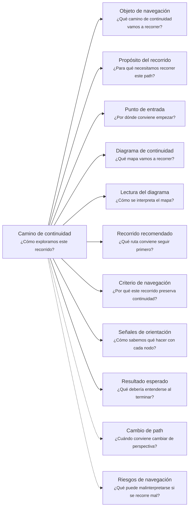
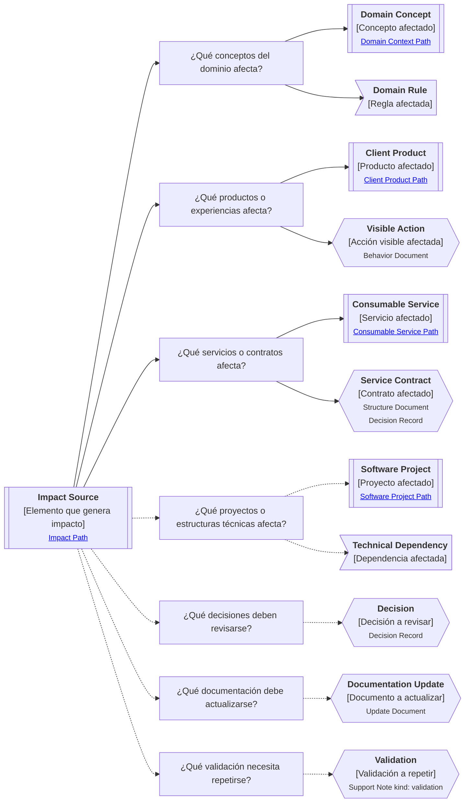

# Camino de continuidad "Impacto" de <tema>

## Organización



## Objeto de navegación

<!--
¿Qué camino de continuidad vamos a recorrer?

Indicar que este documento orienta la lectura del Impact Continuity Path asociado a un cambio, decisión, artifact, producto, servicio, comportamiento, regla, capacidad, validación o parte del sistema.
-->

Este documento orienta la lectura del Camino de continuidad de Impacto para `<tema>`.

## Propósito del recorrido

<!--
¿Para qué necesitamos recorrer este path?

Explicar qué continuidad de efectos, consecuencias, dependencias y propagación de cambios se busca preservar.
-->

Este path busca preservar continuidad sobre qué puede verse afectado cuando `<tema>` cambia, aparece, se elimina, se valida, falla o evoluciona.

Ayuda a entender relaciones de impacto entre conceptos, reglas, decisiones, productos, servicios, capacidades, comportamientos, documentos, equipos y partes técnicas del sistema.

Este path es útil cuando no basta con entender un elemento en sí mismo, porque su modificación puede afectar otras piezas del negocio, del producto, del servicio, de la documentación o del proyecto de software.

En esta perspectiva, impacto no significa documentar todas las relaciones posibles.

Significa seguir los efectos relevantes de un cambio para evitar inconsistencias, rupturas, pérdida de intención o actualización incompleta.

## Punto de entrada

<!--
¿Por dónde conviene empezar?

Indicar el cambio, decisión, concepto, comportamiento, producto, servicio o elemento cuyo impacto se quiere seguir.
-->

El recorrido debería comenzar desde el elemento cuyo impacto se quiere entender.

Ese punto de entrada puede ser:

* una decisión
* un cambio de alcance
* una regla modificada
* una capacidad nueva
* una feature
* un producto al cliente
* un servicio consumible
* un contrato
* un comportamiento
* un error
* una dependencia
* una validación
* un feedback
* una actualización
* una eliminación
* un reemplazo
* una parte del sistema que cambia

## Diagrama de continuidad

<!--
¿Qué mapa vamos a recorrer?

Incluir el Diagrama de Camino de Continuidad asociado a Impact.
El diagrama debe mostrar preguntas de orientación, conceptos relacionados y estado documental de los conceptos conectados.
-->



## Lectura del diagrama

<!--
¿Cómo se interpreta el mapa?

Explicar brevemente cómo leer la semántica visual del Diagrama de Camino de Continuidad.
-->

| Forma       | Significado                                           | Qué hacer al encontrarla                                                                                    |
| ----------- | ----------------------------------------------------- | ----------------------------------------------------------------------------------------------------------- |
| `[[texto]]` | Concepto documentado                                  | Revisar los artifacts asociados si ayudan a entender el impacto                                             |
| `[texto]`   | Pregunta orientadora u orientación definida           | Usarla para decidir qué tipo de impacto revisar                                                             |
| `>texto]`   | Concepto identificado sin necesidad documental actual | Mantenerlo visible sin documentarlo todavía                                                                 |
| `{{texto}}` | Concepto identificado con necesidad documental        | Evaluar si debe documentarse para no perder impacto, cambio, decisión, actualización o validación necesaria |

## Recorrido recomendado

<!--
¿Qué ruta conviene seguir primero?

Describir el recorrido principal recomendado para entender el path sin duplicar el contenido de los artifacts conectados.
-->

| Orden | Nodo, artifact o concepto                  | Por qué revisarlo                                                        |
| ----- | ------------------------------------------ | ------------------------------------------------------------------------ |
| 1     | Elemento que genera impacto                | Permite identificar la fuente del impacto                                |
| 2     | Conceptos del dominio afectados            | Permite entender cambios semánticos, reglas o límites conceptuales       |
| 3     | Productos o experiencias afectadas         | Permite entender cambios visibles para usuarios                          |
| 4     | Servicios o contratos afectados            | Permite entender cambios para consumidores técnicos                      |
| 5     | Proyectos o estructuras técnicas afectadas | Permite entender cambios de implementación, dependencias o mantenimiento |
| 6     | Decisiones a revisar                       | Permite entender si el cambio invalida acuerdos previos                  |
| 7     | Documentación a actualizar                 | Permite preservar continuidad documental                                 |
| 8     | Validación a repetir                       | Permite confirmar que el cambio sigue siendo correcto                    |

## Criterio de navegación

<!--
¿Por qué este recorrido preserva continuidad?

Explicar la lógica del recorrido recomendado y qué pérdida de intención ayuda a evitar.
-->

Este recorrido preserva continuidad porque conecta un cambio con sus efectos posibles sobre dominio, producto, servicios, proyectos, decisiones, documentación y validación.

Ayuda a evitar que un cambio se aplique localmente sin revisar qué conocimiento, comportamiento, contrato, experiencia, decisión o artifact relacionado puede quedar inconsistente.

## Señales de orientación

<!--
¿Cómo sabemos qué hacer con cada nodo?

Registrar señales que ayudan a decidir si conviene seguir, detenerse, documentar, ignorar temporalmente o cambiar de path.
-->

| Señal                                              | Acción sugerida                       |
| -------------------------------------------------- | ------------------------------------- |
| El cambio afecta lenguaje, reglas o límites        | Cambiar hacia Domain Context          |
| El cambio afecta acciones visibles o experiencia   | Cambiar hacia Client Product          |
| El cambio afecta contrato, errores o garantías     | Cambiar hacia Consumable Service      |
| El cambio afecta estructura técnica o dependencias | Cambiar hacia Software Project        |
| El cambio afecta alcance o dirección               | Cambiar hacia Evolution               |
| El cambio invalida una decisión previa             | Evaluar Decision Record               |
| El cambio requiere modificar documentos            | Evaluar Update Document               |
| El cambio requiere confirmar nueva comprensión     | Evaluar Support Note kind: validation |
| El impacto depende de quién mantiene o valida      | Cambiar hacia Ownership               |
| Aparecen demasiadas relaciones sin efecto claro    | Detener o reducir el recorrido        |

## Cambio de path

<!--
¿Cuándo conviene cambiar de perspectiva?

Indicar señales que sugieren que otro Continuity Path podría preservar mejor la continuidad buscada.
-->

| Señal                                                        | Path sugerido      |
| ------------------------------------------------------------ | ------------------ |
| La pregunta pasa a ser dónde ocurre el trabajo               | Business Scenario  |
| La pregunta pasa a ser por qué importa intervenir            | Business Driver    |
| La pregunta pasa a ser qué significado cambia                | Domain Context     |
| La pregunta pasa a ser qué alcance o intención evoluciona    | Evolution          |
| La pregunta pasa a ser qué experiencia cambia                | Client Product     |
| La pregunta pasa a ser qué contrato cambia                   | Consumable Service |
| La pregunta pasa a ser dónde vive técnicamente el cambio     | Software Project   |
| La pregunta pasa a ser quién debe responder por el cambio    | Ownership          |
| La pregunta pasa a ser de dónde viene y dónde se materializó | Traceability       |

## Resultado esperado

<!--
¿Qué debería entenderse al terminar?

Indicar qué claridad, orientación o comprensión debería obtenerse después de recorrer el path.
-->

Al terminar este recorrido debería entenderse:

* qué elemento genera el impacto
* qué conceptos del dominio pueden verse afectados
* qué productos o experiencias pueden cambiar
* qué servicios, contratos o garantías pueden verse afectados
* qué proyectos, estructuras o dependencias técnicas pueden cambiar
* qué decisiones deben revisarse
* qué documentación puede necesitar actualización
* qué validación debe repetirse o registrarse
* qué impacto es relevante para preservar continuidad
* qué impacto solo fue identificado pero no requiere documentación todavía
* cuándo conviene detenerse o cambiar de path

## Riesgos de navegación

<!--
¿Qué puede malinterpretarse si se recorre mal?

Registrar riesgos de usar el path como documento detallado, leer nodos como obligaciones, documentar demasiado pronto o asumir trazabilidad formal innecesaria.
-->

| Riesgo de navegación                                   | Consecuencia                                                               |
| ------------------------------------------------------ | -------------------------------------------------------------------------- |
| Mirar solo el impacto técnico                          | Se pierden efectos sobre dominio, producto, servicio o negocio             |
| Mirar solo el impacto visible                          | Se pierden contratos, reglas, decisiones o dependencias internas           |
| Tratar todo cambio como impacto mayor                  | Se genera análisis innecesario                                             |
| No registrar impactos conocidos                        | Se repiten errores o se pierde aprendizaje                                 |
| Actualizar implementación sin actualizar documentación | Se rompe continuidad documental                                            |
| Actualizar documentación sin validar comportamiento    | Se preserva una intención no comprobada                                    |
| Confundir impacto con trazabilidad                     | Se analiza propagación cuando en realidad se necesitaba reconstruir origen |
| Confundir impacto con evolución                        | Se analizan efectos sin entender qué intención cambió o debe preservarse   |
| Interpretar `{{texto}}` como obligación inmediata      | Se genera documentación prematura                                          |
| Usar impacto como excusa para bloquear cambios         | Se convierte análisis en burocracia                                        |

## Principio de continuidad

!!! principle "Principio de Continuidad"

```
La perspectiva de impacto debería ayudar a entender qué puede cambiar alrededor de un elemento sin convertir cada relación en trazabilidad formal ni cada cambio en análisis exhaustivo.
```
