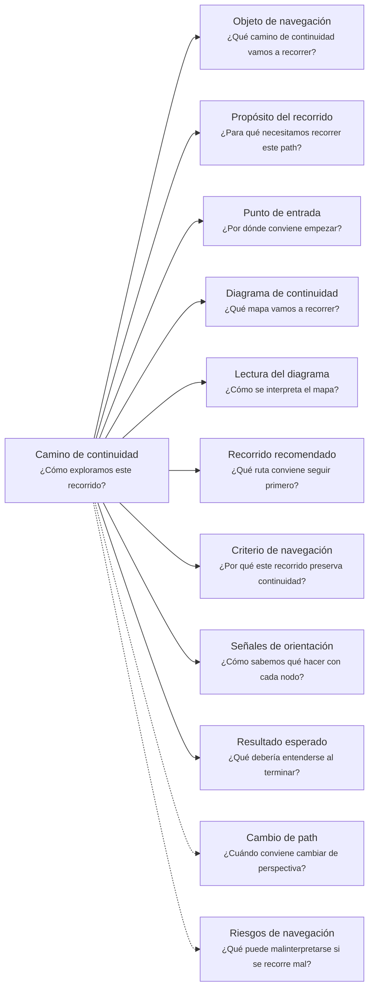
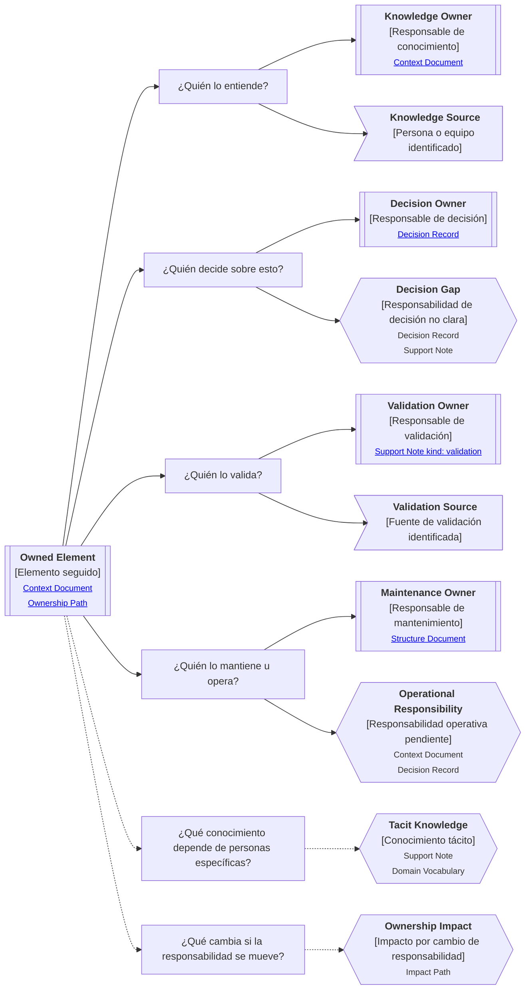

# Camino de continuidad "Responsabilidad" de <tema>

## Organización



## Objeto de navegación

<!--
¿Qué camino de continuidad vamos a recorrer?

Indicar que este documento orienta la lectura del Ownership Continuity Path asociado a un concepto, decisión, artifact, producto, servicio, proceso, capacidad o parte del sistema.
-->

Este documento orienta la lectura del Camino de continuidad de Responsabilidad para `<tema>`.

## Propósito del recorrido

<!--
¿Para qué necesitamos recorrer este path?

Explicar qué continuidad de responsabilidad, conocimiento, decisión, validación, operación o mantenimiento se busca preservar.
-->

Este path busca preservar continuidad sobre quién entiende, decide, valida, mantiene, opera o responde por `<tema>`.

Ayuda a evitar que un concepto, artifact, producto, servicio, decisión o comportamiento quede documentado sin claridad sobre las personas, roles, equipos o áreas que sostienen su conocimiento y evolución.

Este path es especialmente útil cuando la pérdida de ownership puede producir abandono, decisiones inconsistentes, dependencia tácita o conocimiento atrapado en personas específicas.

## Punto de entrada

<!--
¿Por dónde conviene empezar?

Indicar el concepto, artifact, decisión, sistema, proceso, producto, servicio o responsabilidad que se quiere seguir.
-->

El recorrido debería comenzar desde el elemento cuya responsabilidad se quiere entender.

Ese punto de entrada puede ser:

* un concepto de dominio
* una decisión
* un artifact
* una línea de trabajo
* un proceso
* un producto
* un servicio consumible
* una capacidad
* una feature
* una operación
* una regla o invariante
* una parte del sistema que requiere mantenimiento

## Diagrama de continuidad

<!--
¿Qué mapa vamos a recorrer?

Incluir el Diagrama de Camino de Continuidad asociado a Ownership.
-->



## Lectura del diagrama

| Forma       | Significado                                           | Qué hacer al encontrarla                                                                       |
| ----------- | ----------------------------------------------------- | ---------------------------------------------------------------------------------------------- |
| `[[texto]]` | Concepto documentado                                  | Revisar los artifacts asociados si ayudan a entender responsabilidad, ownership o conocimiento |
| `[texto]`   | Pregunta orientadora u orientación definida           | Usarla para decidir qué tipo de responsabilidad revisar                                        |
| `>texto]`   | Concepto identificado sin necesidad documental actual | Mantenerlo visible sin documentarlo todavía                                                    |
| `{{texto}}` | Concepto identificado con necesidad documental        | Evaluar si debe documentarse para no perder ownership, decisión, validación u operación        |

## Recorrido recomendado

| Orden | Nodo, artifact o concepto                | Por qué revisarlo                                                            |
| ----- | ---------------------------------------- | ---------------------------------------------------------------------------- |
| 1     | Elemento seguido                         | Permite identificar sobre qué responsabilidad estamos navegando              |
| 2     | Responsable de conocimiento              | Permite entender quién puede explicar el elemento                            |
| 3     | Responsable de decisión                  | Permite saber quién puede cambiar, aprobar o delimitar el elemento           |
| 4     | Responsable de validación                | Permite saber quién confirma si el elemento funciona o sigue siendo correcto |
| 5     | Responsable de mantenimiento u operación | Permite entender quién sostiene el elemento en el tiempo                     |
| 6     | Conocimiento tácito                      | Permite detectar riesgo de pérdida de continuidad                            |
| 7     | Impacto por cambio de responsabilidad    | Permite entender qué podría romperse si el ownership cambia                  |

## Criterio de navegación

Este recorrido preserva continuidad porque conecta un elemento con las personas, roles, equipos o áreas que sostienen su comprensión, decisión, validación, operación y evolución.

Ayuda a evitar que el conocimiento quede disponible solo de forma implícita o dependiente de memoria individual.

## Señales de orientación

| Señal                                                            | Acción sugerida                         |
| ---------------------------------------------------------------- | --------------------------------------- |
| Nadie puede explicar claramente el elemento                      | Revisar Context Document o Support Note |
| La responsabilidad de decisión no está clara                     | Evaluar Decision Record                 |
| La validación depende de una persona específica                  | Evaluar Support Note kind: validation   |
| La operación depende de conocimiento tácito                      | Evaluar Support Note o Context Document |
| El mantenimiento requiere entender estructura técnica            | Cambiar hacia Software Project          |
| El cambio de ownership afecta otros elementos                    | Cambiar hacia Impact                    |
| La responsabilidad necesita reconstruirse desde origen y destino | Cambiar hacia Traceability              |

## Cambio de path

| Señal                                                                  | Path sugerido       |
| ---------------------------------------------------------------------- | ------------------- |
| La pregunta pasa a ser dónde ocurre el trabajo                         | Business Scenario   |
| La pregunta pasa a ser por qué importa intervenir                      | Business Driver     |
| La pregunta pasa a ser qué lenguaje o reglas deben protegerse          | Domain Context      |
| La pregunta pasa a ser qué iniciativa contiene esta responsabilidad    | Software Initiative |
| La pregunta pasa a ser cómo vive técnicamente el elemento              | Software Project    |
| La pregunta pasa a ser qué otros elementos se ven afectados            | Impact              |
| La pregunta pasa a ser de dónde viene y dónde terminó materializándose | Traceability        |

## Resultado esperado

Al terminar este recorrido debería entenderse:

* qué elemento se está siguiendo
* quién lo entiende
* quién puede decidir sobre él
* quién puede validarlo
* quién lo mantiene u opera
* qué conocimiento está explícito
* qué conocimiento depende de personas específicas
* qué riesgo existe si la responsabilidad cambia
* qué documentación podría preservar continuidad

## Riesgos de navegación

| Riesgo de navegación                                   | Consecuencia                                              |
| ------------------------------------------------------ | --------------------------------------------------------- |
| Confundir ownership con organigrama                    | Se documentan cargos sin preservar responsabilidad real   |
| Confundir responsable con única fuente de verdad       | Se mantiene dependencia individual en vez de reducirla    |
| Documentar personas cuando bastaba con roles o equipos | Se vuelve frágil ante cambios organizacionales            |
| Ocultar conocimiento tácito                            | Se pierde continuidad cuando alguien cambia de rol o sale |
| Interpretar `{{texto}}` como obligación inmediata      | Se genera documentación prematura                         |
| Usar ownership para bloquear decisiones                | Se burocratiza la evolución del sistema                   |

## Principio de continuidad

!!! principle "Principio de Continuidad"

```
La perspectiva de responsabilidad debería ayudar a preservar quién entiende, decide, valida, mantiene u opera un elemento sin convertir ownership en organigrama ni dependencia individual.
```
