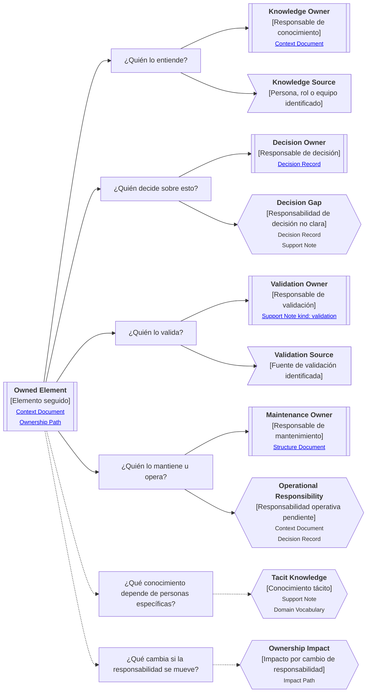

# Camino de continuidad "Responsabilidad" de <tema>

## Propósito del recorrido

<!--
¿Para qué necesitamos recorrer este path?

Explicar qué continuidad de responsabilidad, conocimiento, decisión, validación, operación o mantenimiento se busca preservar.
-->

Este path busca preservar continuidad sobre quién entiende, decide, valida, mantiene, opera o responde por `<tema>`.

Ayuda a evitar que un concepto, artifact, producto, servicio, decisión o comportamiento quede documentado sin claridad sobre las personas, roles, equipos o áreas que sostienen su conocimiento y evolución.

Este path es especialmente útil cuando la pérdida de ownership puede producir abandono, decisiones inconsistentes, dependencia tácita, bloqueo de validación, pérdida de criterio o conocimiento atrapado en personas específicas.

En esta perspectiva, responsabilidad no significa únicamente propiedad formal.

Puede referirse a conocimiento experto, decisión, validación, mantenimiento, operación, soporte, aprobación, custodia o continuidad de una parte del sistema o del negocio.

## Punto de entrada

<!--
¿Por dónde empieza este camino?

Indicar el concepto, artifact, decisión, sistema, proceso, producto, servicio, capacidad, feature, regla, operación o responsabilidad que se quiere seguir.
-->

## Diagrama de continuidad

<!--
¿Qué mapa vamos a recorrer?

Incluir el Diagrama de Camino de Continuidad asociado a Ownership.
El diagrama debe mostrar preguntas de orientación, conceptos relacionados y estado documental de los conceptos conectados.
-->

## Recorrido recomendado

<!--
¿Qué ruta conviene seguir primero?

Describir el recorrido principal recomendado para entender el path sin duplicar el contenido de los artifacts conectados.
-->

| Orden | Nodo, artifact o concepto                | Por qué revisarlo                                                            |
| ----- | ---------------------------------------- | ---------------------------------------------------------------------------- |
| 1     | Elemento seguido                         | Permite identificar sobre qué responsabilidad estamos navegando              |
| 2     | Responsable de conocimiento              | Permite entender quién puede explicar el elemento                            |
| 3     | Responsable de decisión                  | Permite saber quién puede cambiar, aprobar o delimitar el elemento           |
| 4     | Responsable de validación                | Permite saber quién confirma si el elemento funciona o sigue siendo correcto |
| 5     | Responsable de mantenimiento u operación | Permite entender quién sostiene el elemento en el tiempo                     |
| 6     | Conocimiento tácito                      | Permite detectar riesgo de pérdida de continuidad                            |
| 7     | Impacto por cambio de responsabilidad    | Permite entender qué podría romperse si el ownership cambia                  |

## Responsabilidad y ownership

<!--
¿Cómo se interpreta responsabilidad dentro de este path?

Usar esta sección para evitar que ownership se reduzca a propiedad formal, organigrama o asignación individual.
-->

| Concepto                   | Cómo se interpreta                                                                    | Cuándo usarlo                                                               |
| -------------------------- | ------------------------------------------------------------------------------------- | --------------------------------------------------------------------------- |
| Knowledge Owner            | Persona, rol, equipo o área que puede explicar el elemento                            | Cuando necesitamos saber dónde vive el conocimiento                         |
| Decision Owner             | Persona, rol, equipo o área que puede decidir sobre el elemento                       | Cuando una decisión requiere aprobación, criterio o delimitación            |
| Validation Owner           | Persona, rol, equipo o área que puede confirmar si algo sigue siendo correcto         | Cuando necesitamos validar comportamiento, resultado, alcance o experiencia |
| Maintenance Owner          | Persona, rol, equipo o área que sostiene el elemento en el tiempo                     | Cuando la continuidad depende de operación, soporte o mantenimiento         |
| Operational Responsibility | Responsabilidad necesaria para que algo funcione en la operación real                 | Cuando la responsabilidad no está clara o no está formalizada               |
| Tacit Knowledge            | Conocimiento que depende de personas específicas y no está suficientemente preservado | Cuando existe riesgo de pérdida, bloqueo o dependencia informal             |
| Ownership Impact           | Efecto producido por mover, perder o cambiar responsabilidad                          | Cuando un cambio de ownership puede afectar continuidad                     |

## Conceptos complementarios

<!--
¿Qué elementos relacionados ayudan a entender esta responsabilidad sin pertenecer necesariamente a la ruta principal?

Usar esta sección solo cuando existan elementos relevantes para preservar continuidad.
No convertirla en lista exhaustiva.
-->

| Concepto complementario | Relación con la responsabilidad | Path o artifact sugerido |
| ----------------------- | ------------------------------- | ------------------------ |
| <concepto>              | <relación>                      | <path o artifact>        |
