# Camino de continuidad "Proyecto de software" de <tema>

## Propósito del recorrido

<!--
¿Para qué necesitamos recorrer este path?

Explicar qué continuidad de organización técnica se busca preservar.
No explicar todavía toda la implementación ni convertir este path en documentación técnica detallada.
-->

Este path busca preservar continuidad entre `<tema>` y la forma en que una solución de software está organizada.

Ayuda a entender cómo se estructura un proyecto de software, qué partes lo componen, qué responsabilidades tiene cada parte, qué decisiones explican su organización y cómo esa estructura se relaciona con iniciativas, productos, servicios, dominio e implementación.

En esta perspectiva, "proyecto de software" no significa solamente un repositorio o una carpeta.

Puede representar una solución, workspace, aplicación, conjunto de proyectos, monolito, módulo, servicio, paquete, librería, frontend, backend, integración o estructura técnica donde vive una parte del sistema.

Este path ayuda a explicar la organización técnica sin imponer una arquitectura universal.

No asume que toda solución deba usar Clean Architecture, microservicios, CQRS, Event Sourcing, capas estrictas o una estructura específica.

La organización debería explicarse desde las necesidades reales del dominio, la iniciativa de software, los productos o servicios involucrados y las decisiones técnicas tomadas.

## Punto de entrada

<!--
¿Por dónde empieza este camino?

Indicar la solución, repositorio, workspace, aplicación, proyecto, módulo, servicio, librería, integración o estructura técnica desde donde parte el recorrido.
-->

## Diagrama de continuidad

<!--
¿Qué mapa vamos a recorrer?

Incluir el Diagrama de Camino de Continuidad asociado al Software Project.
El diagrama debe mostrar preguntas de orientación, conceptos relacionados y estado documental de los conceptos conectados.
-->

```mermaid
flowchart LR
    A[["<b>Software Project</b><br/>[Proyecto o solución de software]<br/><small><a href='link'>Structure Document</a><br/><a href='link'>Scope Document</a><br/><a href='link'>Software Project Path</a></small>"]]

    A --> P1["¿Qué iniciativa, producto o servicio lo origina?"]
    A --> P2["¿Qué partes componen la solución?"]
    A --> P3["¿Qué responsabilidades tiene cada parte?"]
    A --> P4["¿Qué conceptos de dominio organiza o materializa?"]
    A -.-> P5["¿Qué integraciones, adapters o dependencias necesita?"]
    A -.-> P6["¿Qué decisiones explican esta organización?"]
    A -.-> P7["¿Qué podría verse afectado si cambia?"]

    P1 --> SI1[["<b>Software Initiative</b><br/>[Iniciativa relacionada]<br/><small><a href='link'>Software Initiative Path</a></small>"]]
    P1 --> CP1[["<b>Client Product</b><br/>[Producto relacionado]<br/><small><a href='link'>Client Product Path</a></small>"]]
    P1 --> CS1[["<b>Consumable Service</b><br/>[Servicio relacionado]<br/><small><a href='link'>Consumable Service Path</a></small>"]]
    P1 -.-> OR1{{"<b>Project Origin</b><br/>[Origen no claro]<br/><small>Context Document<br/>Support Note kind: draft<br/>Support Note kind: risk</small>"}}

    P2 --> S1[["<b>Solution Structure</b><br/>[Estructura documentada]<br/><small><a href='link'>Structure Document</a></small>"]]
    P2 --> S2{{"<b>Software Part</b><br/>[Parte que requiere documentación]<br/><small>Structure Document<br/>Scope Document<br/>Support Note kind: draft</small>"}}
    P2 --> S3>"<b>Software Part</b><br/>[Parte identificada]"]

    P3 --> R1[["<b>Technical Responsibility</b><br/>[Responsabilidad documentada]<br/><small><a href='link'>Structure Document</a><br/><a href='link'>Scope Document</a></small>"]]
    P3 --> R2{{"<b>Responsibility Gap</b><br/>[Responsabilidad no clara]<br/><small>Structure Document<br/>Scope Document<br/>Decision Record<br/>Consistency Document<br/>Support Note kind: risk</small>"}}

    P4 --> D1[["<b>Domain Context</b><br/>[Contexto de dominio relacionado]<br/><small><a href='link'>Domain Context Path</a></small>"]]
    P4 --> DC1[["<b>Domain Concept</b><br/>[Concepto materializado]<br/><small><a href='link'>Domain Vocabulary</a><br/><a href='link'>Context Document</a></small>"]]
    P4 --> B1[["<b>Behavior</b><br/>[Comportamiento implementado]<br/><small><a href='link'>Behavior Document</a></small>"]]
    P4 -.-> CAP1{{"<b>Capability</b><br/>[Capacidad materializada]<br/><small>Capability Nexus<br/>Behavior Document<br/>Structure Document<br/>Consistency Document</small>"}}
    P4 -.-> AL1{{"<b>Domain Alignment Risk</b><br/>[Riesgo de desalineación]<br/><small>Support Note kind: risk<br/>Support Note kind: validation</small>"}}

    P5 -.-> AD1[["<b>Adapter</b><br/>[Adapter documentado]<br/><small><a href='link'>Structure Document</a></small>"]]
    P5 -.-> DP1>"<b>Dependency</b><br/>[Dependencia identificada]"]
    P5 -.-> IN1{{"<b>Integration</b><br/>[Integración que requiere documentación]<br/><small>Structure Document<br/>Decision Record<br/>Support Note kind: external<br/>Support Note kind: testing-spec<br/>Support Note kind: risk</small>"}}
    P5 -.-> SCN1{{"<b>Service Consumption</b><br/>[Consumo compuesto]<br/><small>Service Consumption Nexus</small>"}}

    P6 -.-> DEC1[["<b>Technical Decision</b><br/>[Decisión documentada]<br/><small><a href='link'>Decision Record</a></small>"]]
    P6 -.-> DEC2{{"<b>Technical Decision</b><br/>[Decisión pendiente]<br/><small>Decision Record<br/>Support Note kind: draft<br/>Support Note kind: risk</small>"}}
    P6 -.-> VD1{{"<b>Technical Viability</b><br/>[Viabilidad técnica dudosa]<br/><small>Viability Document<br/>Support Note kind: validation</small>"}}

    P7 -.-> IMP1{{"<b>Technical Impact</b><br/>[Impacto a revisar]<br/><small>Impact Path<br/>Update Document<br/>Support Note kind: risk</small>"}}
    P7 -.-> EVO1[["<b>Evolution</b><br/>[Evolución relacionada]<br/><small><a href='link'>Evolution Path</a></small>"]]
    P7 -.-> UP1{{"<b>Project Update</b><br/>[Actualización requerida]<br/><small>Update Document<br/>Decision Record<br/>Navigation Document</small>"}}
```

## Recorrido recomendado

<!--
¿Qué ruta conviene seguir primero?

Describir el recorrido principal recomendado para entender el path sin duplicar el contenido de los artifacts conectados.
-->

| Orden | Nodo, artifact o concepto                 | Por qué revisarlo                                                                                                  |
| ----- | ----------------------------------------- | ------------------------------------------------------------------------------------------------------------------ |
| 1     | Proyecto o solución de software           | Permite identificar qué unidad técnica estamos intentando entender                                                 |
| 2     | Iniciativa, producto o servicio de origen | Permite conectar la organización técnica con la razón por la que existe                                            |
| 3     | Partes de la solución                     | Permite entender cómo se divide la solución en aplicaciones, módulos, librerías, servicios, paquetes o componentes |
| 4     | Responsabilidades técnicas                | Permite entender qué rol cumple cada parte dentro de la solución                                                   |
| 5     | Conceptos de dominio materializados       | Permite conectar estructura técnica con lenguaje, reglas y comportamientos del dominio                             |
| 6     | Integraciones, adapters o dependencias    | Permite entender qué piezas externas o bordes técnicos condicionan la solución                                     |
| 7     | Decisiones técnicas                       | Permite entender por qué la solución está organizada de esa manera                                                 |
| 8     | Impacto o evolución técnica               | Permite entender qué podría cambiar si se modifica la organización de la solución                                  |

## Organización de la solución

<!--
¿Cómo se interpreta la organización de una solución de software dentro de este path?

Usar esta sección para evitar que el proyecto de software se reduzca a carpetas o implementación detallada.
-->

| Concepto                 | Cómo se interpreta                                                                      | Cuándo usarlo                                                                                   |
| ------------------------ | --------------------------------------------------------------------------------------- | ----------------------------------------------------------------------------------------------- |
| Software Project         | Unidad técnica organizada donde vive una parte del sistema                              | Cuando necesitamos explicar cómo está organizada una solución de software                       |
| Solution Structure       | Forma en que se organizan las partes principales de la solución                         | Cuando necesitamos entender aplicaciones, módulos, librerías, servicios, paquetes o componentes |
| Software Part            | Parte específica de la solución con responsabilidad propia                              | Cuando una aplicación, módulo, librería, servicio o componente necesita ser ubicado             |
| Technical Responsibility | Responsabilidad que cumple una parte dentro de la solución                              | Cuando necesitamos evitar que la estructura sea solo una lista de carpetas                      |
| Adapter                  | Pieza que conecta la solución con infraestructura, servicios externos o bordes técnicos | Cuando una dependencia externa condiciona la organización                                       |
| Technical Decision       | Decisión que explica por qué la solución está organizada de cierta forma                | Cuando la estructura no debería entenderse como accidental                                      |
| Domain Concept           | Concepto del dominio materializado dentro de la solución                                | Cuando queremos preservar continuidad entre dominio y código                                    |

## Relación con otros paths de software

<!--
¿Cómo se diferencia este path de los otros paths relacionados con software?

Usar esta sección para mantener clara la responsabilidad del cuarteto de software.
-->

| Path                | Pregunta que ayuda a responder                                      | Diferencia principal                                                             |
| ------------------- | ------------------------------------------------------------------- | -------------------------------------------------------------------------------- |
| Software Initiative | ¿Cómo puedo explicar correctamente las partes de una iniciativa?    | Explica cobertura, alcance y piezas involucradas en un esfuerzo de software      |
| Client Product      | ¿Cómo puedo explicar un sistema a un cliente y manejar su feedback? | Explica experiencia visible, flujos de uso, feedback y validación                |
| Consumable Service  | ¿Cómo puedo explicar cómo consumir un servicio?                     | Explica capacidad consumible, forma de consumo y dominio representado            |
| Software Project    | ¿Cómo está organizada una solución de software?                     | Explica estructura técnica, partes, responsabilidades, dependencias y decisiones |

## Conceptos complementarios

<!--
¿Qué elementos relacionados ayudan a entender este proyecto sin pertenecer necesariamente a la ruta principal?

Usar esta sección solo cuando existan elementos relevantes para preservar continuidad.
No convertirla en lista exhaustiva.
-->

| Concepto complementario | Relación con el proyecto | Path o artifact sugerido |
| ----------------------- | ------------------------ | ------------------------ |
| <concepto>              | <relación>               | <path o artifact>        |
