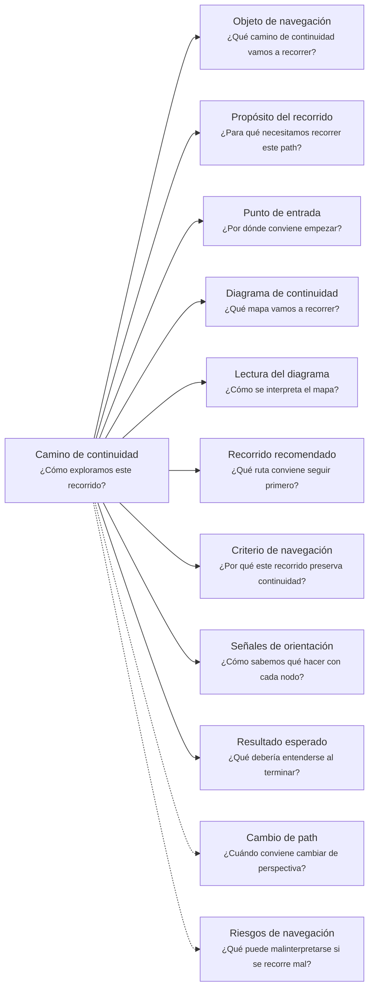
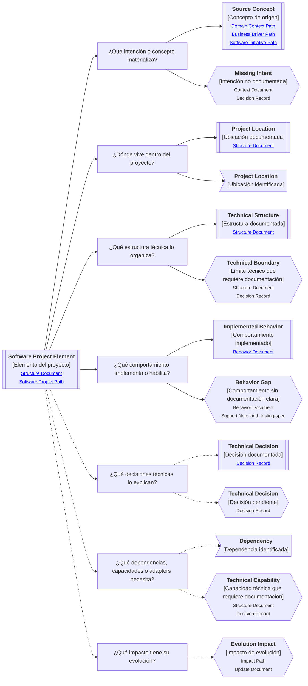

# Camino de continuidad "Proyecto de software" de <tema>

## Organización



## Objeto de navegación

<!--
¿Qué camino de continuidad vamos a recorrer?

Indicar que este documento orienta la lectura del Software Project Continuity Path asociado al concepto, feature, módulo, componente, decisión técnica, comportamiento, dependencia, adapter o parte del proyecto indicada.
-->

Este documento orienta la lectura del Camino de continuidad de Proyecto de software para `<tema>`.

## Propósito del recorrido

<!--
¿Para qué necesitamos recorrer este path?

Explicar qué continuidad técnica y arquitectónica se busca preservar.
No explicar todavía toda la implementación ni convertir este path en documentación técnica detallada.
-->

Este path busca preservar continuidad entre `<tema>` y su materialización dentro del proyecto de software.

Ayuda a entender cómo un concepto, comportamiento, decisión, capacidad o necesidad vive dentro de la estructura técnica, implementación y evolución del sistema.

También ayuda a evitar que el código, la arquitectura o las decisiones técnicas se alejen del lenguaje, intención, reglas y decisiones que les dieron origen.

## Punto de entrada

<!--
¿Por dónde conviene empezar?

Indicar el elemento técnico, comportamiento, decisión, estructura o concepto materializado desde donde parte el recorrido.
-->

El recorrido debería comenzar desde el elemento del proyecto de software que se quiere entender o seguir.

Ese punto de entrada puede ser:

* una feature implementada
* un módulo
* un componente
* una decisión técnica
* una integración
* un servicio interno
* un adapter
* una dependencia
* una estructura del proyecto
* un comportamiento implementado
* una regla materializada en código
* una capacidad técnica
* un cambio técnico observado

## Diagrama de continuidad

<!--
¿Qué mapa vamos a recorrer?

Incluir el Diagrama de Camino de Continuidad asociado al Software Project.
El diagrama debe mostrar preguntas de orientación, conceptos relacionados y estado documental de los conceptos conectados.
-->



## Lectura del diagrama

<!--
¿Cómo se interpreta el mapa?

Explicar brevemente cómo leer la semántica visual del Diagrama de Camino de Continuidad.
-->

| Forma       | Significado                                           | Qué hacer al encontrarla                                                                                  |
| ----------- | ----------------------------------------------------- | --------------------------------------------------------------------------------------------------------- |
| `[[texto]]` | Concepto documentado                                  | Revisar los artifacts asociados si son relevantes para entender cómo vive el concepto dentro del proyecto |
| `[texto]`   | Pregunta orientadora u orientación definida           | Usarla para decidir qué aspecto técnico, estructural o evolutivo revisar                                  |
| `>texto]`   | Concepto identificado sin necesidad documental actual | Mantenerlo visible sin documentarlo todavía                                                               |
| `{{texto}}` | Concepto identificado con necesidad documental        | Evaluar si debe documentarse para no perder intención técnica, arquitectónica o evolutiva                 |

## Recorrido recomendado

<!--
¿Qué ruta conviene seguir primero?

Describir el recorrido principal recomendado para entender el path sin duplicar el contenido de los artifacts conectados.
-->

| Orden | Nodo, artifact o concepto            | Por qué revisarlo                                                               |
| ----- | ------------------------------------ | ------------------------------------------------------------------------------- |
| 1     | Elemento del proyecto                | Permite identificar qué parte del software estamos siguiendo                    |
| 2     | Intención o concepto de origen       | Permite conectar el software con negocio, dominio, iniciativa o decisión previa |
| 3     | Ubicación dentro del proyecto        | Permite entender dónde vive y cómo se encuentra                                 |
| 4     | Estructura técnica                   | Permite entender cómo se organiza y qué límites respeta                         |
| 5     | Comportamiento implementado          | Permite conectar la estructura técnica con lo que debe ocurrir                  |
| 6     | Decisiones técnicas                  | Permiten entender por qué se eligió esa forma de materialización                |
| 7     | Dependencias, capacidades o adapters | Permiten entender qué necesita para funcionar o evolucionar                     |
| 8     | Impacto de evolución                 | Permite entender qué podría cambiar si el elemento evoluciona                   |

## Criterio de navegación

<!--
¿Por qué este recorrido preserva continuidad?

Explicar la lógica del recorrido recomendado y qué pérdida de intención ayuda a evitar.
-->

Este recorrido preserva continuidad porque conecta la materialización técnica con la intención que la originó.

Ayuda a evitar que el proyecto de software se convierta en una estructura desconectada del negocio, del dominio o de la iniciativa que intenta sostener.

También ayuda a evitar que las decisiones técnicas pierdan su razón, que el comportamiento implementado se separe de lo esperado o que la evolución del código ocurra sin entender qué conocimiento puede verse afectado.

## Señales de orientación

<!--
¿Cómo sabemos qué hacer con cada nodo?

Registrar señales que ayudan a decidir si conviene seguir, detenerse, documentar, ignorar temporalmente o cambiar de path.
-->

| Señal                                                            | Acción sugerida                                                                            |
| ---------------------------------------------------------------- | ------------------------------------------------------------------------------------------ |
| Un elemento técnico no tiene intención de origen clara           | Revisar Business Driver, Domain Context, Software Initiative o Decision Record             |
| Una estructura técnica aparece como `{{texto}}`                  | Evaluar si necesita Structure Document                                                     |
| Un límite técnico aparece como `{{texto}}`                       | Evaluar si necesita Structure Document o Decision Record                                   |
| Un comportamiento implementado no tiene expectativa documentada  | Evaluar si necesita Behavior Document                                                      |
| Un comportamiento requiere validación técnica                    | Evaluar si necesita Support Note kind: testing-spec                                        |
| Una decisión técnica aparece como `{{texto}}`                    | Evaluar si necesita Decision Record                                                        |
| Una dependencia aparece como `>texto]`                           | Mantener visible sin documentar salvo que condicione evolución, despliegue o mantenimiento |
| Una capacidad técnica afecta varias partes del sistema           | Evaluar si debe conectarse con Impact o Traceability                                       |
| El path empieza a explicar cobertura funcional de una iniciativa | Cambiar hacia Software Initiative                                                          |
| El path empieza a explicar contratos consumibles                 | Cambiar hacia Consumable Service                                                           |
| El path empieza a explicar percepción de usuario                 | Cambiar hacia Client Product                                                               |

## Cambio de path

<!--
¿Cuándo conviene cambiar de perspectiva?

Indicar señales que sugieren que otro Continuity Path podría preservar mejor la continuidad buscada.
-->

| Señal                                                                                     | Path sugerido       |
| ----------------------------------------------------------------------------------------- | ------------------- |
| La pregunta principal pasa a ser dónde ocurre el trabajo                                  | Business Scenario   |
| La pregunta principal pasa a ser por qué importa intervenir                               | Business Driver     |
| La pregunta principal pasa a ser qué lenguaje, reglas o límites pertenecen al negocio     | Domain Context      |
| La pregunta principal pasa a ser qué iniciativa de software aborda esta parte del trabajo | Software Initiative |
| La pregunta principal pasa a ser cómo se percibe o entrega valor al usuario               | Client Product      |
| La pregunta principal pasa a ser qué contrato, entrada, salida o garantía ofrece          | Consumable Service  |
| La pregunta principal pasa a ser quién entiende, decide, valida o mantiene el elemento    | Ownership           |
| La pregunta principal pasa a ser qué otros elementos se ven afectados                     | Impact              |
| La pregunta principal pasa a ser de dónde viene y dónde terminó materializándose          | Traceability        |

## Resultado esperado

<!--
¿Qué debería entenderse al terminar?

Indicar qué claridad, orientación o comprensión debería obtenerse después de recorrer el path.
-->

Al terminar este recorrido debería entenderse:

* qué elemento del proyecto de software se está siguiendo
* qué intención, concepto, regla, comportamiento o decisión lo originó
* dónde vive dentro del proyecto
* qué estructura técnica lo organiza
* qué comportamiento implementa o habilita
* qué decisiones técnicas explican su forma actual
* qué dependencias, capacidades o adapters necesita
* qué parte de su evolución puede afectar otros elementos
* qué conocimiento ya está documentado
* qué conocimiento requiere documentación
* qué conocimiento fue identificado pero no requiere documentación todavía
* cuándo conviene detenerse o cambiar de path

## Riesgos de navegación

<!--
¿Qué puede malinterpretarse si se recorre mal?

Registrar riesgos de usar el path como documento detallado, leer nodos como obligaciones, documentar demasiado pronto o asumir trazabilidad formal innecesaria.
-->

| Riesgo de navegación                                                           | Consecuencia                                                                  |
| ------------------------------------------------------------------------------ | ----------------------------------------------------------------------------- |
| Confundir proyecto de software con iniciativa de software                      | Se mezcla cobertura funcional con materialización técnica                     |
| Confundir proyecto de software con arquitectura universal                      | Se intenta imponer una estructura técnica antes de entender la necesidad real |
| Confundir estructura del proyecto con modelo de dominio                        | El código empieza a definir el lenguaje en vez de reflejarlo                  |
| Documentar cada módulo, clase o carpeta                                        | Se genera documentación técnica prematura y difícil de mantener               |
| Tratar decisiones técnicas implícitas como si fueran estables                  | Se preservan accidentalmente soluciones no validadas                          |
| Saltar a implementación sin revisar intención de negocio, dominio o iniciativa | Se pierde continuidad entre descubrimiento, documentación y código            |
| Interpretar `{{texto}}` como obligación inmediata                              | Se genera documentación prematura                                             |
| Interpretar `>texto]` como deuda documental                                    | Se burocratizan conceptos que solo necesitaban visibilidad                    |
| Recorrer todas las rutas como obligatorias                                     | Se pierde foco y aumenta la carga documental                                  |
| Usar el path como trazabilidad formal completa                                 | Se agrega complejidad antes de que exista necesidad real                      |
| Usar el path para justificar sobreingeniería técnica                           | Se agregan capas, patrones o abstracciones sin evidencia suficiente           |

## Principio de continuidad

!!! principle "Principio de Continuidad"

```
La perspectiva de proyecto de software debería ayudar a preservar la continuidad entre intención, dominio, decisiones técnicas, estructura e implementación sin imponer una arquitectura universal.
```
