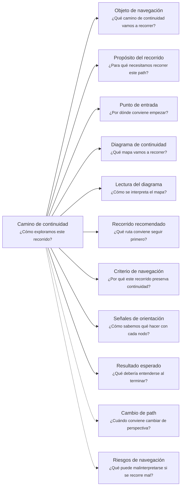
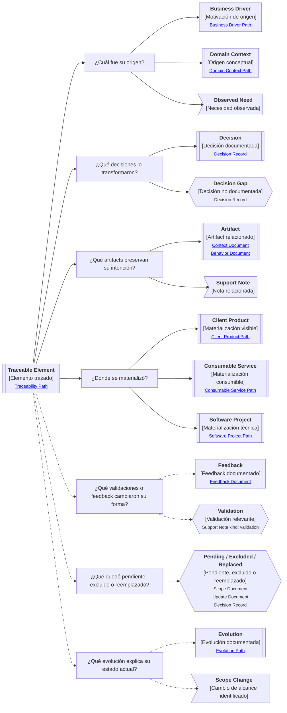

# Camino de continuidad "Trazabilidad" de <tema>

## Organización



## Objeto de navegación

<!--
¿Qué camino de continuidad vamos a recorrer?

Indicar que este documento orienta la lectura del Traceability Continuity Path asociado a un concepto, decisión, necesidad, comportamiento, artifact, producto, servicio, implementación, validación o cambio.
-->

Este documento orienta la lectura del Camino de continuidad de Trazabilidad para `<tema>`.

## Propósito del recorrido

<!--
¿Para qué necesitamos recorrer este path?

Explicar qué continuidad de origen, transformación y materialización se busca preservar.
-->

Este path busca preservar continuidad entre el origen de `<tema>`, las decisiones que lo transformaron, los artifacts que explican su intención y las materializaciones donde terminó viviendo.

Ayuda a responder de dónde viene un concepto, por qué cambió, qué decisiones lo afectaron, qué documentación preserva su intención y dónde terminó expresándose en producto, servicio, proyecto, implementación o documentación.

Este path es útil cuando necesitamos reconstruir una historia de continuidad, no solo entender una perspectiva aislada.

En esta perspectiva, trazabilidad no significa mapear todas las relaciones posibles.

Significa reconstruir las conexiones necesarias para entender origen, transformación y materialización sin convertir cada vínculo en trazabilidad formal obligatoria.

## Punto de entrada

<!--
¿Por dónde conviene empezar?

Indicar el concepto, decisión, artifact, comportamiento, feature, servicio, producto o implementación cuyo recorrido se quiere reconstruir.
-->

El recorrido debería comenzar desde el elemento cuya historia se quiere reconstruir.

Ese punto de entrada puede ser:

* una necesidad
* una oportunidad
* una regla
* una decisión
* una feature
* un comportamiento
* un artifact
* un producto al cliente
* un servicio consumible
* una capacidad
* una implementación
* una validación
* un feedback
* un cambio observado
* una actualización documental
* una exclusión o postergación
* una materialización que perdió contexto

## Diagrama de continuidad

<!--
¿Qué mapa vamos a recorrer?

Incluir el Diagrama de Camino de Continuidad asociado a Traceability.
El diagrama debe mostrar preguntas de orientación, conceptos relacionados y estado documental de los conceptos conectados.
-->



## Lectura del diagrama

<!--
¿Cómo se interpreta el mapa?

Explicar brevemente cómo leer la semántica visual del Diagrama de Camino de Continuidad.
-->

| Forma       | Significado                                           | Qué hacer al encontrarla                                                                         |
| ----------- | ----------------------------------------------------- | ------------------------------------------------------------------------------------------------ |
| `[[texto]]` | Concepto documentado                                  | Revisar los artifacts asociados si ayudan a reconstruir origen, transformación o materialización |
| `[texto]`   | Pregunta orientadora u orientación definida           | Usarla para decidir qué parte de la historia seguir                                              |
| `>texto]`   | Concepto identificado sin necesidad documental actual | Mantenerlo visible sin documentarlo todavía                                                      |
| `{{texto}}` | Concepto identificado con necesidad documental        | Evaluar si debe documentarse para no perder origen, decisión, transformación o materialización   |

## Recorrido recomendado

<!--
¿Qué ruta conviene seguir primero?

Describir el recorrido principal recomendado para entender el path sin duplicar el contenido de los artifacts conectados.
-->

| Orden | Nodo, artifact o concepto         | Por qué revisarlo                                                |
| ----- | --------------------------------- | ---------------------------------------------------------------- |
| 1     | Elemento trazado                  | Permite identificar qué historia se quiere reconstruir           |
| 2     | Origen                            | Permite entender de dónde nace la necesidad, concepto o decisión |
| 3     | Decisiones de transformación      | Permite entender por qué cambió de forma                         |
| 4     | Artifacts que preservan intención | Permite encontrar dónde quedó explicado                          |
| 5     | Materialización                   | Permite entender dónde terminó viviendo                          |
| 6     | Feedback o validación             | Permite entender qué aprendizaje cambió su forma                 |
| 7     | Pendiente, excluido o reemplazado | Permite entender qué no se materializó y por qué                 |
| 8     | Evolución relevante               | Permite entender qué cambios explican su estado actual           |

## Criterio de navegación

<!--
¿Por qué este recorrido preserva continuidad?

Explicar la lógica del recorrido recomendado y qué pérdida de intención ayuda a evitar.
-->

Este recorrido preserva continuidad porque conecta origen, transformación, explicación documental y materialización.

Ayuda a evitar que una feature, decisión, producto, servicio, documento o implementación aparezca como algo aislado, sin memoria de por qué existe, qué cambió en el camino, qué decisiones le dieron forma o qué intención debía preservar.

También ayuda a reconstruir continuidad cuando un elemento ya existe, pero su razón de ser se volvió difícil de encontrar.

## Señales de orientación

<!--
¿Cómo sabemos qué hacer con cada nodo?

Registrar señales que ayudan a decidir si conviene seguir, detenerse, documentar, ignorar temporalmente o cambiar de path.
-->

| Señal                                                  | Acción sugerida                                                      |
| ------------------------------------------------------ | -------------------------------------------------------------------- |
| El origen del elemento no está claro                   | Revisar Business Driver o Domain Context                             |
| La transformación depende de decisiones                | Revisar Decision Record                                              |
| La intención está distribuida en varios documentos     | Conectar artifacts relevantes en el diagrama                         |
| La materialización visible es lo más importante        | Cambiar hacia Client Product                                         |
| La materialización consumible es lo más importante     | Cambiar hacia Consumable Service                                     |
| La materialización técnica es lo más importante        | Cambiar hacia Software Project                                       |
| El elemento cambió por validación o feedback           | Revisar Feedback Document o Support Note kind: validation            |
| El elemento fue reemplazado, excluido o postergado     | Evaluar Scope Document, Update Document, Decision Record o Evolution |
| La historia depende de un cambio de alcance            | Cambiar hacia Evolution                                              |
| La trazabilidad empieza a mapear demasiadas relaciones | Cambiar hacia Impact o detener el recorrido                          |

## Cambio de path

<!--
¿Cuándo conviene cambiar de perspectiva?

Indicar señales que sugieren que otro Continuity Path podría preservar mejor la continuidad buscada.
-->

| Señal                                               | Path sugerido       |
| --------------------------------------------------- | ------------------- |
| La pregunta pasa a ser dónde ocurre el trabajo      | Business Scenario   |
| La pregunta pasa a ser por qué importa intervenir   | Business Driver     |
| La pregunta pasa a ser qué significado tiene        | Domain Context      |
| La pregunta pasa a ser cómo cambió en el tiempo     | Evolution           |
| La pregunta pasa a ser qué iniciativa lo contiene   | Software Initiative |
| La pregunta pasa a ser cómo vive técnicamente       | Software Project    |
| La pregunta pasa a ser qué otros elementos afecta   | Impact              |
| La pregunta pasa a ser quién lo entiende o mantiene | Ownership           |

## Resultado esperado

<!--
¿Qué debería entenderse al terminar?

Indicar qué claridad, orientación o comprensión debería obtenerse después de recorrer el path.
-->

Al terminar este recorrido debería entenderse:

* qué elemento se está trazando
* cuál fue su origen
* qué decisiones lo transformaron
* qué artifacts preservan su intención
* dónde se materializó
* qué feedback o validación cambió su forma
* qué quedó pendiente, excluido o reemplazado
* qué evolución explica su estado actual
* qué relaciones son importantes para preservar continuidad
* qué relaciones no necesitan trazabilidad formal todavía
* cuándo conviene detenerse o cambiar de path

## Riesgos de navegación

<!--
¿Qué puede malinterpretarse si se recorre mal?

Registrar riesgos de usar el path como documento detallado, leer nodos como obligaciones, documentar demasiado pronto o asumir trazabilidad formal innecesaria.
-->

| Riesgo de navegación                                           | Consecuencia                                                                           |
| -------------------------------------------------------------- | -------------------------------------------------------------------------------------- |
| Convertir trazabilidad en matriz exhaustiva                    | Se agrega burocracia antes de necesitarla                                              |
| Trazar todo por defecto                                        | Se pierde foco y se vuelve inmantenible                                                |
| Confundir trazabilidad con impacto                             | Se reconstruye historia cuando en realidad se necesita analizar efectos                |
| Confundir trazabilidad con evolución                           | Se reconstruye origen cuando en realidad se necesita entender cómo cambió en el tiempo |
| Confundir trazabilidad con auditoría formal                    | Se eleva el costo documental sin necesidad real                                        |
| Preservar relaciones accidentales                              | Se documentan conexiones que no aportan continuidad                                    |
| No registrar decisiones transformadoras                        | Se pierde el porqué de la forma actual                                                 |
| No registrar exclusiones o reemplazos importantes              | Se olvida por qué algo no se materializó                                               |
| Interpretar `{{texto}}` como obligación inmediata              | Se genera documentación prematura                                                      |
| Usar trazabilidad para justificar decisiones después del hecho | Se documenta una historia artificial en vez de continuidad real                        |

## Principio de continuidad

!!! principle "Principio de Continuidad"

```
La perspectiva de trazabilidad debería ayudar a reconstruir origen, transformación y materialización de un elemento sin convertir cada relación en trazabilidad formal obligatoria.
```
