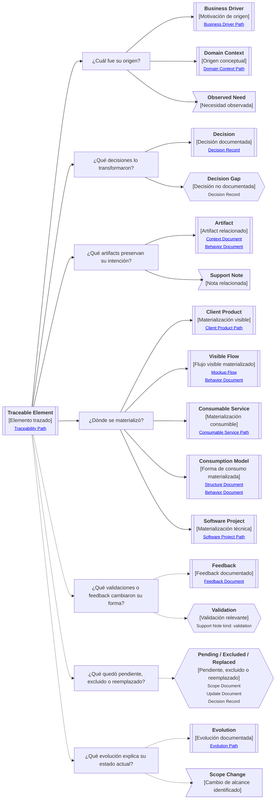

# Camino de continuidad "Trazabilidad" de <tema>

## Propósito del recorrido

<!--
¿Para qué necesitamos recorrer este path?

Explicar qué continuidad de origen, transformación y materialización se busca preservar.
-->

Este path busca preservar continuidad entre el origen de `<tema>`, las decisiones que lo transformaron, los artifacts que explican su intención y las materializaciones donde terminó viviendo.

Ayuda a responder de dónde viene un concepto, por qué cambió, qué decisiones lo afectaron, qué documentación preserva su intención y dónde terminó expresándose en producto, servicio, proyecto, implementación o documentación.

Este path es útil cuando necesitamos reconstruir una historia de continuidad, no solo entender una perspectiva aislada.

En esta perspectiva, trazabilidad no significa mapear todas las relaciones posibles.

Significa reconstruir las conexiones necesarias para entender origen, transformación y materialización sin convertir cada vínculo en trazabilidad formal obligatoria.

## Punto de entrada

<!--
¿Por dónde empieza este camino?

Indicar el concepto, decisión, artifact, comportamiento, feature, servicio, producto, implementación, feedback, validación, cambio o materialización cuyo recorrido se quiere reconstruir.
-->

## Diagrama de continuidad

<!--
¿Qué mapa vamos a recorrer?

Incluir el Diagrama de Camino de Continuidad asociado a Traceability.
El diagrama debe mostrar preguntas de orientación, conceptos relacionados y estado documental de los conceptos conectados.
-->

## Recorrido recomendado

<!--
¿Qué ruta conviene seguir primero?

Describir el recorrido principal recomendado para entender el path sin duplicar el contenido de los artifacts conectados.
-->

| Orden | Nodo, artifact o concepto         | Por qué revisarlo                                                |
| ----- | --------------------------------- | ---------------------------------------------------------------- |
| 1     | Elemento trazado                  | Permite identificar qué historia se quiere reconstruir           |
| 2     | Origen                            | Permite entender de dónde nace la necesidad, concepto o decisión |
| 3     | Decisiones de transformación      | Permite entender por qué cambió de forma                         |
| 4     | Artifacts que preservan intención | Permite encontrar dónde quedó explicado                          |
| 5     | Materialización                   | Permite entender dónde terminó viviendo                          |
| 6     | Feedback o validación             | Permite entender qué aprendizaje cambió su forma                 |
| 7     | Pendiente, excluido o reemplazado | Permite entender qué no se materializó y por qué                 |
| 8     | Evolución relevante               | Permite entender qué cambios explican su estado actual           |

## Origen, transformación y materialización

<!--
¿Cómo se distingue trazabilidad de impacto, evolución o actualización?

Usar esta sección para evitar que Traceability se convierta en una matriz exhaustiva de relaciones.
-->

| Concepto        | Cómo se interpreta                                                          | Cuándo usarlo                                                                          |
| --------------- | --------------------------------------------------------------------------- | -------------------------------------------------------------------------------------- |
| Traceability    | Recorrido entre origen, transformación y materialización                    | Cuando necesitamos reconstruir la historia de continuidad de un elemento               |
| Origin          | Lugar donde nace la necesidad, concepto, regla, decisión o intención        | Cuando necesitamos entender de dónde viene algo                                        |
| Transformation  | Decisión, cambio, aprendizaje o ajuste que modificó la forma del elemento   | Cuando necesitamos entender por qué algo cambió                                        |
| Artifact        | Documento, nota, diagrama, mockup o path que preserva parte de la intención | Cuando necesitamos encontrar dónde quedó explicado                                     |
| Materialization | Lugar donde el elemento terminó viviendo o expresándose                     | Cuando necesitamos conectar intención con producto, servicio, proyecto o documentación |
| Evolution       | Cambio en el tiempo que explica el estado actual                            | Cuando necesitamos entender cómo algo cambió sin perder intención                      |
| Impact          | Elementos afectados por una modificación                                    | Cuando necesitamos entender qué se ve afectado por un cambio                           |
| Update Document | Artifact que explica qué debe actualizarse                                  | Cuando la trazabilidad muestra que algo quedó desalineado                              |

## Conceptos complementarios

<!--
¿Qué elementos relacionados ayudan a entender esta trazabilidad sin pertenecer necesariamente a la ruta principal?

Usar esta sección solo cuando existan elementos relevantes para preservar continuidad.
No convertirla en lista exhaustiva.
-->

| Concepto complementario | Relación con la trazabilidad | Path o artifact sugerido |
| ----------------------- | ---------------------------- | ------------------------ |
| <concepto>              | <relación>                   | <path o artifact>        |
