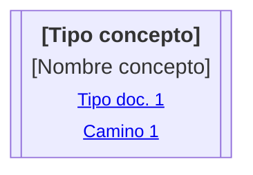
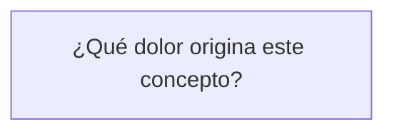
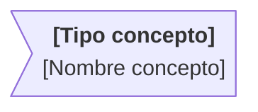
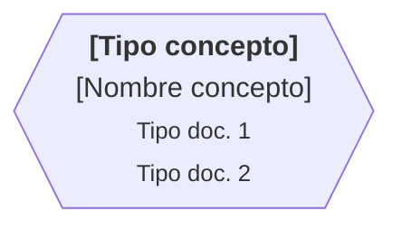
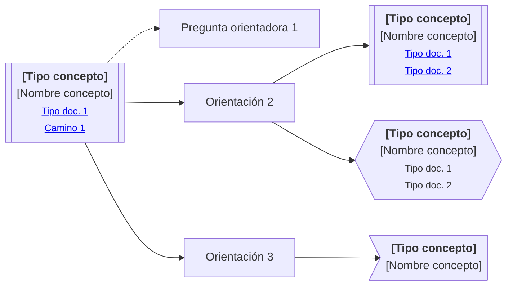

# Diagrama de Camino de Continuidad

## Propósito

El Diagrama de Camino de Continuidad es la representación visual principal de un Continuity Path.

Su propósito es mostrar cómo seguir un concepto a través de preguntas de orientación, conceptos relacionados, artifacts asociados y necesidades documentales detectadas.

El diagrama funciona como un mapa.

No explica todo el conocimiento conectado.

Muestra qué mirar, qué ya existe, qué falta documentar y qué puede observarse sin convertirse todavía en documentación formal.

## Responsabilidad

Un Diagrama de Camino de Continuidad debe ayudar a responder:

* ¿Qué concepto estamos siguiendo?
* ¿Qué preguntas orientan su recorrido?
* ¿Qué conceptos relacionados aparecen?
* ¿Qué conceptos ya están documentados?
* ¿Qué conceptos requieren documentación?
* ¿Qué conceptos fueron identificados pero no necesitan documentación todavía?
* ¿Qué artifacts o caminos ayudan a continuar la exploración?

El diagrama conecta conocimiento.

No reemplaza los documentos, artifacts o decisiones que conecta.

## Regla base

Los documentos explican.

Los paths conectan.

Los diagramas muestran.

Los mockups representan.

La organización documental ordena.

Por lo tanto, el Diagrama de Camino de Continuidad debe mostrar el recorrido de continuidad sin intentar explicar en detalle cada parte del conocimiento.

## Semántica de nodos

El diagrama usa formas de Mermaid para expresar el estado documental de los conceptos y orientaciones.

| Forma       | Significado                                           | Uso                                                                        |
| ----------- | ----------------------------------------------------- | -------------------------------------------------------------------------- |
| `[[texto]]` | Concepto documentado                                  | El concepto ya tiene uno o más artifacts asociados                         |
| `[texto]`   | Pregunta orientadora u orientación definida           | Ayuda a recorrer el concepto desde una perspectiva                         |
| `>texto]`   | Concepto identificado sin necesidad documental actual | El concepto existe en el recorrido, pero no requiere documentación todavía |
| `{{texto}}` | Concepto identificado con necesidad documental        | El concepto requiere documentación para preservar continuidad              |

## Concepto documentado

Un nodo `[[texto]]` representa un concepto que ya cuenta con documentación o artifacts asociados.

Puede incluir:

* tipo de concepto
* nombre del concepto
* enlaces a documentos relacionados
* enlaces a caminos de continuidad relacionados

Ejemplo conceptual:

Regla:

> Un nodo documentado puede señalar dónde continuar la lectura, pero no debe resumir el contenido de los artifacts conectados.

## Pregunta orientadora u orientación definida

Un nodo `[texto]` representa una pregunta, criterio u orientación que ayuda a recorrer el path.

Puede expresar:

* una pregunta de exploración
* una ruta de lectura
* una perspectiva de análisis
* una orientación ya definida
* una decisión de navegación conceptual

Ejemplo:

Regla:

> Una orientación guía el recorrido, pero no debe reemplazar la explicación documental.

## Concepto identificado sin necesidad documental actual

Un nodo `>texto]` representa un concepto identificado durante el recorrido, pero que todavía no necesita documentación propia.

Sirve para preservar visibilidad sin crear ceremonia prematura.

Ejemplo:

Este nodo puede usarse cuando:

* el concepto fue observado
* el concepto ayuda a entender el recorrido
* el concepto no bloquea comprensión actual
* documentarlo ahora agregaría más costo que valor
* todavía no existe evidencia suficiente para formalizarlo

Regla:

> Identificar un concepto no significa documentarlo inmediatamente.

## Concepto identificado con necesidad documental

Un nodo `{{texto}}` representa un concepto identificado que requiere documentación para preservar continuidad.

Ejemplo:

Este nodo puede aparecer cuando:

* existe riesgo de pérdida de intención
* el concepto conecta varios artifacts
* el concepto afecta decisiones relevantes
* el concepto genera ambigüedad
* el concepto aparece en más de un camino
* el concepto será necesario para cerrar una iteración
* el concepto requiere explicación antes de avanzar

Regla:

> `{{texto}}` indica necesidad documental, no obligación automática de documentar en ese momento.

La decisión de cuándo documentar depende del alcance, prioridad, etapa e impacto del concepto.

## Semántica de líneas

El diagrama usa una semántica mínima de líneas.

| Línea  | Significado                                         |
| ------ | --------------------------------------------------- |
| `-->`  | Ruta principal o relación directa de orientación    |
| `-.->` | Ruta auxiliar, contextual, alternativa o secundaria |

Regla:

> La línea indica la naturaleza del recorrido, no una dependencia formal obligatoria.

No toda relación visual debe convertirse en trazabilidad formal.

## Forma base recomendada

La siguiente forma representa la estructura mínima recomendada para diagramas de caminos de continuidad:

## Lectura del diagrama

El diagrama debe leerse como un mapa de continuidad.

Una lectura posible es:

* partir desde el concepto raíz
* observar las preguntas u orientaciones disponibles
* seguir las rutas principales cuando se busca continuidad directa
* seguir rutas auxiliares cuando se necesita contexto adicional
* revisar concepts documentados cuando existan artifacts asociados
* marcar concepts con necesidad documental cuando la continuidad esté en riesgo
* dejar concepts identificados sin documentación cuando todavía no aporten suficiente valor documental

El diagrama no obliga a recorrer todas las rutas.

El recorrido depende del objetivo de lectura.

## Relación con Navigation Document

El Diagrama de Camino de Continuidad muestra el mapa.

El Navigation Document explica cómo usarlo.

Un Navigation Document puede indicar:

* por dónde conviene empezar
* qué ruta seguir según el objetivo
* qué artifacts no deberían saltarse
* cuándo detener la lectura
* cuándo cambiar de path
* qué riesgos existen al recorrer mal el diagrama
* qué hacer cuando aparece un concepto que requiere documentación

Regla:

> El path muestra el recorrido.
> La navegación orienta la lectura del recorrido.

## Relación con artifacts

Los artifacts conectados explican el conocimiento específico.

El diagrama solo debe señalar su existencia o necesidad.

Puede conectar con:

* documentos
* diagramas
* mockups
* decision records
* support notes
* otros continuity paths
* artifacts de investigación
* artifacts de implementación o diseño

Regla:

> Si un nodo necesita explicación detallada, esa explicación debe vivir en un artifact relacionado, no dentro del diagrama.

## Uso en MVP

Un Diagrama de Camino de Continuidad MVP debe incluir solo lo necesario para preservar orientación útil.

Debe priorizar:

* concepto raíz
* preguntas centrales
* conceptos documentados clave
* conceptos que requieren documentación
* rutas principales
* pocos apoyos auxiliares

Debe evitar:

* cubrir todas las preguntas posibles
* conectar todos los artifacts existentes
* representar trazabilidad completa
* agregar rutas que no ayuden al objetivo actual

## Uso en Full

Un Diagrama de Camino de Continuidad Full puede explorar un espacio más amplio.

Puede incluir:

* preguntas auxiliares
* rutas alternativas
* conceptos identificados sin documentación actual
* conceptos pendientes de documentación
* conexiones con otros paths
* riesgos de pérdida de continuidad
* artifacts candidatos
* zonas futuras de exploración

Full no es estándar obligatorio.

Full funciona como laboratorio para entender qué podría necesitar el path si el uso real lo justifica.

## Reglas de uso

* Usar el diagrama para orientar continuidad, no para explicar todo.
* Mantener visible el estado documental de cada concepto.
* No convertir todo concepto identificado en documento.
* No convertir toda relación visual en trazabilidad formal.
* No duplicar contenido que ya vive en documents o artifacts.
* Usar rutas auxiliares solo cuando aporten contexto.
* Preferir diagramas pequeños y navegables.
* Usar Navigation Document cuando el diagrama necesite guía de lectura.
* Usar artifacts específicos cuando un nodo necesite explicación.
* Revisar el diagrama cuando cambien conceptos, artifacts, decisiones o continuidad relevante.

## Anti-patrones

Un Diagrama de Camino de Continuidad está mal usado si:

* intenta reemplazar un Documento de Contexto
* intenta reemplazar un Documento de Estructura
* intenta reemplazar un Documento de Comportamiento
* intenta reemplazar un Decision Record
* explica en detalle lo que debería vivir en otro artifact
* obliga a documentar todo concepto descubierto
* convierte exploración conceptual en burocracia
* mezcla navegación con implementación
* mezcla orientación con validación formal
* se vuelve tan grande que deja de orientar
* requiere un Navigation Document solo para entender cada nodo individual

## Criterio de cierre

Un Diagrama de Camino de Continuidad es válido si permite seguir un concepto sin perder intención y sin exigir más documentación de la necesaria.

Debe ayudar a preservar continuidad entre conocimiento, artifacts, decisiones y evolución.

Su objetivo no es completar un mapa perfecto.

Su objetivo es hacer visible el recorrido suficiente para que el conocimiento no se fragmente.
