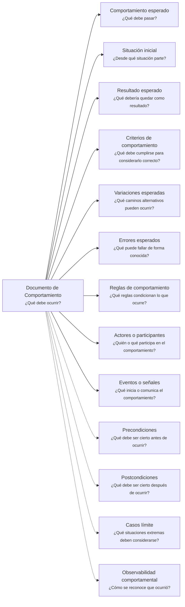

---
artifact:
  kind: document
  type: behavior
  scope: <concept|process|flow|feature|capability|product|service|operation|integration|rule>
  target: <target-name>
  language: <es>

metadata:
  status: <draft|candidate|active|deprecated|superseded>
  relates: 
    - relation: <references/referenced-by|complements|depends-on|owned-by|derived-from|updates|supersedes/superseded-by>
      target: <artifact-id>

document:
  question: ¿Qué debe ocurrir?

tooling:
  schema:
    version: 0.1.0
  template:
    name: behavior.document
    version: 0.1.0
---

# Documento de Comportamiento - <tema>

## Organización

## Comportamiento esperado

<!--
¿Qué debe pasar?

Describir el comportamiento esperado sin explicar todavía cómo se implementa.
-->

## Situación inicial

<!--
¿Desde qué situación parte?

Indicar el estado, condición o situación observable antes de que ocurra el comportamiento.
-->

## Resultado esperado

<!--
¿Qué debería quedar como resultado?

Describir el resultado visible, conceptual o esperado después de que ocurre el comportamiento.
-->

## Criterios de comportamiento

<!--
¿Qué debe cumplirse para considerar correcto este comportamiento?

Definir criterios verificables sin convertir esta sección en una especificación completa de testing.
-->

- <criterio de comportamiento>

## Variaciones esperadas

<!--
¿Qué caminos alternativos pueden ocurrir?

Describir variaciones normales del comportamiento, no errores.
-->

| Variación | Resultado esperado |
| --- | --- |
| <variación esperada> | <qué debería ocurrir> |

## Errores esperados

<!--
¿Qué puede fallar de forma conocida?

Registrar errores esperados como parte del comportamiento, sin usar excepciones o fallas técnicas inesperadas como control de flujo documental.
-->

| Error esperado | Cuándo ocurre | Resultado esperado |
| --- | --- | --- |
| <error> | <situación que lo produce> | <qué debería ocurrir> |

## Reglas de comportamiento

<!--
¿Qué reglas condicionan lo que ocurre?

Registrar reglas que afectan el comportamiento sin convertir esta sección en un Documento de Consistencia completo.
-->

- <regla de comportamiento>

## Actores o participantes

<!--
¿Quién o qué participa en el comportamiento?

Indicar actores, roles, sistemas, servicios o componentes que participan en este comportamiento.
-->

| Tipo | Participante | Participación |
| --- | --- | --- |
| <actor, sistema, servicio o componente> | <nombre> | <cómo participa> |

## Eventos o señales

<!--
¿Qué inicia o comunica el comportamiento?

Indicar eventos, señales, acciones, mensajes o cambios que disparan o comunican este comportamiento.
-->

| Evento o señal | Rol en el comportamiento |
| --- | --- |
| <evento o señal> | <qué inicia o comunica> |

## Precondiciones

<!--
¿Qué debe ser cierto antes de ocurrir?

Registrar condiciones previas cuando sean necesarias para entender el comportamiento.
-->

- <precondición>

## Postcondiciones

<!--
¿Qué debe ser cierto después de ocurrir?

Registrar condiciones esperadas después de ejecutar el comportamiento.
-->

- <postcondición>

## Casos límite

<!--
¿Qué situaciones extremas deben considerarse?

Registrar casos límite conocidos sin convertir esta sección en una especificación completa de testing.
-->

| Caso límite | Comportamiento esperado |
| --- | --- |
| <caso límite> | <qué debería ocurrir> |

## Observabilidad comportamental

<!--
¿Cómo se reconoce que ocurrió?

Describir señales observables que permiten reconocer que el comportamiento ocurrió.
-->

- <señal observable>
