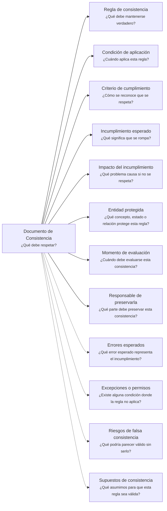

---
artifact:
  kind: document
  type: consistency
  scope: <concept|rule|invariant|behavior|capability|service|product|domain-context|project>
  target: <target-name>
  language: es

metadata:
  status: <draft|candidate|active|deprecated|superseded>
  relates: 
    - relation: <references|referenced-by|complements|depends-on|owned-by|derived-from|updates|supersedes|superseded-by>
      target: <artifact-id>

document:
  question: ¿Qué debe respetar?

tooling:
  schema:
    version: 0.1.0
  template:
    name: consistency.document
    version: 0.1.0
---

# Documento de Consistencia - <tema>

## Organización

## Regla de consistencia

<!--
¿Qué debe mantenerse verdadero?

Declarar la regla, invariant o condición que debe respetarse.
-->

## Condición de aplicación

<!--
¿Cuándo aplica esta regla?

Indicar en qué situación, estado, scope o contexto esta regla debe respetarse.
-->

## Criterio de cumplimiento

<!--
¿Cómo se reconoce que se respeta?

Describir cómo se entiende conceptualmente que la regla está siendo respetada.
No convertir esta sección en una especificación de testing.
-->

## Incumplimiento esperado

<!--
¿Qué significa que se rompa?

Describir qué estado, situación o condición representa un incumplimiento de esta regla.
-->

## Impacto del incumplimiento

<!--
¿Qué problema causa si no se respeta?

Explicar por qué esta regla importa y qué consecuencia conceptual, operativa o técnica puede generar su incumplimiento.
-->

## Entidad protegida

<!--
¿Qué concepto, estado o relación protege esta regla?

Indicar qué elemento del dominio, sistema, servicio, feature, componente o superficie queda protegido por esta consistencia.
-->

| Tipo | Elemento protegido | Qué protege la regla |
| --- | --- | --- |
| <concepto, estado o relación> | <nombre> | <qué evita o preserva> |

## Momento de evaluación

<!--
¿Cuándo debe evaluarse esta consistencia?

Indicar en qué momento esta regla debería ser considerada, evaluada o preservada.
-->

## Responsable de preservarla

<!--
¿Qué parte debe preservar esta consistencia?

Indicar qué parte del dominio, sistema, servicio, feature o componente debería cuidar que esta regla se mantenga.
No convertir esta sección en ownership organizacional completo.
-->

## Errores esperados

<!--
¿Qué error esperado representa el incumplimiento?

Registrar errores esperados asociados al incumplimiento cuando existan.
-->

| Error esperado | Incumplimiento que representa |
| --- | --- |
| <error> | <qué regla rota representa> |

## Excepciones o permisos

<!--
¿Existe alguna condición donde la regla no aplica?

Registrar excepciones conocidas, permisos explícitos o condiciones donde esta regla no debe aplicarse.
-->

| Excepción o permiso | Condición |
| --- | --- |
| <excepción o permiso> | <cuándo aplica> |

## Riesgos de falsa consistencia

<!--
¿Qué podría parecer válido sin serlo?

Describir situaciones donde algo parece cumplir la regla, pero en realidad no preserva la consistencia esperada.
-->

| Falsa consistencia | Riesgo |
| --- | --- |
| <qué podría parecer válido> | <por qué no lo es realmente> |

## Supuestos de consistencia

<!--
¿Qué asumimos para que esta regla sea válida?

Registrar premisas que sostienen esta regla y que podrían cambiar en el futuro.
-->

| Supuesto | Riesgo si cambia |
| --- | --- |
| <supuesto> | <qué se vería afectado si deja de ser cierto> |