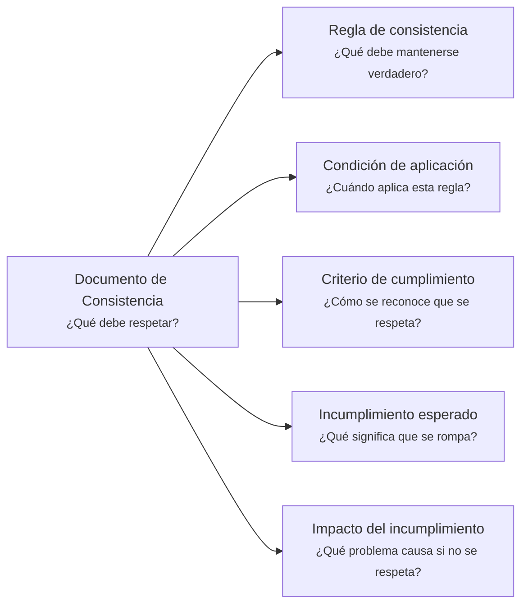

---
artifact:
  kind: document
  type: consistency
  scope: <concept|rule|invariant|behavior|capability|service|product|domain-context|project>
  target: <target-name>
  language: es

metadata:
  status: <draft|candidate|active|deprecated|superseded>
  relates: 
    - relation: <references|referenced-by|complements|depends-on|owned-by|derived-from|updates|supersedes|superseded-by>
      target: <artifact-id>

document:
  question: ¿Qué debe respetar?

tooling:
  schema:
    version: 0.1.0
  template:
    name: consistency.document
    version: 0.1.0
---

# Documento de Consistencia - <tema>

## Organización

## Regla de consistencia

<!--
¿Qué debe mantenerse verdadero?

Declarar la regla, invariant o condición que debe respetarse.
-->

## Condición de aplicación

<!--
¿Cuándo aplica esta regla?

Indicar en qué situación, estado, scope o contexto esta regla debe respetarse.
-->

## Criterio de cumplimiento

<!--
¿Cómo se reconoce que se respeta?

Describir cómo se entiende conceptualmente que la regla está siendo respetada.
No convertir esta sección en una especificación de testing.
-->

## Incumplimiento esperado

<!--
¿Qué significa que se rompa?

Describir qué estado, situación o condición representa un incumplimiento de esta regla.
-->

## Impacto del incumplimiento

<!--
¿Qué problema causa si no se respeta?

Explicar por qué esta regla importa y qué consecuencia conceptual, operativa o técnica puede generar su incumplimiento.
-->