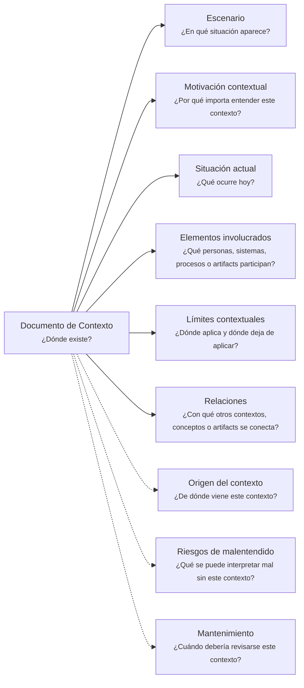

---
artifact:
  kind: document
  type: context
  scope: <concept|process|flow|feature|capability|initiative|product|service|project|organization|domain-context|handoff>
  target: <target-name>
  language: <es|en>

metadata:
  status: <draft|candidate|active|deprecated|superseded>
  relates: 
    - relation: <references/referenced-by|complements|depends-on|owned-by|derived-from|updates|supersedes/superseded-by>
      target: <artifact-id>

document:
  question: ¿Dónde existe?

tooling:
  schema:
    version: 0.1.0
  template:
    name: context.document
    version: 0.1.0
---

# Documento de Contexto - <tema>

## Organización

## Escenario

<!--
¿En qué situación aparece este concepto, problema, sistema, capacidad, decisión o artifact?
-->

## Motivación contextual

<!--
¿Por qué importa entender este contexto?

Explicar qué se pierde, confunde o dificulta si este contexto no se preserva.
-->

## Situación actual

<!--
¿Qué ocurre hoy?

Describir el estado actual de la situación sin entrar todavía en solución detallada.
-->

## Elementos involucrados

<!--
¿Qué personas, sistemas, procesos, artifacts, áreas, equipos o superficies participan en este contexto?
-->

## Límites contextuales

<!--
¿Dónde aplica y dónde deja de aplicar este contexto?

Evitar convertir esta sección en un Documento de Alcance completo.
-->

## Origen del contexto

<!--
¿De dónde viene este contexto?

Indicar conversaciones, observaciones, uso real, investigación, incidentes, decisiones o artifacts relacionados.
-->

## Riesgos de malentendido

<!--
¿Qué se puede interpretar mal si este contexto no se entiende?
-->

## Mantenimiento

<!--
¿Cuándo debería revisarse este contexto?
-->
