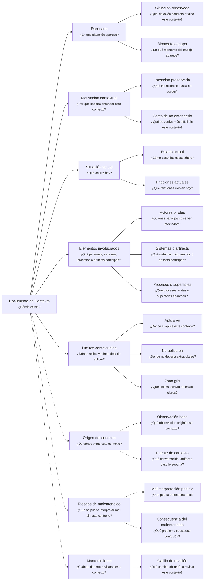

---
artifact:
  kind: document
  type: context
  scope: <concept|process|flow|feature|capability|initiative|product|service|project|organization|domain-context|handoff>
  target: <target-name>
  language: es

metadata:
  status: <draft|candidate|active|deprecated|superseded>
  relates: 
    - relation: <references|referenced-by|complements|depends-on|owned-by|derived-from|updates|supersedes|superseded-by>
      target: <artifact-id>

document:
  question: ¿Dónde existe?

tooling:
  schema:
    version: 0.1.0
  template:
    name: context.document
    version: 0.1.0
---

# Documento de Contexto - <tema>

## Organización

## Escenario

<!--
¿En qué situación aparece este concepto, problema, sistema, capacidad, decisión o artifact?
- ¿Qué situación concreta origina este contexto?
- ¿En qué momento del trabajo aparece?
-->

## Motivación contextual

<!--
¿Por qué importa entender este contexto?
- ¿Qué intención se busca no perder?
- ¿Qué se vuelve más difícil sin este contexto?
-->

## Situación actual

<!--
¿Qué ocurre hoy?
- ¿Cómo están las cosas ahora?
- ¿Qué tensiones existen hoy?
-->

## Elementos involucrados

<!--
¿Qué personas, sistemas, procesos o artifacts participan en este contexto?
- ¿Quiénes participan o se ven afectados?
- ¿Qué sistemas, documentos o artifacts participan?
- ¿Qué procesos, vistas o superficies aparecen?
-->

| Tipo | Elemento | Participación en el contexto |
| --- | --- | --- |
| <actor, rol, sistema, proceso, superficie o artifact> | <nombre> | <cómo participa o por qué importa> |

## Límites contextuales

<!--
¿Dónde aplica y dónde deja de aplicar este contexto?
- ¿Dónde sí aplica este contexto?
- ¿Dónde no debería extrapolarse?
- ¿Qué límites todavía no están claros?
-->

| Tipo de límite | Descripción |
| --- | --- |
| Aplica en | <dónde sí aplica este contexto> |
| No aplica en | <dónde no debería extrapolarse> |
| Zona gris | <qué límites todavía no están claros> |

## Origen del contexto

<!--
¿De dónde viene este contexto?
- ¿Qué observación originó este contexto?
- ¿Qué conversación, artifact o caso lo soporta?
-->

## Riesgos de malentendido

<!--
¿Qué se puede interpretar mal si este contexto no se entiende?
- ¿Qué podría entenderse mal?
- ¿Qué problema causa esa confusión?
-->

| Malinterpretación posible | Consecuencia |
| --- | --- |
| <qué podría entenderse mal> | <qué problema causa esa confusión> |

## Mantenimiento

<!--
¿Cuándo debería revisarse este contexto?
- ¿Qué cambio obligaría a revisar este contexto?
-->
